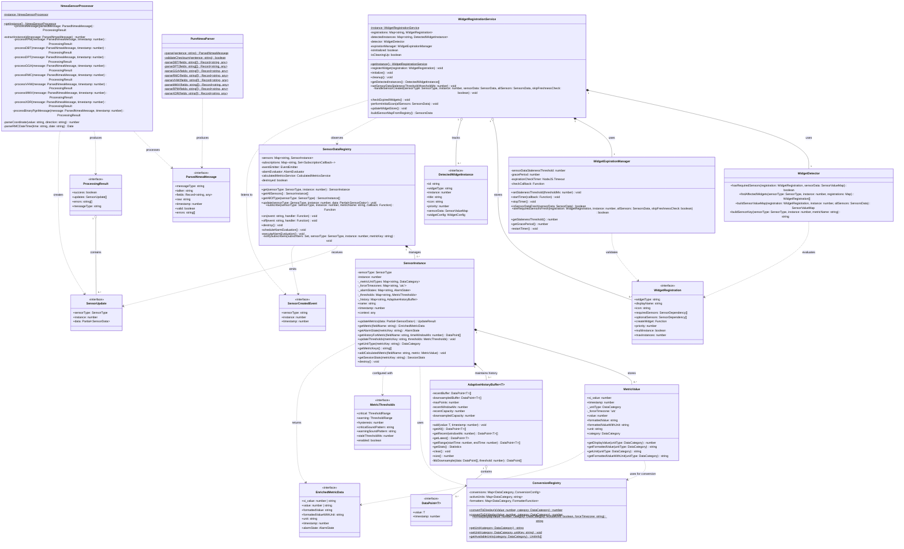

```mermaid
classDiagram
    %% Core Data Management Classes
    class SensorInstance {
        -sensorType: SensorType
        -instance: number
        -_metricUnitTypes: Map~string, DataCategory~
        -_forceTimezones: Map~string, 'utc'~
        -_alarmStates: Map~string, AlarmState~
        -_thresholds: Map~string, MetricThresholds~
        -_history: Map~string, AdaptiveHistoryBuffer~
        +name: string
        +timestamp: number
        +context: any
        +updateMetrics(data: Partial~SensorData~) UpdateResult
        +getMetric(fieldName: string) EnrichedMetricData
        +getAlarmState(metricKey: string) AlarmState
        +getHistoryForMetric(fieldName: string, timeWindowMs: number) DataPoint[]
        +updateThresholds(metricKey: string, thresholds: MetricThresholds) void
        +getUnitType(metricKey: string) DataCategory
        +getMetricKeys() string[]
        +addCalculatedMetric(fieldName: string, metric: MetricValue) void
        +getSessionStats(metricKey: string) SessionStats
        +destroy() void
    }

    class MetricValue {
        +si_value: number
        +timestamp: number
        -_unitType: DataCategory
        -_forceTimezone: 'utc'
        +getDisplayValue(unitType: DataCategory) number
        +getFormattedValue(unitType: DataCategory) string
        +getUnit(unitType: DataCategory) string
        +getFormattedValueWithUnit(unitType: DataCategory) string
        +value: number
        +formattedValue: string
        +formattedValueWithUnit: string
        +unit: string
        +category: DataCategory
    }

    class AdaptiveHistoryBuffer~T~ {
        -recentBuffer: DataPoint~T~[]
        -downsampledBuffer: DataPoint~T~[]
        -maxPoints: number
        -recentWindowMs: number
        -recentCapacity: number
        -downsampledCapacity: number
        +add(value: T, timestamp: number) void
        +getAll() DataPoint~T~[]
        +getRecent(windowMs: number) DataPoint~T~[]
        +getLatest() DataPoint~T~
        +getRange(startTime: number, endTime: number) DataPoint~T~[]
        +getStats() Statistics
        +clear() void
        +size() number
        -lttbDownsample(data: DataPoint[], threshold: number) DataPoint[]
    }

    class ConversionRegistry {
        -conversions: Map~DataCategory, ConversionConfig~
        -activeUnits: Map~DataCategory, string~
        -formatters: Map~DataCategory, FormatterFunction~
        +convertToDisplay(siValue: number, category: DataCategory) number$
        +convertToSI(displayValue: number, category: DataCategory) number$
        +format(displayValue: number, category: DataCategory, includeUnit: boolean, forceTimezone: string) string$
        +getUnit(category: DataCategory) string$
        +setUnit(category: DataCategory, unitKey: string) void$
        +getAvailableUnits(category: DataCategory) UnitInfo[]$
    }

    %% NMEA Processing Classes
    class NmeaSensorProcessor {
        -instance: NmeaSensorProcessor$
        +getInstance() NmeaSensorProcessor$
        +processMessage(parsedMessage: ParsedNmeaMessage) ProcessingResult
        -extractInstanceId(message: ParsedNmeaMessage) number
        -processRPM(message: ParsedNmeaMessage, timestamp: number) ProcessingResult
        -processDBT(message: ParsedNmeaMessage, timestamp: number) ProcessingResult
        -processDPT(message: ParsedNmeaMessage, timestamp: number) ProcessingResult
        -processGGA(message: ParsedNmeaMessage, timestamp: number) ProcessingResult
        -processRMC(message: ParsedNmeaMessage, timestamp: number) ProcessingResult
        -processVHW(message: ParsedNmeaMessage, timestamp: number) ProcessingResult
        -processMWV(message: ParsedNmeaMessage, timestamp: number) ProcessingResult
        -processXDR(message: ParsedNmeaMessage, timestamp: number) ProcessingResult
        -processBinaryPgnMessage(message: ParsedNmeaMessage, timestamp: number) ProcessingResult
        -parseCoordinate(value: string, direction: string) number
        -parseRMCDateTime(time: string, date: string) Date
    }

    class PureNmeaParser {
        +parse(sentence: string) ParsedNmeaMessage$
        -validateChecksum(sentence: string) boolean$
        -parseDBT(fields: string[]) Record~string, any~$
        -parseDPT(fields: string[]) Record~string, any~$
        -parseGGA(fields: string[]) Record~string, any~$
        -parseRMC(fields: string[]) Record~string, any~$
        -parseVHW(fields: string[]) Record~string, any~$
        -parseMWV(fields: string[]) Record~string, any~$
        -parseRPM(fields: string[]) Record~string, any~$
        -parseXDR(fields: string[]) Record~string, any~$
    }

    class SensorDataRegistry {
        -sensors: Map~string, SensorInstance~
        -subscriptions: Map~string, Set~SubscriptionCallback~~
        -eventEmitter: EventEmitter
        -alarmEvaluator: AlarmEvaluator
        -calculatedMetricsService: CalculatedMetricsService
        -destroyed: boolean
        +get(sensorType: SensorType, instance: number) SensorInstance
        +getAllSensors() SensorInstance[]
        +getAllOfType(sensorType: SensorType) SensorInstance[]
        +update(sensorType: SensorType, instance: number, data: Partial~SensorData~) void
        +subscribe(sensorType: SensorType, instance: number, metricName: string, callback: Function) Function
        +on(event: string, handler: Function) void
        +off(event: string, handler: Function) void
        +destroy() void
        -scheduleAlarmEvaluation() void
        -executeAlarmEvaluation() void
        -notifySubscribers(subscribers: Set, sensorType: SensorType, instance: number, metricKey: string) void
    }

    %% Widget Management Classes
    class WidgetRegistrationService {
        -instance: WidgetRegistrationService$
        -registrations: Map~string, WidgetRegistration~
        -detectedInstances: Map~string, DetectedWidgetInstance~
        -detector: WidgetDetector
        -expirationManager: WidgetExpirationManager
        -isInitialized: boolean
        -isCleaningUp: boolean
        +getInstance() WidgetRegistrationService$
        +registerWidget(registration: WidgetRegistration) void
        +initialize() void
        +cleanup() void
        +getDetectedInstances() DetectedWidgetInstance[]
        +setSensorDataStalenessThreshold(thresholdMs: number) void
        -handleSensorCreated(sensorType: SensorType, instance: number, sensorData: SensorData, allSensors: SensorsData, skipFreshnessCheck: boolean) void
        -checkExpiredWidgets() void
        -performInitialScan(allSensors: SensorsData) void
        -updateWidgetStore() void
        -buildSensorMapFromRegistry() SensorsData
    }

    class WidgetDetector {
        +hasRequiredSensors(registration: WidgetRegistration, sensorData: SensorValueMap) boolean
        +findAffectedWidgets(sensorType: SensorType, instance: number, registrations: Map) WidgetRegistration[]
        +buildSensorValueMap(registration: WidgetRegistration, instance: number, allSensors: SensorsData) SensorValueMap
        +buildSensorKey(sensorType: SensorType, instance: number, metricName: string) string
    }

    class WidgetExpirationManager {
        -sensorDataStalenessThreshold: number
        -gracePeriod: number
        -expirationCheckTimer: NodeJS.Timeout
        -checkCallback: Function
        +setStalenessThreshold(thresholdMs: number) void
        +startTimer(callback: Function) void
        +stopTimer() void
        +isSensorDataFresh(sensorData: SensorData) boolean
        +areRequiredSensorsFresh(registration: WidgetRegistration, instance: number, allSensors: SensorsData, skipFreshnessCheck: boolean) boolean
        +getStalenessThreshold() number
        +getGracePeriod() number
        -restartTimer() void
    }

    %% Data Transfer Objects
    class ParsedNmeaMessage {
        <<interface>>
        +messageType: string
        +talker: string
        +fields: Record~string, any~
        +raw: string
        +timestamp: number
        +valid: boolean
        +errors: string[]
    }

    class ProcessingResult {
        <<interface>>
        +success: boolean
        +updates: SensorUpdate[]
        +errors: string[]
        +messageType: string
    }

    class SensorUpdate {
        <<interface>>
        +sensorType: SensorType
        +instance: number
        +data: Partial~SensorData~
    }

    class EnrichedMetricData {
        <<interface>>
        +si_value: number | string
        +value: number | string
        +formattedValue: string
        +formattedValueWithUnit: string
        +unit: string
        +timestamp: number
        +alarmState: AlarmState
    }

    class DataPoint~T~ {
        <<interface>>
        +value: T
        +timestamp: number
    }

    class MetricThresholds {
        <<interface>>
        +critical: ThresholdRange
        +warning: ThresholdRange
        +hysteresis: number
        +criticalSoundPattern: string
        +warningSoundPattern: string
        +staleThresholdMs: number
        +enabled: boolean
    }

    class WidgetRegistration {
        <<interface>>
        +widgetType: string
        +displayName: string
        +icon: string
        +requiredSensors: SensorDependency[]
        +optionalSensors: SensorDependency[]
        +createWidget: Function
        +priority: number
        +multiInstance: boolean
        +maxInstances: number
    }

    class DetectedWidgetInstance {
        <<interface>>
        +id: string
        +widgetType: string
        +instance: number
        +title: string
        +icon: string
        +priority: number
        +sensorData: SensorValueMap
        +widgetConfig: WidgetConfig
    }

    class SensorCreatedEvent {
        <<interface>>
        +sensorType: string
        +instance: number
        +timestamp: number
    }

    %% Relationships
    SensorInstance "1" *-- "0..*" MetricValue : stores
    SensorInstance "1" *-- "0..*" AdaptiveHistoryBuffer : maintains history
    SensorInstance ..> ConversionRegistry : uses
    SensorInstance ..> MetricThresholds : configured with
    SensorInstance ..> EnrichedMetricData : returns

    MetricValue ..> ConversionRegistry : uses for conversion
    MetricValue ..> EnrichedMetricData : enriches to

    AdaptiveHistoryBuffer "1" o-- "0..*" DataPoint : contains

    NmeaSensorProcessor ..> ParsedNmeaMessage : processes
    NmeaSensorProcessor ..> ProcessingResult : produces
    NmeaSensorProcessor ..> SensorUpdate : creates

    PureNmeaParser ..> ParsedNmeaMessage : produces

    SensorDataRegistry "1" *-- "0..*" SensorInstance : manages
    SensorDataRegistry ..> SensorUpdate : receives
    SensorDataRegistry ..> SensorCreatedEvent : emits

    WidgetRegistrationService "1" *-- "1" WidgetDetector : uses
    WidgetRegistrationService "1" *-- "1" WidgetExpirationManager : uses
    WidgetRegistrationService "1" o-- "0..*" WidgetRegistration : stores
    WidgetRegistrationService "1" o-- "0..*" DetectedWidgetInstance : tracks
    WidgetRegistrationService ..> SensorDataRegistry : observes
    WidgetRegistrationService ..> SensorCreatedEvent : listens to

    WidgetDetector ..> WidgetRegistration : evaluates
    WidgetExpirationManager ..> WidgetRegistration : validates

    ProcessingResult "1" o-- "0..*" SensorUpdate : contains
```