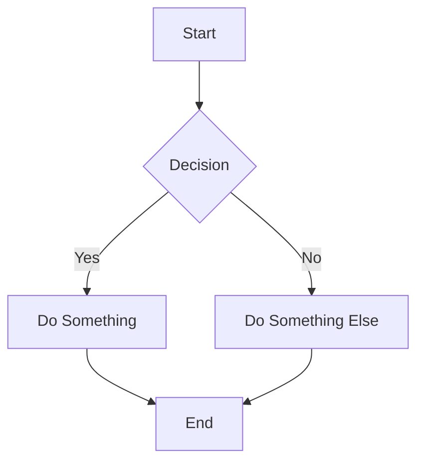
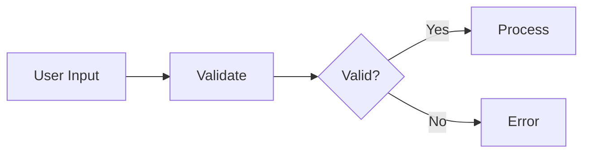
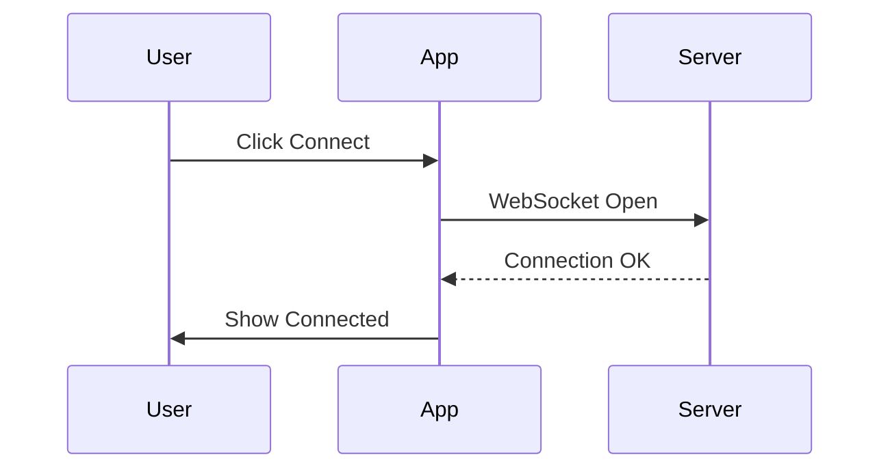
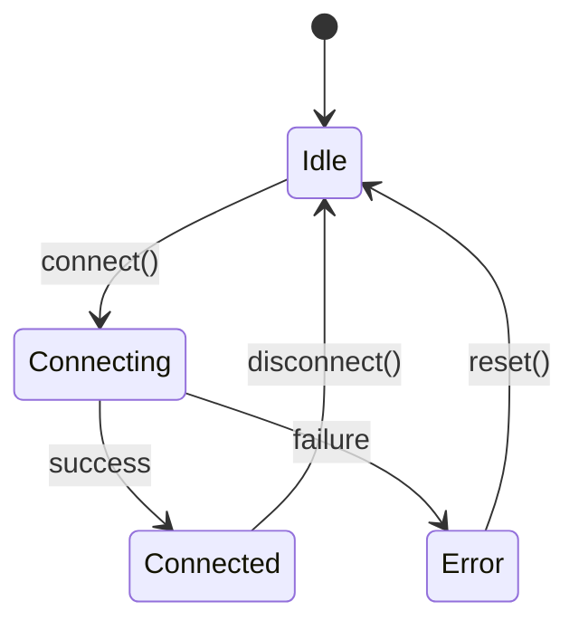
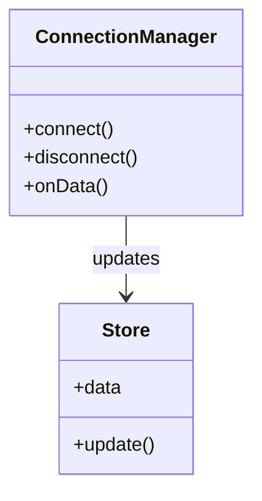
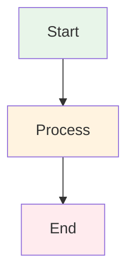

# Code Flow Documentation Guide

Quick reference for documenting code flow in VS Code.

## 🎉 Extensions Installed

All extensions are now installed and ready to use:

1. ✅ **Mermaid Preview** - Flowcharts, sequence diagrams in Markdown
2. ✅ **Draw.io Integration** - Visual diagram editor
3. ✅ **CodeTour** - Interactive code walkthroughs
4. ✅ **CodeMap** - Code structure visualization

---

## 📊 Using Mermaid Diagrams

### In Any Markdown File

Create a code block with `mermaid` language:

````markdown

````

### Preview in VS Code

- Open any `.md` file
- Press `Cmd+Shift+V` to preview
- Diagrams render automatically!

### Example Documentation Created

See: [docs/architecture/NMEA-DATA-FLOW.md](architecture/NMEA-DATA-FLOW.md)

This file contains:
- High-level data flow
- Sequence diagrams
- State machines
- Class diagrams
- Error handling flows

---

## 🎨 Using Draw.io

### Create a New Diagram

1. Create a file with `.drawio.svg` or `.drawio.png` extension
2. Open in VS Code
3. Visual editor launches automatically!

### Example:

```bash
# Create new diagram
touch docs/architecture/connection-flow.drawio.svg

# Open in VS Code
code docs/architecture/connection-flow.drawio.svg
```

The diagram embeds in Markdown:
```markdown

```

---

## 🗺️ Using CodeTour

### View Existing Tours

1. Look for the "CodeTour" icon in VS Code sidebar
2. Or press `Cmd+Shift+P` → "CodeTour: Open Tour"

### Tour Already Created!

**"NMEA Connection Flow"** - Complete walkthrough of how NMEA data flows through the app

To start the tour:
1. Click CodeTour icon in sidebar
2. Select "NMEA Connection Flow"
3. Click "Start Tour"
4. Follow the step-by-step guide!

### Create Your Own Tour

1. `Cmd+Shift+P` → "CodeTour: Record Tour"
2. Give it a name and description
3. Navigate to files and click "+ Add Step" in each location
4. Write descriptions for each step
5. Save the tour

Tours are saved in `.tours/` directory.

---

## 📁 Using CodeMap

### View Code Structure

CodeMap automatically creates a tree view of your code structure in the sidebar.

**Features:**
- Shows functions, classes, interfaces
- Quick navigation by clicking items
- Updates in real-time as you code

**Open CodeMap:**
- Look for "CodeMap" in the sidebar
- Or `Cmd+Shift+P` → "CodeMap: Show"

---

## 🎓 Best Practices

### When to Use Each Tool

| Tool | Best For | Example Use Case |
|------|----------|------------------|
| **Mermaid** | Architecture, flows, sequences | Document data flow, API interactions |
| **Draw.io** | Complex visual diagrams | System architecture, network topology |
| **CodeTour** | Onboarding, explaining features | "How to add a new widget" tutorial |
| **CodeMap** | Code navigation | Quick overview of file structure |
| **Excalidraw** | Hand-drawn style diagrams | Brainstorming, whiteboard sessions |

### Documentation Locations

```
docs/
├── architecture/
│   ├── NMEA-DATA-FLOW.md          # Mermaid diagrams
│   ├── system-overview.drawio.svg  # Draw.io diagrams
│   └── presentation-system.md      # More documentation
│
.tours/
├── nmea-connection-flow.tour       # CodeTour walkthrough
└── widget-development.tour         # Future tours
```

---

## 🚀 Quick Examples

### 1. Simple Flowchart



### 2. Sequence Diagram



### 3. State Diagram



### 4. Class Diagram



---

## 💡 Pro Tips

### Mermaid Live Editor

Test your Mermaid diagrams online: https://mermaid.live/

### Diagram Styling

Add styles to Mermaid diagrams:



### Export Diagrams

Mermaid diagrams in Markdown can be exported:
- Screenshot for presentations
- Copy diagram code for documentation
- Render as SVG in CI/CD pipelines

### CodeTour Navigation

While in a tour:
- **Next:** `Cmd+Right` or click "Next"
- **Previous:** `Cmd+Left` or click "Previous"
- **Exit:** Press `Esc` or click "Exit Tour"

---

## 📚 Additional Resources

### Mermaid Documentation
- Official docs: https://mermaid.js.org/
- Syntax reference: https://mermaid.js.org/intro/

### Draw.io
- Official site: https://www.drawio.com/
- VS Code extension: https://github.com/hediet/vscode-drawio

### CodeTour
- GitHub: https://github.com/microsoft/codetour
- Examples: https://github.com/microsoft/codetour-samples

---

## 🔧 Troubleshooting

### Mermaid Not Rendering?

1. Check syntax in Mermaid Live Editor
2. Ensure preview is open (`Cmd+Shift+V`)
3. Reload VS Code window

### Draw.io Not Opening?

1. Ensure file has `.drawio.svg` or `.drawio.png` extension
2. Right-click file → "Open With" → "Draw.io"
3. Reinstall extension if needed

### CodeTour Not Showing?

1. Check `.tours/` directory exists
2. Look for CodeTour icon in Activity Bar (left sidebar)
3. Run `Cmd+Shift+P` → "CodeTour: Open Tour"

---

## 🎯 Next Steps

1. **Explore the example:** Open [NMEA-DATA-FLOW.md](architecture/NMEA-DATA-FLOW.md)
2. **Take the tour:** Start "NMEA Connection Flow" in CodeTour
3. **Create your own:** Document a feature you're working on
4. **Share with team:** Commit diagrams and tours to git

---

*Happy documenting! 🎉*
