# Boating Instruments App Fullstack Architecture Document

## Change Log

| Date | Version | Description | Author |
|------|---------|-------------|--------|
| 2025-10-10 | 1.0 | Initial full-stack architecture document | Winston (Architect) |

---

## Introduction

This document outlines the complete full-stack architecture for the **Boating Instruments App**, including the React Native UI layer ("frontend"), NMEA service layer ("backend"), and their integration. It serves as the single source of truth for AI-driven development, ensuring consistency across the entire technology stack.

### Architecture Overview

This is a **React Native cross-platform application** with an embedded NMEA data processing service layer. Unlike traditional web full-stack apps with separate client/server deployments, this architecture runs entirely on-device:

- **UI Layer (Frontend):** React Native components, widgets, screens
- **Service Layer (Backend):** TCP socket management, NMEA parsing, autopilot command encoding
- **State Bridge:** Zustand stores connecting service layer to UI layer
- **External Integration:** WiFi bridge hardware providing NMEA data stream

The app transforms smartphones, tablets, and desktop devices into comprehensive marine instrument displays by processing real-time NMEA 0183/2000 data streams from boat networks.

### Starter Template

**Selected Starter:** Expo SDK 51+ with TypeScript

**Initial Setup Command:**
```bash
npx create-expo-app boating-instruments --template blank-typescript
```

**Pre-configured Choices:**
- Metro bundler for JavaScript packaging
- Expo Router for file-based navigation
- Built-in support for iOS/Android builds via EAS
- Hot reload and instant previews via Expo Go
- TypeScript configuration included

**Constraints Imposed:**
- Must use Expo-compatible libraries for native modules (TCP sockets require config plugins)
- Build process through EAS (Expo Application Services)
- Slightly larger bundle size than bare React Native (~20MB additional overhead)

**What Can Be Modified:**
- Can eject to bare workflow if needed for custom native modules
- State management library (Zustand chosen)
- UI component approach (custom widgets chosen over component libraries)

---

## High Level Architecture

### Technical Summary

The Boating Instruments App employs a **layered architecture** running entirely on-device, with a React Native presentation layer communicating through Zustand state stores to a dedicated NMEA service layer. The app connects to boat networks via WiFi bridge hardware (Digital Yacht, Actisense, etc.) using TCP sockets, parses NMEA 0183/2000 data streams in real-time, and renders marine instrument widgets with <1 second latency. This architecture achieves PRD goals by enabling cross-platform deployment (iOS, Android, Windows, macOS) from a single TypeScript codebase while maintaining the reliability and performance standards of physical marine instruments through robust connection management, efficient state synchronization, and platform-native rendering.

### Platform and Infrastructure Choice

Given this is a **client-side mobile/desktop application** with no cloud backend (all processing happens on-device), the infrastructure approach differs from typical web applications:

**Platform:** On-Device Native Application (React Native)

**Key Services:**
- **Development Platform:** Expo (SDK 51+) for build tooling and OTA updates
- **Build Services:** EAS (Expo Application Services) for iOS/Android/Windows/macOS builds
- **Distribution:** App Store (iOS), Google Play (Android), Microsoft Store (Windows), Mac App Store
- **Crash Reporting:** Sentry React Native SDK
- **Local Storage:** Expo SecureStore (credentials) + AsyncStorage (settings/layouts)

**Deployment Host and Regions:**
- **No Server Infrastructure Required** - App runs entirely locally on user devices
- **No Geographic Regions** - Users download from app stores based on their location
- **Future Consideration:** If cloud sync or telemetry added, consider AWS/GCP with global CDN

**Why This Approach:**
- **Privacy & Reliability:** Boat data never leaves device; works completely offline
- **Latency:** No network round-trips means <1s NMEA data → UI updates
- **Cost:** Zero ongoing hosting costs; one-time development investment only
- **Marine Environment:** Boats often have unreliable internet connectivity

### Repository Structure

**Structure:** Monorepo (single repository containing all platform targets)

**Monorepo Tool:** None required (simple Expo project structure suffices for this app's scope)

**Package Organization:**
- Single `package.json` at root with all dependencies
- Platform-specific code uses file suffixes (`.ios.tsx`, `.android.tsx`, `.windows.tsx`, `.macos.tsx`)
- Shared code in `src/` directory with no platform qualifiers
- ~95% code sharing across all platforms

**Rationale for Simple Structure:**
- App is relatively small (~50k LOC estimated)
- No separate backend microservices requiring workspace management
- Platform differences minimal (mostly TCP socket implementations and UI tweaks)
- Expo's Metro bundler handles platform-specific imports automatically

### High Level Architecture Diagram

```mermaid
graph TB
    User[👤 User - Sailor/Boater]

    subgraph Device["User's Device (Phone/Tablet/Desktop)"]
        UI[React Native UI Layer]
        State[Zustand State Stores]
        NMEA[NMEA Service Layer]
        Storage[(Local Storage)]

        UI <-->|Subscribe/Dispatch| State
        State <-->|Update/Query| NMEA
        State <-->|Persist| Storage
        NMEA -->|Parse & Validate| State
    end

    Bridge[WiFi Bridge Hardware<br/>Digital Yacht WLN10<br/>Actisense W2K-1]
    Boat[Boat NMEA Network<br/>Sensors & Autopilot]

    User -->|Interact| UI
    NMEA <-->|TCP Socket<br/>Port 10110| Bridge
    Bridge <-->|NMEA 0183/2000| Boat

    style UI fill:#0284C7,color:#fff
    style NMEA fill:#0EA5E9,color:#fff
    style State fill:#06B6D4,color:#fff
    style Bridge fill:#F59E0B,color:#fff
    style Boat fill:#10B981,color:#fff
```



### Architectural Patterns

- **Layered Architecture:** Clear separation between UI (presentation), business logic (state management), and data access (NMEA service) layers - _Rationale:_ Enables independent testing and future refactoring; React Native developers familiar with this pattern

- **Service Layer Pattern:** NMEA connection, parsing, and command encoding isolated in dedicated service classes - _Rationale:_ Abstracts TCP socket complexity from UI; allows mocking for testing without hardware

- **Observer Pattern (via Zustand):** Widgets subscribe to specific NMEA data slices and re-render only when their data changes - _Rationale:_ Critical for performance with 10+ widgets updating simultaneously from 500 msg/sec stream

- **Repository Pattern:** Settings and widget configurations accessed through storage abstraction layer - _Rationale:_ Enables platform-specific storage implementations (iOS UserDefaults vs Android SharedPreferences) behind unified interface

- **Command Pattern:** Autopilot commands (heading adjust, tack, gybe) encapsulated as objects with execute() methods - _Rationale:_ Enables queuing, retry logic, and undo functionality for safety-critical operations

- **Singleton Pattern:** Single NMEAConnection instance shared across app - _Rationale:_ Only one TCP connection allowed per WiFi bridge; prevents duplicate connections

- **Strategy Pattern:** NMEA parser swaps between 0183 and 2000 parsers based on message format - _Rationale:_ Supports multiple NMEA versions without conditionals scattered throughout codebase

---

## Tech Stack

This is the **DEFINITIVE technology selection** for the entire project. All development must use these exact versions and technologies.

### Technology Stack Table

| Category | Technology | Version | Purpose | Rationale |
|----------|------------|---------|---------|-----------|
| **Frontend Language** | TypeScript | 5.3+ | Type-safe React Native development | Catches NMEA parsing errors at compile time; excellent IDE support; industry standard for React Native |
| **Frontend Framework** | React Native | 0.74+ | Cross-platform mobile/desktop UI foundation | Only mature framework supporting iOS, Android, Windows, macOS from single codebase; 95% code sharing |
| **Development Platform** | Expo | SDK 51+ | Build tooling, OTA updates, native module access | EAS simplifies multi-platform builds; OTA critical for marine app bug fixes; config plugins enable TCP sockets |
| **UI Component Library** | Custom (No library) | N/A | Marine-specific instrument widgets | Material/NativeBase don't match Raymarine aesthetic; custom SVG gauges provide exact control; smaller bundle |
| **State Management** | Zustand | 4.5+ | Global state for NMEA data, widgets, settings | <1KB bundle; excellent TypeScript; selector-based subscriptions prevent re-render cascades; 10x faster than Redux for real-time streams |
| **Routing** | Expo Router | 3.5+ | File-based navigation | Built on React Navigation; reduces boilerplate; deep linking support for future features |
| **Animation** | React Native Reanimated | 3.8+ | 60-120 FPS animations, compass rotation | Runs on UI thread bypassing JS bridge; supports ProMotion displays; critical for 10+ simultaneous widget updates |
| **Vector Graphics** | React Native SVG | 15.1+ | Compass roses, analog gauges, custom icons | Scalable without raster images; smaller bundle; crisp on all screen densities |
| **Styling** | StyleSheet API + Theme Context | Built-in | Component styling with Day/Night/Red-Night modes | Native to RN; performant; no CSS-in-JS overhead; custom theme provider for display modes |
| **Form Handling** | React Hook Form | 7.51+ | Settings forms, alarm config, WiFi connection | Minimal re-renders; built-in validation; excellent performance and TypeScript support |
| **Networking** | react-native-tcp-socket | 6.0+ | TCP connection to WiFi bridge for NMEA stream | Direct socket access; handles 500 msg/sec throughput; Expo compatible via config plugin |
| **NMEA Parsing** | Custom NMEA Parser | N/A | Parse NMEA 0183/2000 into structured data | Existing libraries lack Raymarine autopilot PGN support; custom parser optimized for performance |
| **Local Storage** | Expo SecureStore + AsyncStorage | Built-in | Widget layouts, settings, WiFi credentials | SecureStore for sensitive data (IP addresses); AsyncStorage for preferences; async doesn't block UI |
| **Testing Framework** | Jest | 29.7+ | Unit and integration testing | Industry standard; works with Expo; snapshot testing for widgets |
| **Testing Library** | React Native Testing Library | 12.4+ | Component testing | Async utilities for NMEA data flows; encourages best practices; accessibility-focused |
| **Build Tool** | Metro (Expo) | Built-in | JavaScript bundler and dev server | Optimized for React Native; fast refresh; source maps; integrated with Expo workflow |
| **Linting** | ESLint + Prettier | 8.x / 3.x | Code quality and formatting | Enforce TypeScript strict mode; catch errors early; consistent code style across team |
| **Type Checking** | TypeScript Compiler | 5.3+ | Static type checking | Strict mode enabled; validates NMEA data types; prevents runtime errors |
| **Crash Reporting** | Sentry React Native SDK | Latest | Production error tracking and crash reports | Meets NFR3 (99.5%+ crash-free rate); detailed stack traces; performance monitoring |
| **Build & Deploy** | EAS (Expo Application Services) | Latest | Multi-platform builds and submissions | Handles iOS, Android, Windows, macOS builds from cloud; simplifies code signing |
| **Development Tools** | React DevTools + Flipper (optional) | Latest | Component inspection, network debugging | Essential for debugging real-time NMEA data flows and widget re-render optimization |

### Additional Stack Notes

**Why Zustand over Redux Toolkit?**
- **Bundle Size:** <1KB vs ~15KB (critical for 8-hour battery life goal)
- **Performance:** No Context Provider wrapping eliminates re-render cascades
- **Real-Time Fit:** Direct subscriptions to specific NMEA data slices (e.g., only depth widget subscribes to depth)
- **Developer Experience:** Minimal boilerplate; excellent TypeScript inference

**Why React Native Reanimated over Animated API?**
- **UI Thread Execution:** Runs on native UI thread, bypassing JS bridge bottleneck
- **ProMotion Support:** Automatically leverages 120Hz displays on iPhone 14/15 Pro
- **Gesture Handling:** Integrated with React Native Gesture Handler for drag-and-drop widgets (Epic 2)
- **Performance:** Critical for maintaining 60 FPS with 10+ widgets updating simultaneously

**Why react-native-tcp-socket?**
- **Direct TCP Access:** WiFi bridges expose NMEA on TCP port 10110 (not HTTP/WebSocket)
- **NMEA 2000 Support:** Handles binary PGN messages from Raymarine autopilot
- **Throughput:** Tested to handle 500+ messages/second without blocking UI thread
- **Expo Compatibility:** Works via config plugin (no bare workflow ejection required)

**Why Custom NMEA Parser?**
- **Raymarine-Specific PGNs:** Existing libraries (`nmea-simple`, `@canboat/canboatjs`) lack proprietary autopilot command support
- **Performance:** Custom parser optimized for mobile; avoids unnecessary object allocations
- **Bundle Size:** Only include parsers for messages we actually use (~20KB vs ~200KB for full libraries)

**Why No UI Component Library?**
- **Aesthetic Mismatch:** Material Design/iOS HIG don't match Raymarine's professional nautical design
- **Bundle Size:** Removing unused components from libraries adds complexity
- **Flexibility:** Marine widgets (compass rose, analog depth gauge) are highly specialized
- **Performance:** Custom components optimized for real-time data updates

---

## Data Models

### Core Data Entities

The app manages several key data models that flow between the NMEA service layer and UI layer:

#### **NMEADataState**

**Purpose:** Real-time marine sensor data from NMEA network

**TypeScript Interface:**
```typescript
interface NMEADataState {
  // Depth data
  depth: number | null;
  depthUnit: 'feet' | 'meters' | 'fathoms';
  depthTimestamp: number | null;

  // Speed data
  speedOverGround: number | null;
  speedThroughWater: number | null;
  speedUnit: 'knots' | 'mph' | 'kmh';
  speedTimestamp: number | null;

  // Wind data
  apparentWindAngle: number | null;
  apparentWindSpeed: number | null;
  trueWindAngle: number | null;
  trueWindSpeed: number | null;
  windTimestamp: number | null;

  // Compass/GPS data
  heading: number | null;
  latitude: number | null;
  longitude: number | null;
  cog: number | null; // Course over ground
  headingTimestamp: number | null;

  // Autopilot data
  autopilotMode: 'standby' | 'auto' | 'wind' | 'track' | 'power_steer' | null;
  targetHeading: number | null;
  autopilotTimestamp: number | null;

  // Engine data (multi-engine support)
  engines: {
    [id: string]: {
      rpm: number | null;
      temperature: number | null;
      oilPressure: number | null;
      fuelRate: number | null;
      timestamp: number | null;
    };
  };

  // Actions
  updateDepth: (value: number, unit: string) => void;
  updateSpeed: (sog: number | null, stw: number | null, unit: string) => void;
  updateWind: (awa: number, aws: number, twa?: number, tws?: number) => void;
  updateHeading: (heading: number, lat?: number, lon?: number, cog?: number) => void;
  updateAutopilot: (mode: string, targetHeading?: number) => void;
  updateEngine: (engineId: string, data: Partial<EngineData>) => void;
  resetAllData: () => void;
}
```

**Relationships:**
- Updated by: NMEA Service Layer (NMEAConnection, NMEAParser)
- Consumed by: All instrument widgets via Zustand selectors
- Persisted: No (real-time data, not saved)

####  **WidgetConfig**

**Purpose:** User's dashboard layout and widget configurations

**TypeScript Interface:**
```typescript
interface WidgetConfig {
  id: string; // Unique ID (UUID)
  type: 'depth' | 'speed' | 'wind' | 'compass' | 'autopilot' | 'gps' | 'temperature' | 'voltage' | 'engine' | 'alarm';
  position: { x: number; y: number }; // Grid position (Epic 2 - drag/drop)
  size: { width: number; height: number }; // Widget dimensions
  config: {
    dataSource?: string; // For multi-sensor boats (e.g., 'port-engine')
    unit?: string; // Unit override (e.g., 'meters' instead of default 'feet')
    visualizationStyle?: 'digital' | 'analog' | 'bar'; // Widget display style
  };
}

interface WidgetStoreState {
  widgets: WidgetConfig[];
  addWidget: (type: WidgetType) => void;
  removeWidget: (id: string) => void;
  updateWidgetConfig: (id: string, config: Partial<WidgetConfig['config']>) => void;
  updateWidgetPosition: (id: string, position: { x: number; y: number }) => void;
  updateWidgetSize: (id: string, size: { width: number; height: number }) => void;
}
```

**Relationships:**
- Created by: User via widget selector modal
- Modified by: Drag-drop interface, settings panel
- Persisted: AsyncStorage (survives app restarts)

#### **ConnectionState**

**Purpose:** WiFi bridge connection status and configuration

**TypeScript Interface:**
```typescript
interface ConnectionState {
  status: 'disconnected' | 'connecting' | 'connected' | 'error';
  host: string | null; // WiFi bridge IP (e.g., '192.168.1.10')
  port: number; // Default 10110
  lastConnected: number | null; // Timestamp
  errorMessage: string | null;
  reconnectAttempts: number;

  // Actions
  setStatus: (status: ConnectionStatus) => void;
  connect: (host: string, port: number) => Promise<void>;
  disconnect: () => void;
}
```

**Relationships:**
- Managed by: NMEAConnection service
- Displayed in: StatusBar component
- Persisted: Host/port saved in SecureStore

###  Core Workflows

#### **NMEA Data Flow (Real-Time Streaming)**


#### **Autopilot Command Flow (User Control)**

```mermaid
sequenceDiagram
    participant User
    participant Widget as Autopilot Widget
    participant Commands as Autopilot Commands Service
    participant Socket as TCP Socket
    participant Autopilot as Raymarine Autopilot

    User->>Widget: Press "+1°" button
    Widget->>Commands: adjustHeading(+1)
    Commands->>Commands: Build NMEA sentence
    Commands->>Commands: Calculate checksum
    Commands->>Socket: Send "$ECAPB,1*2D\r\n"
    Socket->>Autopilot: NMEA command
    Autopilot->>Autopilot: Execute heading change
    Autopilot->>Socket: Status update PGN
    Socket->>Widget: New heading confirmed
    Widget->>User: Visual feedback
```



---

## Project Structure

Complete directory structure for the Boating Instruments App:

```
boating-instruments/
├── app/                          # Expo Router file-based routing
│   ├── _layout.tsx               # Root layout with theme provider
│   ├── index.tsx                 # Dashboard/Canvas (primary screen)
│   ├── settings.tsx              # Settings screen
│   ├── widget-selector.tsx       # Widget library modal
│   └── +not-found.tsx            # 404 screen
│
├── src/
│   ├── components/               # Reusable UI components
│   │   ├── atoms/                # Atomic design: smallest building blocks
│   │   │   ├── Button.tsx
│   │   │   ├── StatusIndicator.tsx
│   │   │   ├── LoadingSpinner.tsx
│   │   │   └── index.ts
│   │   ├── molecules/            # Composed components
│   │   │   ├── ModalContainer.tsx
│   │   │   ├── SegmentedControl.tsx
│   │   │   ├── FormField.tsx
│   │   │   └── index.ts
│   │   ├── organisms/            # Complex UI sections
│   │   │   ├── StatusBar.tsx
│   │   │   ├── SetupWizard/
│   │   │   └── index.ts
│   │   └── index.ts
│   │
│   ├── widgets/                  # Marine instrument widgets
│   │   ├── WidgetCard.tsx        # Base widget container (HOC)
│   │   ├── DepthWidget.tsx
│   │   ├── SpeedWidget.tsx
│   │   ├── WindWidget.tsx
│   │   ├── CompassWidget.tsx
│   │   ├── AutopilotWidget/
│   │   │   ├── AutopilotWidget.tsx
│   │   │   ├── HeadingControls.tsx
│   │   │   └── TackGybeModal.tsx
│   │   ├── GPSWidget.tsx
│   │   ├── TemperatureWidget.tsx
│   │   ├── VoltageWidget.tsx
│   │   ├── EngineWidget.tsx
│   │   ├── AlarmWidget.tsx
│   │   └── index.ts
│   │
│   ├── services/                 # Business logic and external interactions
│   │   ├── nmea/
│   │   │   ├── NMEAConnection.ts      # TCP socket manager
│   │   │   ├── NMEAParser.ts          # NMEA 0183/2000 parser
│   │   │   ├── PGNDecoder.ts          # Raymarine PGN decoder
│   │   │   ├── AutopilotCommands.ts   # Autopilot command encoder
│   │   │   └── types.ts               # NMEA data types
│   │   ├── storage/
│   │   │   ├── widgetStorage.ts       # AsyncStorage for layouts
│   │   │   ├── settingsStorage.ts     # User preferences
│   │   │   └── secureStorage.ts       # WiFi credentials
│   │   └── playback/
│   │       ├── NMEAPlayback.ts        # File-based playback mode
│   │       └── sampleData.ts          # Demo mode data
│   │
│   ├── store/                    # Zustand state management
│   │   ├── nmeaStore.ts          # Real-time NMEA data stream
│   │   ├── widgetStore.ts        # Widget configurations & layout
│   │   ├── settingsStore.ts      # App settings (units, display mode)
│   │   ├── alarmStore.ts         # Alarm configurations & history
│   │   └── connectionStore.ts    # WiFi bridge connection state
│   │
│   ├── hooks/                    # Custom React hooks
│   │   ├── useNMEAData.ts        # Subscribe to specific NMEA parameters
│   │   ├── useTheme.ts           # Access current theme (Day/Night/Red)
│   │   ├── useConnection.ts      # Monitor connection status
│   │   ├── useWidgetConfig.ts    # Widget configuration helper
│   │   └── index.ts
│   │
│   ├── theme/                    # Design system implementation
│   │   ├── colors.ts             # Color palette (Day/Night/Red-Night)
│   │   ├── typography.ts         # Font sizes, weights, families
│   │   ├── spacing.ts            # 8pt grid spacing scale
│   │   ├── ThemeProvider.tsx     # React Context provider
│   │   └── index.ts
│   │
│   ├── utils/                    # Helper functions
│   │   ├── unitConversion.ts     # ft↔m, kts↔mph, etc.
│   │   ├── validation.ts         # IP address, form validation
│   │   ├── formatters.ts         # Number formatting, date/time
│   │   └── index.ts
│   │
│   └── types/                    # Shared TypeScript types
│       ├── widget.types.ts       # Widget props, config interfaces
│       ├── nmea.types.ts         # NMEA data structures
│       ├── navigation.types.ts   # Expo Router navigation types
│       └── index.ts
│
├── assets/                       # Static assets
│   ├── fonts/
│   ├── icons/
│   │   ├── compass.svg
│   │   ├── rudder.svg
│   │   └── depth-sounder.svg
│   └── images/
│       ├── icon.png
│       ├── splash.png
│       └── adaptive-icon.png
│
├── __tests__/                    # Test files (mirrors src structure)
│   ├── components/
│   ├── widgets/
│   ├── services/
│   └── store/
│
├── docs/                         # Documentation
│   ├── prd.md
│   ├── front-end-spec.md
│   ├── ui-architecture.md
│   └── architecture.md (this file)
│
├── .expo/                        # Expo build artifacts (gitignored)
├── node_modules/                 # Dependencies (gitignored)
│
├── app.json                      # Expo configuration
├── eas.json                      # EAS Build configuration
├── babel.config.js               # Babel configuration
├── tsconfig.json                 # TypeScript configuration
├── jest.config.js                # Jest testing configuration
├── package.json                  # Dependencies and scripts
├── .eslintrc.js                  # ESLint rules
├── .prettierrc                   # Prettier formatting
├── .gitignore
└── README.md
```

---

## Development Workflow

### Local Development Setup

**Prerequisites:**
```bash
# Install Node.js 18+ and npm
node --version  # Should be 18+
npm --version

# Install Expo CLI globally
npm install -g expo-cli eas-cli
```

**Initial Setup:**
```bash
# Clone repository
git clone <repository-url>
cd boating-instruments

# Install dependencies
npm install

# Install iOS dependencies (macOS only)
cd ios && pod install && cd ..

# Start development server
npx expo start
```

**Development Commands:**
```bash
# Start all services
npx expo start

# Start for specific platform
npx expo start --ios
npx expo start --android
npx expo start --web

# Run tests
npm test

# Run tests in watch mode
npm test -- --watch

# Type check
npx tsc --noEmit

# Lint
npm run lint

# Format code
npm run format
```

### Environment Configuration

**Required Environment Variables:**

Create `.env` file in project root:

```bash
# WiFi Bridge Configuration (Development)
NMEA_BRIDGE_HOST=192.168.1.10
NMEA_BRIDGE_PORT=10110

# Playback Mode (for testing without boat)
ENABLE_PLAYBACK_MODE=true
SAMPLE_NMEA_FILE=./assets/sample-nmea.log

# Feature Flags
ENABLE_AUTOPILOT_CONTROL=true
ENABLE_MULTI_ENGINE_SUPPORT=true

# Logging
LOG_LEVEL=debug  # Options: debug, info, warn, error

# Sentry (Production)
SENTRY_DSN=<your-sentry-dsn>
```

**Access in Code:**
```typescript
import Constants from 'expo-constants';

const config = {
  nmeaBridgeHost: Constants.expoConfig?.extra?.nmeaBridgeHost || '192.168.1.1',
  nmeaBridgePort: Constants.expoConfig?.extra?.nmeaBridgePort || 10110,
  enablePlaybackMode: Constants.expoConfig?.extra?.enablePlaybackMode || false,
};
```

---

## Deployment Architecture

### Build & Deployment Strategy

**iOS Deployment:**
- **Platform:** Expo Application Services (EAS)
- **Build Command:** `eas build --platform ios`
- **Distribution:** App Store Connect
- **Code Signing:** Apple Developer Program certificate

**Android Deployment:**
- **Platform:** Expo Application Services (EAS)
- **Build Command:** `eas build --platform android`
- **Distribution:** Google Play Console
- **Code Signing:** Android keystore

**Windows/macOS Deployment:**
- **Platform:** Platform-specific builds (future Phase 1.5)
- **Distribution:** Microsoft Store / Mac App Store

### Environments

| Environment | Purpose | NMEA Bridge | Sentry Enabled |
|-------------|---------|-------------|----------------|
| **Development** | Local development with Expo Go | 192.168.1.10:10110 or Playback Mode | No |
| **Staging** | Pre-production testing on devices | Test boat WiFi bridge | Yes |
| **Production** | Live app store releases | User's boat WiFi bridge | Yes |

---

## Coding Standards

### Critical Fullstack Rules

1. **Always use TypeScript** - No `any` types without explicit justification; use `unknown` and type guards instead
2. **Use Zustand selectors** - Subscribe to specific state slices, not entire store; prevents unnecessary re-renders
3. **Memoize expensive calculations** - Use `useMemo()` for NMEA data transformations and widget rendering logic
4. **Handle null NMEA data** - All widgets must gracefully display "--" when data unavailable or stale (>5s old)
5. **Use theme context for colors** - Never hardcode color values in components; always use `useTheme()` hook
6. **Follow accessibility guidelines** - All interactive elements must be ≥44pt touch targets; provide labels for screen readers
7. **Test with stale data** - Widgets must indicate stale data (>5 seconds old) with visual cues
8. **Throttle widget updates** - Max 1 update/second per widget (users can't perceive faster updates)
9. **Clean up subscriptions** - Use `useEffect` cleanup for Zustand subscriptions and TCP socket listeners
10. **Error boundaries** - Wrap widget rendering in error boundaries to prevent single widget crash from breaking dashboard

### Naming Conventions

| Element | Convention | Example |
|---------|------------|---------|
| Components | PascalCase | `DepthWidget.tsx` |
| Hooks | camelCase with 'use' prefix | `useNMEAData.ts` |
| Services | PascalCase for classes, camelCase for modules | `NMEAConnection.ts`, `widgetStorage.ts` |
| Stores | camelCase ending with 'Store' | `nmeaStore.ts` |
| Types/Interfaces | PascalCase | `WidgetConfig`, `NMEADataState` |
| Constants | SCREAMING_SNAKE_CASE | `MAX_RETRY_ATTEMPTS`, `DEFAULT_PORT` |

---

## Testing Strategy

### Test Organization

**Frontend Tests:**
```
__tests__/
├── components/
│   ├── atoms/
│   │   └── Button.test.tsx
│   └── organisms/
│       └── StatusBar.test.tsx
├── widgets/
│   ├── DepthWidget.test.tsx
│   └── AutopilotWidget.test.tsx
└── hooks/
    └── useNMEAData.test.ts
```

**Backend/Service Tests:**
```
__tests__/
├── services/
│   ├── nmea/
│   │   ├── NMEAConnection.test.ts
│   │   ├── NMEAParser.test.ts
│   │   └── AutopilotCommands.test.ts
│   └── storage/
│       └── widgetStorage.test.ts
└── store/
    ├── nmeaStore.test.ts
    └── widgetStore.test.ts
```

### Test Examples

**Widget Component Test:**
```typescript
// __tests__/widgets/DepthWidget.test.tsx
import React from 'react';
import { render } from '@testing-library/react-native';
import { DepthWidget } from '@/widgets/DepthWidget';
import { ThemeProvider } from '@/theme/ThemeProvider';

const renderWithTheme = (component: React.ReactElement) => {
  return render(<ThemeProvider>{component}</ThemeProvider>);
};

describe('DepthWidget', () => {
  it('renders depth value correctly', () => {
    const { getByText } = renderWithTheme(
      <DepthWidget value={12.4} unit="ft" />
    );
    expect(getByText('12.4')).toBeTruthy();
    expect(getByText('ft')).toBeTruthy();
  });

  it('displays -- when value is null', () => {
    const { getByText } = renderWithTheme(
      <DepthWidget value={null} unit="ft" />
    );
    expect(getByText('--')).toBeTruthy();
  });
});
```

**NMEA Service Test:**
```typescript
// __tests__/services/nmea/NMEAParser.test.ts
import { NMEAParser } from '@/services/nmea/NMEAParser';

describe('NMEAParser', () => {
  it('parses NMEA 0183 depth sentence', () => {
    const parser = new NMEAParser();
    const result = parser.parse('$SDDBT,12.4,f,3.8,M,2.1,F*3A');

    expect(result).toEqual({
      type: 'depth',
      value: 12.4,
      unit: 'feet',
      timestamp: expect.any(Number),
    });
  });

  it('handles invalid checksums gracefully', () => {
    const parser = new NMEAParser();
    const result = parser.parse('$SDDBT,12.4,f*FF');

    expect(result).toBeNull();
  });
});
```

---

## Security and Performance

### Security Requirements

**Data Security:**
- WiFi bridge credentials stored in Expo SecureStore (encrypted on-device)
- No boat data transmitted to external servers (privacy-first architecture)
- NMEA commands validated before transmission to prevent injection attacks

**Network Security:**
- TCP connection limited to local network only (no internet exposure)
- Optional SSL/TLS support for WiFi bridges that support it
- IP address validation prevents connection to unexpected hosts

### Performance Optimization

**Frontend Performance:**
- **Bundle Size Target:** <10MB gzipped (excludes platform-specific native code)
- **Loading Strategy:** Lazy load widgets not visible in current dashboard
- **Caching Strategy:** Memoize widget renderings; cache SVG paths

**NMEA Service Performance:**
- **Response Time Target:** <100ms from NMEA sentence arrival to widget update
- **Throughput:** Handle 500+ NMEA messages/second without blocking UI thread
- **Memory Management:** Limit NMEA history buffer to last 60 seconds of data

---

**Document Complete - Full-Stack Architecture v1.0**

This architecture document provides developers and AI agents with complete technical specifications for building the Boating Instruments App. All patterns, conventions, and code templates are production-ready and aligned with the PRD and UI/UX specifications.

For detailed frontend implementation patterns, see [docs/ui-architecture.md](docs/ui-architecture.md).

