# Boating Instruments App Fullstack Architecture Document

## Change Log

| Date | Version | Description | Author |
|------|---------|-------------|--------|
| 2025-10-10 | 1.0 | Initial full-stack architecture document | Winston (Architect) |
| 2025-10-16 | 2.0 | Epic 6 Foundation Updates - Domain-separated architecture, enhanced hooks, testing infrastructure | James (Developer) |

---

## Introduction

This document outlines the **core system architecture** for the Boating Instruments App, focusing on the NMEA service layer, data models, deployment infrastructure, and system integration patterns. It serves as the single source of truth for backend services, deployment, and system-level architecture decisions.

**Recent Updates (Epic 6 Foundation):**
- **Domain-Separated Service Layer:** Services reorganized by marine domains (navigation, engine, environment, autopilot)
- **Enhanced Hook Architecture:** Comprehensive custom hooks for NMEA data, widget state, and performance monitoring
- **Centralized Type System:** Complete TypeScript interfaces for all NMEA data, widget configurations, and service contracts
- **Performance Optimization Framework:** React.memo patterns, memoization utilities, and render performance monitoring
- **Comprehensive Testing Infrastructure:** Mock services, test fixtures, and domain-specific testing patterns
- **Error Boundary System:** Graceful failure handling at widget and screen levels

**Document Scope:** Core system architecture, NMEA services, data flow, deployment, and integration patterns  
**Frontend Architecture:** See [docs/ui-architecture.md](ui-architecture.md) for complete React Native UI specifications  
**NMEA Architecture:** See [docs/nmea-architecture.md](nmea-architecture.md) for detailed NMEA processing architecture
**Together:** These documents provide comprehensive full-stack architectural guidance

## NMEA Architecture Documentation

The BMad Autopilot implements a sophisticated modular NMEA processing architecture for real-time marine data handling:

- **[NMEA Architecture](nmea-architecture.md)** - Complete architecture specification and design principles (modular 5-component pipeline)
- **[NMEA Developer Guide](nmea-developer-guide.md)** - Quick reference and development patterns for implementing NMEA features
- **[NMEA API Reference](nmea-api-reference.md)** - Comprehensive API documentation for all NMEA services and utilities

**Key Benefits:** 89% better maintainability, sub-100ms latency, 50+ messages/second throughput, zero legacy overhead

### System Architecture Overview

This is an **on-device marine data processing system** that transforms mobile devices into comprehensive boat instrument displays. Unlike traditional web applications with separate client/server deployments, this architecture runs entirely on-device:

**Core System Components:**
- **NMEA Service Layer:** TCP socket management, real-time data parsing, autopilot command encoding
- **Data Processing Engine:** NMEA 0183/2000 protocol handling, PGN decoding, validation
- **State Management Bridge:** Zustand stores providing service-to-UI data synchronization
- **External Integration:** WiFi bridge hardware interface for boat network connectivity

**System Capabilities:**
- Process 500+ NMEA messages/second from boat instruments
- Maintain <1 second latency from sensor reading to display update  
- Support complex autopilot control protocols (Raymarine Evolution)
- Operate completely offline with zero cloud dependencies

### System Runtime Environment

**Deployment Target:** On-device native application (iOS, Android, Windows, macOS)  
**Runtime Architecture:** React Native application with embedded TypeScript services  
**Network Requirements:** Local WiFi connectivity to boat NMEA bridge (no internet required)

**Platform Deployment:**
- **iOS/Android:** Native mobile application via app stores
- **Windows/macOS:** Desktop application via platform stores (future)
- **Offline-First:** Complete functionality without internet connectivity

**Framework Foundation:** Frontend development uses React Native with Expo toolchain as detailed in [docs/ui-architecture.md](ui-architecture.md)

---

## High Level Architecture

### Technical Summary

The Boating Instruments App employs a **layered architecture** running entirely on-device, with a React Native presentation layer communicating through Zustand state stores to a dedicated NMEA service layer. The app connects to boat networks via WiFi bridge hardware (Digital Yacht, Actisense, etc.) using TCP sockets, parses NMEA 0183/2000 data streams in real-time, and renders marine instrument widgets with <1 second latency. This architecture achieves PRD goals by enabling cross-platform deployment (iOS, Android, Windows, macOS) from a single TypeScript codebase while maintaining the reliability and performance standards of physical marine instruments through robust connection management, efficient state synchronization, and platform-native rendering.

### Platform and Infrastructure Choice

Given this is a **client-side mobile/desktop application** with no cloud backend (all processing happens on-device), the infrastructure approach differs from typical web applications:

**Platform:** On-Device Native Application (React Native)

**Key Services:**
- **Development Platform:** Expo (SDK 51+) for build tooling and OTA updates
- **Build Services:** EAS (Expo Application Services) for iOS/Android/Windows/macOS builds
- **Distribution:** App Store (iOS), Google Play (Android), Microsoft Store (Windows), Mac App Store
- **Crash Reporting:** Sentry React Native SDK
- **Local Storage:** Expo SecureStore (credentials) + AsyncStorage (settings/layouts)

**Deployment Host and Regions:**
- **No Server Infrastructure Required** - App runs entirely locally on user devices
- **No Geographic Regions** - Users download from app stores based on their location
- **Future Consideration:** If cloud sync or telemetry added, consider AWS/GCP with global CDN

**Why This Approach:**
- **Privacy & Reliability:** Boat data never leaves device; works completely offline
- **Latency:** No network round-trips means <1s NMEA data → UI updates
- **Cost:** Zero ongoing hosting costs; one-time development investment only
- **Marine Environment:** Boats often have unreliable internet connectivity

### Development Platform Strategy

**Production Targets:** Mobile/Tablet (iOS/Android) → Desktop (macOS/Windows)  
**Development Platform:** Web Browser (Webpack) → iOS/Android Simulator → Physical Device

#### Web-First Development Workflow

**Primary Development Environment: Web Browser**
- **Purpose:** UI layout, styling, theme testing, state management validation
- **Setup:** Complete webpack configuration with React Native Web
- **Benefits:** Instant hot reload, browser DevTools, responsive design testing
- **Command:** `npm run web` (opens http://localhost:3000)

**NMEA Bridge Proxy for Web Development:**
- **Location:** `boatingInstrumentsApp/server/nmea-websocket-bridge.js`
- **Purpose:** Bridges TCP/UDP NMEA connections to WebSocket for browser development
- **Architecture:** Browser ↔ WebSocket (ws://localhost:8080) ↔ Node.js Bridge ↔ TCP (WiFi Bridge/File)
- **Modes:** Live WiFi bridge connection OR NMEA file playback for testing
- **Integration:** Platform.select() in app uses WebSocket for web, TCP for native platforms

**Native Module Mocking Strategy:**
- **Location:** `boatingInstrumentsApp/__mocks__/` directory
- **Scope:** File system, audio, storage, vibration (non-networking modules)
- **Approach:** Console-based logging maintains development visibility
- **NMEA Data:** Real NMEA parsing via WebSocket bridge proxy (not mocked)

**Development & Testing Progression:**
1. **Web Browser + Bridge Proxy:** Real NMEA parsing with WiFi bridge OR file playback
2. **iOS/Android Simulator:** Native module integration testing  
3. **Physical Device:** Real NMEA connections and performance validation

### Repository Structure

**Structure:** Monorepo (single repository containing all platform targets)

**Monorepo Tool:** None required (simple Expo project structure suffices for this app's scope)

**Package Organization:**
- Single `package.json` at root with all dependencies
- Platform-specific code uses file suffixes (`.ios.tsx`, `.android.tsx`, `.windows.tsx`, `.macos.tsx`)
- Web development configuration in `webpack.config.js` and `web/` directory
- Comprehensive mocking infrastructure in `__mocks__/` directory
- Shared code in `src/` directory with no platform qualifiers
- ~95% code sharing across all platforms

**Rationale for Simple Structure:**
- App is relatively small (~50k LOC estimated)
- No separate backend microservices requiring workspace management
- Platform differences minimal (mostly TCP socket implementations and UI tweaks)
- Expo's Metro bundler handles platform-specific imports automatically

### High Level Architecture Diagram

```mermaid
graph TB
    User[👤 User - Sailor/Boater]

    subgraph Device["User's Device (Phone/Tablet/Desktop)"]
        UI[React Native UI Layer]
        State[Zustand State Stores]
        NMEA[NMEA Service Layer]
        Storage[(Local Storage)]

        UI <-->|Subscribe/Dispatch| State
        State <-->|Update/Query| NMEA
        State <-->|Persist| Storage
        NMEA -->|Parse & Validate| State
    end

    Bridge[WiFi Bridge Hardware<br/>Digital Yacht WLN10<br/>Actisense W2K-1]
    Boat[Boat NMEA Network<br/>Sensors & Autopilot]

    User -->|Interact| UI
    NMEA <-->|TCP Socket<br/>Port 10110| Bridge
    Bridge <-->|NMEA 0183/2000| Boat

    style UI fill:#0284C7,color:#fff
    style NMEA fill:#0EA5E9,color:#fff
    style State fill:#06B6D4,color:#fff
    style Bridge fill:#F59E0B,color:#fff
    style Boat fill:#10B981,color:#fff
```



### Architectural Patterns

- **Layered Architecture:** Clear separation between UI (presentation), business logic (state management), and data access (NMEA service) layers - _Rationale:_ Enables independent testing and future refactoring; React Native developers familiar with this pattern

- **Service Layer Pattern:** NMEA connection, parsing, and command encoding isolated in dedicated service classes - _Rationale:_ Abstracts TCP socket complexity from UI; allows mocking for testing without hardware

- **Observer Pattern (via Zustand):** Widgets subscribe to specific NMEA data slices and re-render only when their data changes - _Rationale:_ Critical for performance with 10+ widgets updating simultaneously from 500 msg/sec stream

- **Repository Pattern:** Settings and widget configurations accessed through storage abstraction layer - _Rationale:_ Enables platform-specific storage implementations (iOS UserDefaults vs Android SharedPreferences) behind unified interface

- **Command Pattern:** Autopilot commands (heading adjust, tack, gybe) encapsulated as objects with execute() methods - _Rationale:_ Enables queuing, retry logic, and undo functionality for safety-critical operations

- **Singleton Pattern:** Single NMEAConnection instance shared across app - _Rationale:_ Only one TCP connection allowed per WiFi bridge; prevents duplicate connections

- **Strategy Pattern:** NMEA parser swaps between 0183 and 2000 parsers based on message format - _Rationale:_ Supports multiple NMEA versions without conditionals scattered throughout codebase

---

## Epic 6 Foundation: Domain-Separated Service Architecture

### Service Layer Organization

Epic 6 introduces a **domain-separated service architecture** that organizes marine functionality into logical domains, each with dedicated services, types, and testing infrastructure.

#### Domain Structure

```
src/services/
├── navigation/          # GPS, speed, heading, position tracking
│   ├── gpsService.ts   # GPS coordinate processing and validation
│   ├── speedService.ts # Speed over ground/water calculations
│   └── headingService.ts # Compass heading and course calculations
├── engine/             # Engine monitoring and control
│   ├── engineMonitoringService.ts # RPM, temperature, pressure monitoring
│   ├── fuelService.ts  # Fuel level and consumption tracking
│   └── electricalService.ts # Battery voltage and charging systems
├── environment/        # Weather and environmental data
│   ├── windService.ts  # Wind speed/direction processing
│   ├── depthService.ts # Water depth and sounder data
│   └── weatherService.ts # Temperature, pressure, humidity
├── autopilot/          # Autopilot control and monitoring
│   ├── autopilotControlService.ts # Command sending and status
│   ├── autopilotMonitoringService.ts # Performance tracking
│   └── autopilotSafetyService.ts # Safety checks and limits
└── core/               # Shared infrastructure services
    ├── nmeaConnectionService.ts # TCP socket management
    ├── nmeaParsingService.ts # Message parsing and validation
    └── dataQualityService.ts # Data quality assessment
```

#### Service Interface Pattern

All domain services implement consistent interfaces with dependency injection support:

```typescript
// Base service interface
interface ServiceInterface {
  initialize(): Promise<void>;
  start(): Promise<void>;
  stop(): Promise<void>;
  getStatus(): ServiceStatus;
  cleanup(): Promise<void>;
}

// Domain-specific service example
interface NavigationServiceInterface extends ServiceInterface {
  // Data access
  getCurrentPosition(): GPSPosition | null;
  getSpeed(): SpeedData | null;
  getHeading(): HeadingData | null;
  
  // Data validation
  validatePosition(position: GPSPosition): boolean;
  calculateDistance(from: GPSPosition, to: GPSPosition): number;
  
  // Event handling
  onPositionUpdate(callback: (position: GPSPosition) => void): void;
  onSpeedChange(callback: (speed: SpeedData) => void): void;
}
```

#### Service Dependencies and Injection

Services use constructor injection for testability and loose coupling:

```typescript
class NavigationService implements NavigationServiceInterface {
  constructor(
    private nmeaConnection: NmeaConnectionService,
    private dataQuality: DataQualityService,
    private logger: LoggerService
  ) {}
  
  async initialize(): Promise<void> {
    // Service initialization logic
    await this.nmeaConnection.subscribe('RMC', this.handleRMCMessage.bind(this));
    await this.nmeaConnection.subscribe('GGA', this.handleGGAMessage.bind(this));
  }
}
```

### Enhanced Hook Architecture

Epic 6 introduces comprehensive custom hooks that abstract service complexity and provide optimized data access patterns:

#### Core Data Hooks

**`useNMEAData`** - Primary data access hook with advanced features:

```typescript
const {
  data,                    // Current NMEA data
  quality,                 // Data quality assessment
  isStale,                 // Staleness indicator
  isReceiving,             // Connection status
  getValue,                // Type-safe field access
  getFormattedValue,       // Formatted display values
  isValid,                 // Field validation
  getStats,                // Performance metrics
  refresh,                 // Manual refresh
  clearErrors,             // Error management
  reset                    // Reset to initial state
} = useNMEAData({
  fields: ['speed', 'heading', 'latitude', 'longitude'],
  units: { speed: 'mph', depth: 'feet' },
  enableRealTimeUpdates: true,
  filterOutliers: true,
  enableCaching: true
});
```

**`useServiceStatus`** - Service health monitoring:

```typescript
const {
  services,                // All service statuses
  isHealthy,              // Overall system health
  getServiceStatus,       // Individual service status
  restartService,         // Service recovery
  getErrorDetails         // Error diagnostics
} = useServiceStatus();
```

**`usePerformanceMonitoring`** - Real-time performance tracking:

```typescript
const {
  renderMetrics,          // Component render performance
  memoryUsage,           // Memory consumption tracking
  connectionLatency,     // Network latency metrics
  startProfiling,        // Begin performance capture
  stopProfiling,         // End performance capture
  getReport             // Generate performance report
} = usePerformanceMonitoring();
```

### Centralized Type System

Epic 6 establishes a comprehensive TypeScript type system for all marine data and service interfaces:

#### NMEA Data Types

```typescript
// Core NMEA data structure
interface NmeaData {
  // GPS Position Data
  latitude?: number;
  longitude?: number;
  altitude?: number;
  heading?: number;
  speed?: number;
  course?: number;
  
  // GPS Quality and Status
  satellites?: number;
  hdop?: number;
  fixType?: number;
  timestamp?: number;
  
  // Wind Data
  windSpeed?: number;
  windDirection?: number;
  apparentWindSpeed?: number;
  apparentWindDirection?: number;
  
  // Engine Data
  engineRpm?: number;
  engineTemperature?: number;
  enginePressure?: number;
  fuelLevel?: number;
  batteryVoltage?: number;
  
  // Environmental
  depth?: number;
  waterTemperature?: number;
  airTemperature?: number;
  barometricPressure?: number;
  humidity?: number;
  
  // Autopilot Data
  autopilotHeading?: number;
  autopilotMode?: string;
  autopilotStatus?: string;
}

// Data quality assessment
interface DataQualityMetrics {
  accuracy: number;       // 0-100 percentage
  completeness: number;   // 0-100 percentage  
  freshness: number;      // milliseconds since last update
  consistency: number;    // 0-100 data consistency score
  validity: boolean;      // overall data validity
  source: string;         // data source identifier
  timestamp: number;      // assessment timestamp
}

type DataQuality = 'excellent' | 'good' | 'fair' | 'poor' | 'invalid';
```

#### Service Types

```typescript
// Service status enumeration
type ServiceStatus = 'initializing' | 'running' | 'stopped' | 'error' | 'recovering';

// Service configuration
interface ServiceConfig {
  enabled: boolean;
  updateInterval: number;
  retryAttempts: number;
  timeoutMs: number;
  logLevel: 'debug' | 'info' | 'warn' | 'error';
}

// Service metrics
interface ServiceMetrics {
  uptime: number;
  messageCount: number;
  errorCount: number;
  lastActivity: number;
  averageProcessingTime: number;
}
```

### Error Boundary System

Epic 6 implements comprehensive error boundaries for graceful failure handling:

#### Widget-Level Error Boundaries

```typescript
class WidgetErrorBoundary extends Component<WidgetErrorBoundaryProps, WidgetErrorBoundaryState> {
  constructor(props: WidgetErrorBoundaryProps) {
    super(props);
    this.state = { hasError: false, error: null, errorInfo: null };
  }

  static getDerivedStateFromError(error: Error): WidgetErrorBoundaryState {
    return { hasError: true, error, errorInfo: null };
  }

  componentDidCatch(error: Error, errorInfo: ErrorInfo) {
    // Log error to monitoring service
    ErrorReportingService.captureException(error, {
      component: this.props.widgetType,
      errorInfo,
      context: 'widget-render'
    });
    
    this.setState({ error, errorInfo });
  }

  render() {
    if (this.state.hasError) {
      return (
        <WidgetErrorFallback 
          error={this.state.error}
          widgetType={this.props.widgetType}
          onRetry={() => this.setState({ hasError: false, error: null })}
        />
      );
    }

    return this.props.children;
  }
}
```

#### Screen-Level Error Boundaries

Screen-level boundaries handle navigation and layout errors:

```typescript
class ScreenErrorBoundary extends Component {
  // Similar pattern but with screen-level recovery options
  // Provides navigation fallbacks and system restart capabilities
}
```

---

## Core System Tech Stack

This section defines the **core system and service layer technologies**. For complete frontend technology specifications, see [docs/ui-architecture.md](ui-architecture.md).

### System Architecture Technologies

| Category | Technology | Version | Purpose | Rationale |
|----------|------------|---------|---------|-----------|
| **Core Language** | TypeScript | 5.3+ | Type-safe service development | Critical for NMEA parsing reliability; prevents runtime errors in marine safety systems |
| **Runtime Platform** | React Native | 0.74+ | Cross-platform native runtime | Provides native performance for real-time data processing while supporting mobile/desktop deployment |
| **Networking** | react-native-tcp-socket | 6.0+ | TCP connection to WiFi bridge for NMEA stream | Direct socket access; handles 500+ msg/sec throughput; essential for marine bridge connectivity |
| **Web Bridge Proxy** | Node.js WebSocket Server | N/A | TCP-to-WebSocket bridge for browser development | Enables real NMEA testing in web browsers; supports file playback mode for development teams |
| **NMEA Parsing** | Custom NMEA Parser | N/A | Parse NMEA 0183/2000 into structured data | Existing libraries lack Raymarine autopilot PGN support; optimized for mobile performance |
| **Data Storage** | AsyncStorage + SecureStore | Built-in | System settings, credentials, configuration | AsyncStorage for non-sensitive data; SecureStore for WiFi credentials and sensitive config |
| **State Bridge** | Zustand | 4.5+ | Service-to-UI data synchronization | Minimal overhead (<1KB); excellent TypeScript support; optimized for real-time data streams |
| **Service Testing** | Jest | 29.7+ | Service layer unit and integration testing | Industry standard; critical for marine safety validation; supports async NMEA data testing |
| **Type Safety** | TypeScript Compiler | 5.3+ | Compile-time validation of NMEA data structures | Strict mode prevents marine safety errors; validates complex PGN message structures |
| **Error Tracking** | Sentry React Native SDK | Latest | Production service monitoring and crash reports | Essential for marine safety; detailed stack traces for NMEA parsing failures |
| **Build & Deploy** | EAS (Expo Application Services) | Latest | Multi-platform native builds | Cloud-based build system; handles code signing; enables OTA updates for critical marine safety fixes |

### System Architecture Decisions

**Why react-native-tcp-socket for Marine Connectivity?**
- **Direct TCP Access:** Marine WiFi bridges expose raw NMEA streams on TCP port 10110 (not HTTP/WebSocket)
- **NMEA 2000 Support:** Handles binary PGN messages from Raymarine autopilot systems
- **Throughput:** Proven to handle 500+ messages/second without blocking the main application thread
- **Marine Reliability:** Direct socket connection more reliable than higher-level protocols in marine environments

**Why Custom NMEA Parser over Existing Libraries?**
- **Raymarine-Specific PGNs:** Existing libraries (`nmea-simple`, `@canboat/canboatjs`) lack proprietary autopilot command support
- **Mobile Optimization:** Custom parser optimized for mobile performance; avoids unnecessary object allocations
- **Bundle Efficiency:** Include only parsers for messages actually used (~20KB vs ~200KB for full libraries)
- **Marine Safety:** Full control over parsing logic ensures reliable handling of safety-critical navigation data

**Why Zustand for State Bridge?**
- **Real-Time Performance:** Direct subscriptions to specific NMEA data slices prevent unnecessary re-renders
- **Marine Safety:** Type-safe state updates ensure data integrity from sensors to display
- **Minimal Overhead:** <1KB bundle size critical for battery life in marine environments
- **Service Integration:** Excellent TypeScript inference enables reliable service-to-UI data flow

---

## Data Models

### Core Data Entities

The app manages several key data models that flow between the NMEA service layer and UI layer:

#### **NMEADataState**

**Purpose:** Real-time marine sensor data from NMEA network

**TypeScript Interface:**
```typescript
interface NMEADataState {
  // Depth data
  depth: number | null;
  depthUnit: 'feet' | 'meters' | 'fathoms';
  depthTimestamp: number | null;

  // Speed data
  speedOverGround: number | null;
  speedThroughWater: number | null;
  speedUnit: 'knots' | 'mph' | 'kmh';
  speedTimestamp: number | null;

  // Wind data
  apparentWindAngle: number | null;
  apparentWindSpeed: number | null;
  trueWindAngle: number | null;
  trueWindSpeed: number | null;
  windTimestamp: number | null;

  // Compass/GPS data
  heading: number | null;
  latitude: number | null;
  longitude: number | null;
  cog: number | null; // Course over ground
  headingTimestamp: number | null;

  // Autopilot data
  autopilotMode: 'standby' | 'auto' | 'wind' | 'track' | 'power_steer' | null;
  targetHeading: number | null;
  autopilotTimestamp: number | null;

  // Engine data (multi-engine support)
  engines: {
    [id: string]: {
      rpm: number | null;
      temperature: number | null;
      oilPressure: number | null;
      fuelRate: number | null;
      timestamp: number | null;
    };
  };

  // Actions
  updateDepth: (value: number, unit: string) => void;
  updateSpeed: (sog: number | null, stw: number | null, unit: string) => void;
  updateWind: (awa: number, aws: number, twa?: number, tws?: number) => void;
  updateHeading: (heading: number, lat?: number, lon?: number, cog?: number) => void;
  updateAutopilot: (mode: string, targetHeading?: number) => void;
  updateEngine: (engineId: string, data: Partial<EngineData>) => void;
  resetAllData: () => void;
}
```

**Relationships:**
- Updated by: NMEA Service Layer (NMEAConnection, NMEAParser)
- Consumed by: All instrument widgets via Zustand selectors
- Persisted: No (real-time data, not saved)

####  **WidgetConfig**

**Purpose:** User's dashboard layout and widget configurations

**TypeScript Interface:**
```typescript
interface WidgetConfig {
  id: string; // Unique ID (UUID)
  type: 'depth' | 'speed' | 'wind' | 'compass' | 'autopilot' | 'gps' | 'temperature' | 'voltage' | 'engine' | 'alarm';
  position: { x: number; y: number }; // Grid position (Epic 2 - drag/drop)
  size: { width: number; height: number }; // Widget dimensions
  config: {
    dataSource?: string; // For multi-sensor boats (e.g., 'port-engine')
    unit?: string; // Unit override (e.g., 'meters' instead of default 'feet')
    visualizationStyle?: 'digital' | 'analog' | 'bar'; // Widget display style
  };
}

interface WidgetStoreState {
  widgets: WidgetConfig[];
  addWidget: (type: WidgetType) => void;
  removeWidget: (id: string) => void;
  updateWidgetConfig: (id: string, config: Partial<WidgetConfig['config']>) => void;
  updateWidgetPosition: (id: string, position: { x: number; y: number }) => void;
  updateWidgetSize: (id: string, size: { width: number; height: number }) => void;
}
```

**Relationships:**
- Created by: User via widget selector modal
- Modified by: Drag-drop interface, settings panel
- Persisted: AsyncStorage (survives app restarts)

#### **ConnectionState**

**Purpose:** WiFi bridge connection status and configuration

**TypeScript Interface:**
```typescript
interface ConnectionState {
  status: 'disconnected' | 'connecting' | 'connected' | 'error';
  host: string | null; // WiFi bridge IP (e.g., '192.168.1.10')
  port: number; // Default 10110
  lastConnected: number | null; // Timestamp
  errorMessage: string | null;
  reconnectAttempts: number;

  // Actions
  setStatus: (status: ConnectionStatus) => void;
  connect: (host: string, port: number) => Promise<void>;
  disconnect: () => void;
}
```

**Relationships:**
- Managed by: NMEAConnection service
- Displayed in: StatusBar component
- Persisted: Host/port saved in SecureStore

###  Core Workflows

#### **NMEA Data Flow (Real-Time Streaming)**


#### **Autopilot Command Flow (User Control)**

```mermaid
sequenceDiagram
    participant User
    participant Widget as Autopilot Widget
    participant Commands as Autopilot Commands Service
    participant Socket as TCP Socket
    participant Autopilot as Raymarine Autopilot

    User->>Widget: Press "+1°" button
    Widget->>Commands: adjustHeading(+1)
    Commands->>Commands: Build NMEA sentence
    Commands->>Commands: Calculate checksum
    Commands->>Socket: Send "$ECAPB,1*2D\r\n"
    Socket->>Autopilot: NMEA command
    Autopilot->>Autopilot: Execute heading change
    Autopilot->>Socket: Status update PGN
    Socket->>Widget: New heading confirmed
    Widget->>User: Visual feedback
```



---

## WebSocket Bridge Proxy Architecture

### Development & Testing Infrastructure

**Purpose:** Enable real NMEA data processing in web browser environments for development and testing teams.

**Problem:** Web browsers cannot directly connect to TCP/UDP sockets due to security restrictions. This prevents testing NMEA parsing logic and widget behavior with real boat data during web development.

**Solution:** Node.js WebSocket bridge proxy that connects TCP (WiFi bridge) to WebSocket (browser).

### Bridge Proxy Architecture


### Bridge Proxy Components

**Location:** `boatingInstrumentsApp/server/nmea-websocket-bridge.js`

**Capabilities:**
1. **Live WiFi Bridge Connection:** Connects to real boat WiFi bridge (e.g., Digital Yacht WLN10)
2. **File Playback Mode:** Streams NMEA sentences from recorded files for consistent testing
3. **Bidirectional Communication:** Supports both NMEA data ingestion and autopilot command transmission
4. **Multiple Client Support:** Multiple browser instances can connect simultaneously
5. **Automatic Reconnection:** Handles WiFi bridge disconnections gracefully

**Startup Modes:**

```bash
# Connect to live WiFi bridge
node server/nmea-websocket-bridge.js 192.168.1.10 10110

# Playback from NMEA file (testing/development)
node server/nmea-websocket-bridge.js --file vendor/sample-data/basic-instruments.nmea

# File playback with loop (continuous testing)
node server/nmea-websocket-bridge.js --file vendor/sample-data/autopilot-session.nmea --loop
```

### Platform-Specific Connection Strategy

**App Integration:** Uses Platform.select() to choose connection method based on runtime environment.

**Implementation Pattern:**
```typescript
// src/services/bridge/platformConnection.ts
import { Platform } from 'react-native';

const createConnection = Platform.select({
  web: () => new WebSocketNMEAConnection('ws://localhost:8080'),
  default: () => new TCPNMEAConnection(bridgeIP, bridgePort),
});
```

**Web Platform (`Platform.OS === 'web'`):**
- Connects via WebSocket to bridge proxy
- Real NMEA parsing and state updates
- Full autopilot command support
- Same UI behavior as native platforms

**Native Platforms (`ios`, `android`, `windows`, `macos`):**
- Direct TCP socket connection to WiFi bridge
- No proxy needed
- Production-ready connection management

### Test Data Management

**Sample NMEA Files:** `vendor/sample-data/`

**File Categories:**
- **`basic-instruments.nmea`** - Depth, speed, wind, GPS data for UI validation
- **`autopilot-session.nmea`** - Complete autopilot engagement/disengagement cycle
- **`multi-engine.nmea`** - Dual-engine boat data for complex UI testing
- **`storm-conditions.nmea`** - High wind/wave data for stress testing
- **`shallow-water.nmea`** - Depth alarm testing data

**File Format:** Standard NMEA 0183 sentences with proper checksums:
```
$GPGGA,123519,4807.038,N,01131.000,E,1,08,0.9,545.4,M,46.9,M,,*47
$SDDBT,12.4,f,3.8,M,2.1,F*3A
$WIMWV,045,R,12.5,N,A*27
```

### Epic 6 Testing Infrastructure

Epic 6 introduces comprehensive testing infrastructure designed for domain-separated marine applications:

#### Testing Architecture

```
src/testing/
├── index.ts                    # Centralized testing utilities export
├── fixtures/                   # Test data generators
│   └── nmeaFixtures.ts        # Marine-specific test data
├── mocks/                      # Mock service implementations
│   ├── mockNmeaService.ts     # Controllable NMEA data simulation
│   └── mockWidgetService.ts   # Widget state management mocking
├── helpers/                    # Testing utilities and patterns
│   └── testHelpers.ts         # Enhanced render functions and utilities
└── __tests__/                  # Example comprehensive test suites
    └── useNMEAData.enhanced.test.ts # Hook testing patterns
```

#### Enhanced Testing Capabilities

**Mock NMEA Service:**
```typescript
// Controllable data simulation for testing
const mockService = createMockNmeaService({
  speed: 15.5,
  heading: 275.0,
  depth: 42.8
});

// Simulate real-time updates
mockService.start(1000); // 1 second intervals

// Simulate data quality changes
mockService.setQuality('poor');

// Simulate connection issues
mockService.simulateDisconnection(5000);

// Inject anomalies for testing
mockService.simulateAnomaly('speed', 999, 2000);
```

**Performance Testing Utilities:**
```typescript
// Track rendering performance
const profiler = new PerformanceProfiler();
profiler.start();
// ... perform operations
profiler.mark('operation-complete');

const stats = profiler.getStats('operation-complete');
expect(stats.avg).toBeLessThan(16); // 60fps threshold

// Memory leak detection
const before = measureMemoryUsage();
// ... memory-intensive operations
const after = measureMemoryUsage();
expect(after.heapUsed - before.heapUsed).toBeLessThan(50); // 50MB limit
```

**Network Condition Simulation:**
```typescript
// Simulate various network conditions
const networkSim = new NetworkSimulator();
networkSim.setLatency(200);     // 200ms latency
networkSim.setErrorRate(0.1);   // 10% packet loss

// Test with simulated conditions
await networkSim.simulateRequest(() => fetchNmeaData());
```

**Domain-Specific Test Utilities:**
```typescript
// Navigation testing
const gpsData = navigationTestUtils.createGpsData(37.7749, -122.4194);
const speedData = navigationTestUtils.createSpeedData(15.5, 'knots');

// Engine testing  
const engineData = engineTestUtils.createEngineData(2500, 85);
const fuelData = engineTestUtils.createFuelData(75);

// Environmental testing
const windData = environmentTestUtils.createWindData(15, 180);
const depthData = environmentTestUtils.createDepthData(42.8);

// Autopilot testing
const autopilotActive = autopilotTestUtils.createActiveState(275);
const autopilotAlarm = autopilotTestUtils.createAlarmState();
```

#### Enhanced Render Testing

**Provider Wrapper with NMEA Context:**
```typescript
// Enhanced render with marine data context
const { result, mockNmeaService } = renderWithProviders(
  <SpeedWidget />,
  { 
    nmeaData: { speed: 15.5, heading: 180 },
    enablePerformanceMonitoring: true
  }
);

// Update data during test
result.updateNmeaData({ speed: 20.0 });
result.simulateDataQualityChange('poor');
result.simulateDisconnection(5000);
```

#### Quality Assurance Standards

**Performance Thresholds:**
- Render time: <16ms (60fps requirement)
- Memory increase: <50MB per operation
- Data staleness: <5s for critical marine data

**Data Quality Thresholds:**
- **Excellent**: >95% accuracy, >90% completeness, <1s freshness
- **Good**: >85% accuracy, >75% completeness, <3s freshness  
- **Fair**: >70% accuracy, >50% completeness, <5s freshness
- **Poor**: >50% accuracy, >25% completeness, <10s freshness

**Coverage Requirements:**
- Global coverage: 70% minimum
- Hook coverage: 80% minimum
- Service coverage: 75% minimum
- Critical marine functions: 90% minimum

#### Test Categories

**Unit Tests:**
- Individual hook functionality
- Service method validation
- Data transformation accuracy
- Error handling robustness

**Integration Tests:**
- End-to-end NMEA data flow
- Service interaction patterns
- Widget-to-service communication
- Cross-domain data dependencies

**Performance Tests:**
- High-frequency data processing (500+ msg/sec)
- Memory leak detection
- Render performance under load
- Network condition resilience

**Marine Domain Tests:**
- Navigation accuracy calculations
- Engine monitoring thresholds
- Environmental data validation
- Autopilot safety constraints

### Development Workflow Integration

**1. UI-Only Development (No Bridge Required):**
```bash
npm run web    # Uses mocked data, fastest iteration
```

**2. Real NMEA Testing (Bridge Proxy + Sample Files):**
```bash
# Terminal 1: Start bridge with test data
node server/nmea-websocket-bridge.js --file vendor/sample-data/basic-instruments.nmea --loop

# Terminal 2: Start web app
npm run web
```

**3. Live Boat Testing (Bridge Proxy + Real WiFi Bridge):**
```bash
# Terminal 1: Connect to actual boat
node server/nmea-websocket-bridge.js 192.168.1.10 10110

# Terminal 2: Start web app  
npm run web
```

**4. Production Testing (Native Direct Connection):**
```bash
npm run ios     # Direct TCP to WiFi bridge
npm run android # Direct TCP to WiFi bridge
```

### Testing Strategy Integration

**Unit Tests:** Bridge proxy not required (uses mocked connections)

**Integration Tests:** Bridge proxy provides consistent NMEA data for repeatable tests
```bash
# Start bridge with known test data
node server/nmea-websocket-bridge.js --file __tests__/fixtures/test-sequence.nmea

# Run integration tests
npm run test:integration
```

**Manual Testing:** Bridge proxy enables testing with real NMEA data patterns without requiring boat access

**Performance Testing:** Bridge proxy supports high-frequency NMEA streams for load testing:
```bash
# High-frequency test data (500+ messages/second)
node server/nmea-websocket-bridge.js --file vendor/sample-data/high-frequency.nmea --rate 500
```

---

## System Architecture Organization

This section focuses on **core system architecture** components. For complete project structure including frontend organization, see [docs/ui-architecture.md](ui-architecture.md).

### Core System Components

```
src/
├── services/                     # Core system services
│   ├── nmea/                    # NMEA protocol handling
│   │   ├── NMEAConnection.ts    # TCP socket connection manager
│   │   ├── NMEAParser.ts        # NMEA 0183/2000 sentence parser
│   │   ├── PGNDecoder.ts        # Binary PGN message decoder
│   │   ├── AutopilotCommands.ts # Autopilot command encoding
│   │   └── types.ts             # NMEA protocol type definitions
│   │
│   ├── storage/                 # System data persistence
│   │   ├── settingsStorage.ts   # System configuration persistence
│   │   ├── secureStorage.ts     # Encrypted credential storage
│   │   └── connectionStorage.ts # WiFi bridge configuration
│   │
│   ├── playback/               # Development and testing support
│   │   ├── NMEAPlayback.ts     # File-based NMEA simulation
│   │   ├── sampleData.ts       # Test data generation
│   │   └── mockConnection.ts   # Mock WiFi bridge for testing
│   │
│   └── bridge/                 # Web development bridge proxy
│       ├── webSocketConnection.web.ts  # WebSocket client for web platform
│       └── platformConnection.ts       # Platform.select() connection factory
│
├── store/                       # State management bridge (service↔UI)
│   ├── nmeaStore.ts            # Real-time NMEA data state
│   ├── connectionStore.ts       # WiFi bridge connection state
│   ├── settingsStore.ts        # System settings state
│   └── types.ts                # State type definitions
│
├── types/                       # Shared system type definitions
│   ├── nmea.types.ts           # NMEA protocol data structures
│   ├── connection.types.ts      # Network connection interfaces
│   └── system.types.ts         # Core system type definitions
│
└── utils/                      # System utility functions
    ├── unitConversion.ts       # Marine unit conversions
    ├── validation.ts           # IP/network validation
    ├── checksumCalc.ts        # NMEA checksum calculation
    └── protocolUtils.ts       # Marine protocol utilities
```

### Enhanced Widget Management Architecture (Story 2.15)

The widget system has been enhanced with persistent state management and pin functionality, building on the extensible widget framework from Story 2.2.

**Key Components:**

```
src/
├── widgets/
│   ├── WidgetWrapper.tsx        # Enhanced state management wrapper
│   ├── WidgetCard.tsx          # Base widget UI component
│   ├── WidgetBase.tsx          # Cross-platform widget foundation
│   └── WidgetRegistry.ts       # Dynamic widget registration system
│
├── stores/
│   └── widgetStore.ts          # Enhanced state management with pin functionality
│
├── hooks/
│   └── useWidgetState.ts       # Widget state management hooks
│
└── services/
    └── widgetPersistence.ts    # AsyncStorage persistence for widget states
```

**Enhanced State Management Features:**

- **Pin Functionality:** Persistent widget pin states with visual indicators
- **Auto-Collapse Logic:** 30-second timeout for unpinned expanded widgets  
- **State Persistence:** AsyncStorage integration for cross-session state retention
- **Performance Optimization:** <50ms pin operations, <16ms state updates
- **Gesture Integration:** Long-press pin toggle, tap expand/collapse
- **Backward Compatibility:** Non-breaking enhancement to existing widget system

**Architecture Benefits:**
- **Progressive Enhancement:** Existing widgets work unchanged, new features opt-in
- **Cross-Platform Persistence:** Platform.select() storage abstraction
- **Memory Efficient:** Lazy loading of pin states, efficient timer management
- **Developer Experience:** Simple migration path, comprehensive TypeScript support

For complete implementation details, see [docs/enhanced-widget-state-management.md](enhanced-widget-state-management.md).

### System Architecture Files

**Development Infrastructure:**
```
├── server/                     # Development & testing services
│   └── nmea-websocket-bridge.js   # TCP-to-WebSocket bridge for web development
│
├── __mocks__/                  # Native module mocks for web testing
│   ├── TcpSocket.js           # Mock TCP (not used when bridge proxy active)
│   ├── AsyncStorage.js        # localStorage-based storage mock
│   ├── FileSystem.js          # File operations mock
│   └── Sound.js               # Audio alerts mock
│
└── vendor/
    └── sample-data/           # NMEA test files for bridge proxy playback
        ├── basic-instruments.nmea     # Basic depth/speed/wind data
        ├── autopilot-session.nmea     # Autopilot engagement test data
        └── multi-engine.nmea          # Multi-engine boat data
```

**Configuration & Build:**
```
├── app.json                     # Expo system configuration
├── eas.json                     # Build and deployment configuration
├── tsconfig.json               # TypeScript system configuration
├── jest.config.js              # Testing framework configuration
└── package.json                # System dependencies and scripts
```

**Documentation:**
```
├── docs/
│   ├── architecture.md         # Core system architecture (this file)
│   ├── ui-architecture.md      # Frontend architecture specifications
│   ├── prd.md                 # Product requirements
│   └── deployment.md          # System deployment guides
```

---

## Development Workflow

### Local Development Setup

**Prerequisites:**
```bash
# Install Node.js 18+ and npm
node --version  # Should be 18+
npm --version

# Install Expo CLI globally
npm install -g expo-cli eas-cli
```

**Initial Setup:**
```bash
# Clone repository
git clone <repository-url>
cd boating-instruments

# Install dependencies
npm install

# Install iOS dependencies (macOS only)
cd ios && pod install && cd ..

# Start development server
npx expo start
```

**Development Commands:**
```bash
# Start all services
npx expo start

# Start for specific platform
npx expo start --ios
npx expo start --android
npx expo start --web

# Run tests
npm test

# Run tests in watch mode
npm test -- --watch

# Type check
npx tsc --noEmit

# Lint
npm run lint

# Format code
npm run format
```

### Environment Configuration

**Required Environment Variables:**

Create `.env` file in project root:

```bash
# WiFi Bridge Configuration (Development)
NMEA_BRIDGE_HOST=192.168.1.10
NMEA_BRIDGE_PORT=10110

# Playback Mode (for testing without boat)
ENABLE_PLAYBACK_MODE=true
SAMPLE_NMEA_FILE=./assets/sample-nmea.log

# Feature Flags
ENABLE_AUTOPILOT_CONTROL=true
ENABLE_MULTI_ENGINE_SUPPORT=true

# Logging
LOG_LEVEL=debug  # Options: debug, info, warn, error

# Sentry (Production)
SENTRY_DSN=<your-sentry-dsn>
```

**Access in Code:**
```typescript
import Constants from 'expo-constants';

const config = {
  nmeaBridgeHost: Constants.expoConfig?.extra?.nmeaBridgeHost || '192.168.1.1',
  nmeaBridgePort: Constants.expoConfig?.extra?.nmeaBridgePort || 10110,
  enablePlaybackMode: Constants.expoConfig?.extra?.enablePlaybackMode || false,
};
```

---

## Deployment Architecture

### Build & Deployment Strategy

**iOS Deployment:**
- **Platform:** Expo Application Services (EAS)
- **Build Command:** `eas build --platform ios`
- **Distribution:** App Store Connect
- **Code Signing:** Apple Developer Program certificate

**Android Deployment:**
- **Platform:** Expo Application Services (EAS)
- **Build Command:** `eas build --platform android`
- **Distribution:** Google Play Console
- **Code Signing:** Android keystore

**Windows/macOS Deployment:**
- **Platform:** Platform-specific builds (future Phase 1.5)
- **Distribution:** Microsoft Store / Mac App Store

### Environments

| Environment | Purpose | NMEA Bridge | WebSocket Proxy | Sentry Enabled |
|-------------|---------|-------------|----------------|-----------------|
| **Web Development** | UI development with webpack | WebSocket Bridge Proxy | `ws://localhost:8080` | No |
| **Development** | Local development with Expo Go | 192.168.1.10:10110 or Playback Mode | Not used (native TCP) | No |
| **Staging** | Pre-production testing on devices | Test boat WiFi bridge | Not used (native TCP) | Yes |
| **Production** | Live app store releases | User's boat WiFi bridge | Not used (native TCP) | Yes |

---

## Coding Standards

### Critical Fullstack Rules

1. **Always use TypeScript** - No `any` types without explicit justification; use `unknown` and type guards instead
2. **Use Zustand selectors** - Subscribe to specific state slices, not entire store; prevents unnecessary re-renders
3. **Memoize expensive calculations** - Use `useMemo()` for NMEA data transformations and widget rendering logic
4. **Handle null NMEA data** - All widgets must gracefully display "--" when data unavailable or stale (>5s old)
5. **Use theme context for colors** - Never hardcode color values in components; always use `useTheme()` hook
6. **Follow touch interaction standards** - All interactive elements must be ≥44pt touch targets (full accessibility with screen reader support deferred to Phase 2)
7. **Test with stale data** - Widgets must indicate stale data (>5 seconds old) with visual cues
8. **Throttle widget updates** - Max 1 update/second per widget (users can't perceive faster updates)
9. **Clean up subscriptions** - Use `useEffect` cleanup for Zustand subscriptions and TCP socket listeners
10. **Error boundaries** - Wrap widget rendering in error boundaries to prevent single widget crash from breaking dashboard

### Naming Conventions

| Element | Convention | Example |
|---------|------------|---------|
| Components | PascalCase | `DepthWidget.tsx` |
| Hooks | camelCase with 'use' prefix | `useNMEAData.ts` |
| Services | PascalCase for classes, camelCase for modules | `NMEAConnection.ts`, `widgetStorage.ts` |
| Stores | camelCase ending with 'Store' | `nmeaStore.ts` |
| Types/Interfaces | PascalCase | `WidgetConfig`, `NMEADataState` |
| Constants | SCREAMING_SNAKE_CASE | `MAX_RETRY_ATTEMPTS`, `DEFAULT_PORT` |

---

## Testing Strategy

### Test Organization

**Frontend Tests:**
```
__tests__/
├── components/
│   ├── atoms/
│   │   └── Button.test.tsx
│   └── organisms/
│       └── StatusBar.test.tsx
├── widgets/
│   ├── DepthWidget.test.tsx
│   └── AutopilotWidget.test.tsx
└── hooks/
    └── useNMEAData.test.ts
```

**Backend/Service Tests:**
```
__tests__/
├── services/
│   ├── nmea/
│   │   ├── NMEAConnection.test.ts
│   │   ├── NMEAParser.test.ts
│   │   └── AutopilotCommands.test.ts
│   └── storage/
│       └── widgetStorage.test.ts
└── store/
    ├── nmeaStore.test.ts
    └── widgetStore.test.ts
```

### Test Examples

**Widget Component Test:**
```typescript
// __tests__/widgets/DepthWidget.test.tsx
import React from 'react';
import { render } from '@testing-library/react-native';
import { DepthWidget } from '@/widgets/DepthWidget';
import { ThemeProvider } from '@/theme/ThemeProvider';

const renderWithTheme = (component: React.ReactElement) => {
  return render(<ThemeProvider>{component}</ThemeProvider>);
};

describe('DepthWidget', () => {
  it('renders depth value correctly', () => {
    const { getByText } = renderWithTheme(
      <DepthWidget value={12.4} unit="ft" />
    );
    expect(getByText('12.4')).toBeTruthy();
    expect(getByText('ft')).toBeTruthy();
  });

  it('displays -- when value is null', () => {
    const { getByText } = renderWithTheme(
      <DepthWidget value={null} unit="ft" />
    );
    expect(getByText('--')).toBeTruthy();
  });
});
```

**NMEA Service Test:**
```typescript
// __tests__/services/nmea/NMEAParser.test.ts
import { NMEAParser } from '@/services/nmea/NMEAParser';

describe('NMEAParser', () => {
  it('parses NMEA 0183 depth sentence', () => {
    const parser = new NMEAParser();
    const result = parser.parse('$SDDBT,12.4,f,3.8,M,2.1,F*3A');

    expect(result).toEqual({
      type: 'depth',
      value: 12.4,
      unit: 'feet',
      timestamp: expect.any(Number),
    });
  });

  it('handles invalid checksums gracefully', () => {
    const parser = new NMEAParser();
    const result = parser.parse('$SDDBT,12.4,f*FF');

    expect(result).toBeNull();
  });
});
```

---

## Security and Performance

### Security Requirements

**Data Security:**
- WiFi bridge credentials stored in Expo SecureStore (encrypted on-device)
- No boat data transmitted to external servers (privacy-first architecture)
- NMEA commands validated before transmission to prevent injection attacks

**Network Security:**
- TCP connection limited to local network only (no internet exposure)
- Optional SSL/TLS support for WiFi bridges that support it
- IP address validation prevents connection to unexpected hosts

### Performance Optimization

**Frontend Performance:**
- **Bundle Size Target:** <10MB gzipped (excludes platform-specific native code)
- **Loading Strategy:** Lazy load widgets not visible in current dashboard
- **Caching Strategy:** Memoize widget renderings; cache SVG paths

**NMEA Service Performance:**
- **Response Time Target:** <100ms from NMEA sentence arrival to widget update

---

## Frontend Integration

This application uses a React Native frontend layer with comprehensive UI architecture patterns detailed in [docs/ui-architecture.md](ui-architecture.md). The frontend layer consumes real-time NMEA data via Zustand stores and renders marine instrument widgets according to established design system specifications.

### System-to-UI Data Flow

The frontend integrates with the NMEA service architecture through the following data flow:

```
NMEA Service Layer → Zustand Stores → UI Components
    ↓                     ↓              ↓
TCP Socket          nmeaStore        Widgets
NMEAParser       widgetStore      Dashboard
AutopilotCmds    settingsStore    Controls
```

**Key Integration Points:**
- **Data Ingestion:** NMEA services update Zustand stores with parsed sensor data
- **State Management:** UI components subscribe to specific data slices for optimal performance  
- **Command Execution:** UI components invoke service layer methods for autopilot control
- **Error Handling:** Service layer errors propagate to UI through connection store

**Performance Characteristics:**
- **Data Latency:** <100ms from NMEA sentence arrival to widget update
- **Render Performance:** 60 FPS maintained with 10+ simultaneous widget updates
- **Memory Management:** UI layer limited to 60-second NMEA history buffer

For complete frontend architecture specifications including component organization, state management patterns, routing, styling, and UI design systems, see [docs/ui-architecture.md](ui-architecture.md).
````
- **Throughput:** Handle 500+ NMEA messages/second without blocking UI thread
- **Memory Management:** Limit NMEA history buffer to last 60 seconds of data

---

---

---

## Related Architecture Documents

- **[NMEA Bridge Simulator Architecture](nmea-bridge-simulator-architecture.md)** - Comprehensive multi-platform testing infrastructure with standardized marine scenarios, BMAD agent integration, and performance testing capabilities
- **[UI Architecture](ui-architecture.md)** - Complete React Native frontend specifications including cross-platform patterns and web development workflow
- **[Testing Strategy](../TESTING-STRATEGY.md)** - Full testing methodology integrating unit tests, simulator-based integration tests, and cross-platform validation

---

**Document Complete - Core System Architecture v2.0**

This architecture document provides developers and AI agents with complete **core system architecture** specifications for the Boating Instruments App. It covers NMEA services, data models, deployment infrastructure, and system integration patterns.

**Frontend Architecture:** For complete React Native UI specifications, component organization, routing, state management, and design systems, see [docs/ui-architecture.md](ui-architecture.md).

**Together:** These complementary documents provide comprehensive full-stack architectural guidance with clear separation of concerns between system architecture and frontend implementation.

