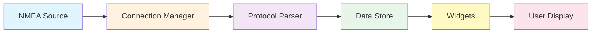
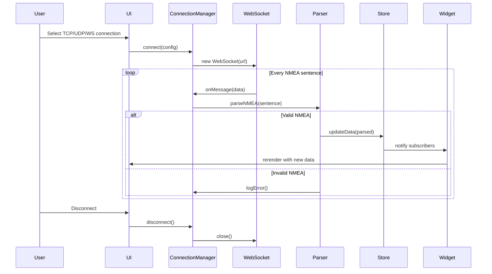
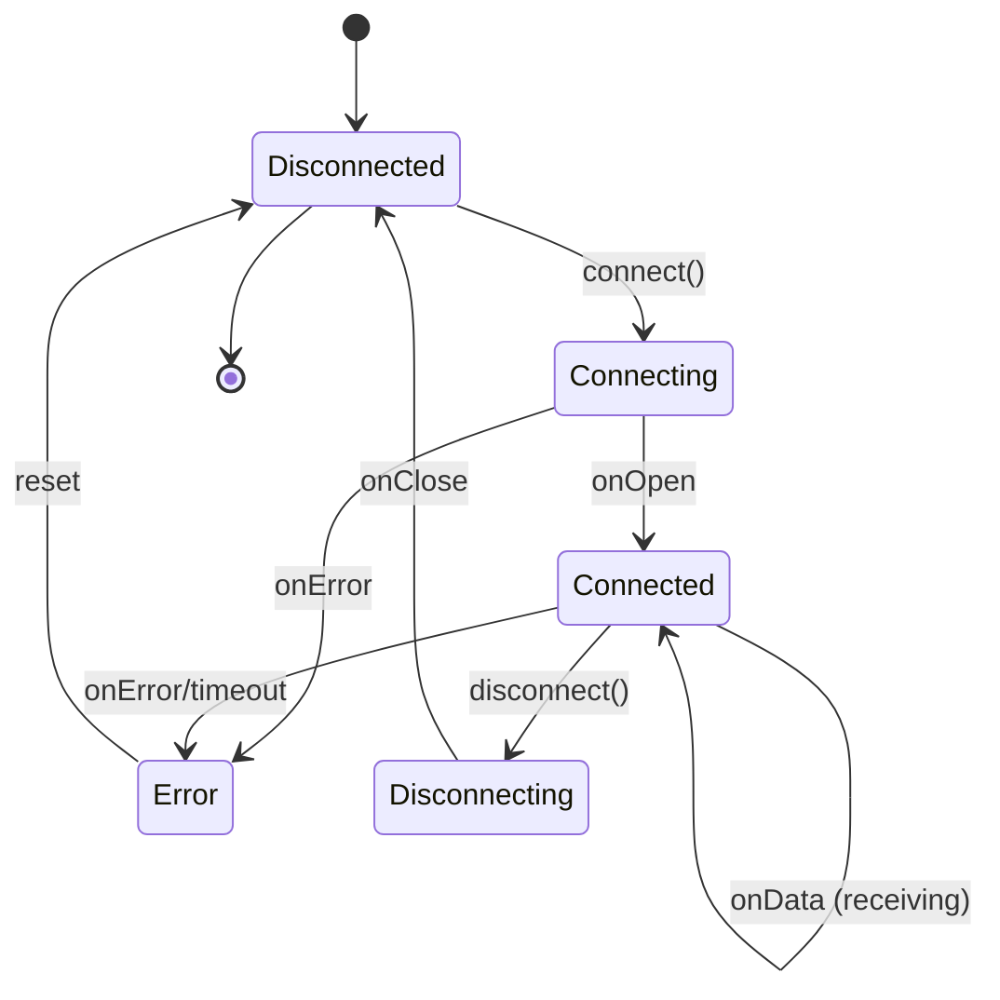
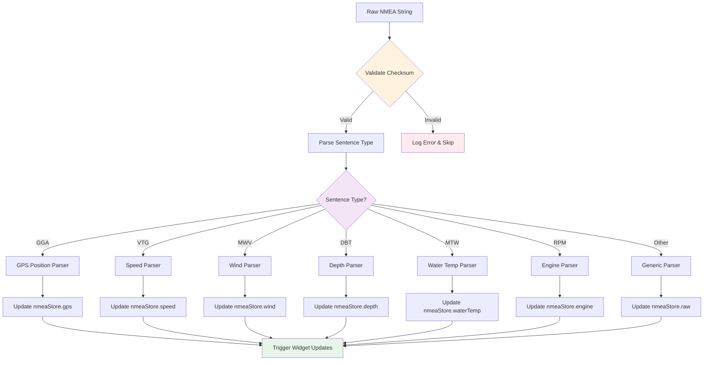
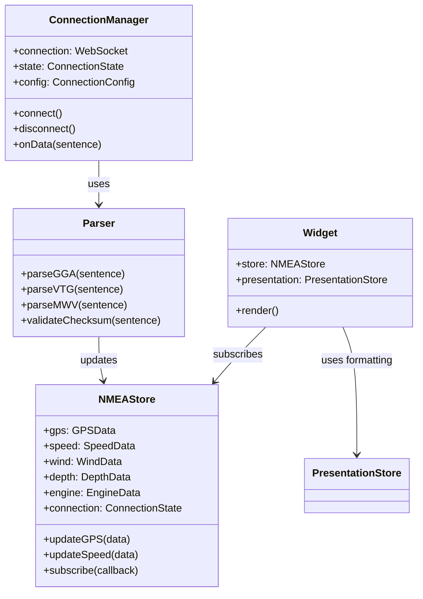
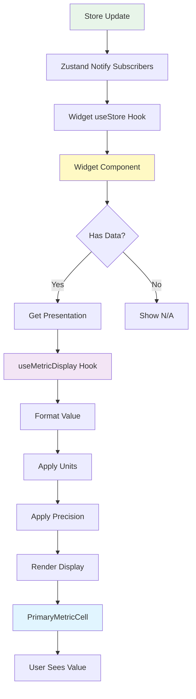
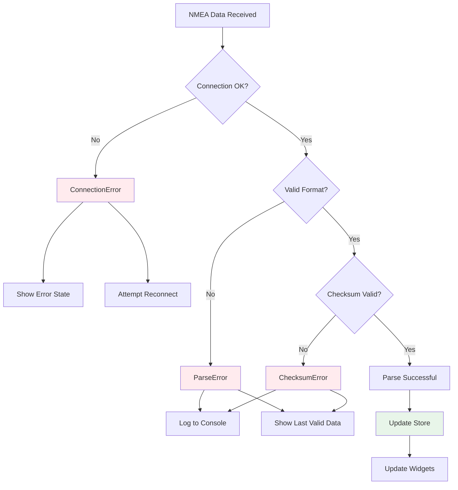
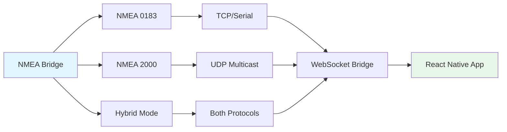

# NMEA Data Flow Architecture

This document shows how NMEA data flows through the boating instruments application.

## High-Level Data Flow



## Detailed Sequence Diagram



## Connection Manager State Machine



## Data Parsing Pipeline



## Store Architecture



## Widget Rendering Flow



## Error Handling Flow



## Protocol Support Matrix



---

## Key Files Reference

### Connection Management
- [PureConnectionManager.ts](../../boatingInstrumentsApp/src/services/nmea/connection/PureConnectionManager.ts) - Core connection logic
- [ConnectionConfigDialog.tsx](../../boatingInstrumentsApp/src/components/dialogs/ConnectionConfigDialog.tsx) - Connection UI

### Data Store
- [nmeaStore.ts](../../boatingInstrumentsApp/src/store/nmeaStore.ts) - Zustand store for NMEA data
- [presentationStore.ts](../../boatingInstrumentsApp/src/presentation/presentationStore.ts) - Unit formatting

### Parsing
- [nmea-bridge.js](../../boatingInstrumentsApp/server/nmea-bridge.js) - Server-side NMEA bridge
- [protocol-servers.js](../../boatingInstrumentsApp/server/lib/protocol-servers.js) - Protocol implementations

### Widgets
- [DepthWidget.tsx](../../boatingInstrumentsApp/src/widgets/DepthWidget.tsx) - Example widget
- [SpeedWidget.tsx](../../boatingInstrumentsApp/src/widgets/SpeedWidget.tsx) - Example widget
- [GPSWidget.tsx](../../boatingInstrumentsApp/src/widgets/GPSWidget.tsx) - Complex widget

---

## Development Notes

### Adding New NMEA Sentence Support

1. Add parser in `nmea-bridge.js` or client-side parser
2. Update `nmeaStore.ts` with new data structure
3. Create widget component
4. Add presentation format in `presentationStore.ts`

### Testing Data Flow

Use VS Code tasks to start NMEA simulator:
- **Task:** "Start NMEA Bridge: Basic Navigation"
- **Task:** "Start Full Web Development Stack (Safari)"

### Debugging Tips

Enable logging for specific subsystems:
```javascript
// In Safari/Chrome console
enableLog('nmea.gps')     // GPS parsing
enableLog('nmea.connection') // Connection events
enableLog('nmea.parser')  // All parsing
disableLog('nmea.gps')    // Turn off logging
```

---

*See also: [Memory Optimization Guide](../../MEMORY-OPTIMIZATION-GUIDE.md) for performance tips*
