# Data Models

## Core Data Entities

The app manages several key data models that flow between the NMEA service layer and UI layer:

### **NMEADataState**

**Purpose:** Real-time marine sensor data from NMEA network

**TypeScript Interface:**
```typescript
interface NMEADataState {
  // Depth data
  depth: number | null;
  depthUnit: 'feet' | 'meters' | 'fathoms';
  depthTimestamp: number | null;

  // Speed data
  speedOverGround: number | null;
  speedThroughWater: number | null;
  speedUnit: 'knots' | 'mph' | 'kmh';
  speedTimestamp: number | null;

  // Wind data
  apparentWindAngle: number | null;
  apparentWindSpeed: number | null;
  trueWindAngle: number | null;
  trueWindSpeed: number | null;
  windTimestamp: number | null;

  // Compass/GPS data
  heading: number | null;
  latitude: number | null;
  longitude: number | null;
  cog: number | null; // Course over ground
  headingTimestamp: number | null;

  // Autopilot data
  autopilotMode: 'standby' | 'auto' | 'wind' | 'track' | 'power_steer' | null;
  targetHeading: number | null;
  autopilotTimestamp: number | null;

  // Engine data (multi-engine support)
  engines: {
    [id: string]: {
      rpm: number | null;
      temperature: number | null;
      oilPressure: number | null;
      fuelRate: number | null;
      timestamp: number | null;
    };
  };

  // Actions
  updateDepth: (value: number, unit: string) => void;
  updateSpeed: (sog: number | null, stw: number | null, unit: string) => void;
  updateWind: (awa: number, aws: number, twa?: number, tws?: number) => void;
  updateHeading: (heading: number, lat?: number, lon?: number, cog?: number) => void;
  updateAutopilot: (mode: string, targetHeading?: number) => void;
  updateEngine: (engineId: string, data: Partial<EngineData>) => void;
  resetAllData: () => void;
}
```

**Relationships:**
- Updated by: NMEA Service Layer (NMEAConnection, NMEAParser)
- Consumed by: All instrument widgets via Zustand selectors
- Persisted: No (real-time data, not saved)

###  **WidgetConfig**

**Purpose:** User's dashboard layout and widget configurations

**TypeScript Interface:**
```typescript
interface WidgetConfig {
  id: string; // Unique ID (UUID)
  type: 'depth' | 'speed' | 'wind' | 'compass' | 'autopilot' | 'gps' | 'temperature' | 'voltage' | 'engine' | 'alarm';
  position: { x: number; y: number }; // Grid position (Epic 2 - drag/drop)
  size: { width: number; height: number }; // Widget dimensions
  config: {
    dataSource?: string; // For multi-sensor boats (e.g., 'port-engine')
    unit?: string; // Unit override (e.g., 'meters' instead of default 'feet')
    visualizationStyle?: 'digital' | 'analog' | 'bar'; // Widget display style
  };
}

interface WidgetStoreState {
  widgets: WidgetConfig[];
  addWidget: (type: WidgetType) => void;
  removeWidget: (id: string) => void;
  updateWidgetConfig: (id: string, config: Partial<WidgetConfig['config']>) => void;
  updateWidgetPosition: (id: string, position: { x: number; y: number }) => void;
  updateWidgetSize: (id: string, size: { width: number; height: number }) => void;
}
```

**Relationships:**
- Created by: User via widget selector modal
- Modified by: Drag-drop interface, settings panel
- Persisted: AsyncStorage (survives app restarts)

### **ConnectionState**

**Purpose:** WiFi bridge connection status and configuration

**TypeScript Interface:**
```typescript
interface ConnectionState {
  status: 'disconnected' | 'connecting' | 'connected' | 'error';
  host: string | null; // WiFi bridge IP (e.g., '192.168.1.10')
  port: number; // Default 10110
  lastConnected: number | null; // Timestamp
  errorMessage: string | null;
  reconnectAttempts: number;

  // Actions
  setStatus: (status: ConnectionStatus) => void;
  connect: (host: string, port: number) => Promise<void>;
  disconnect: () => void;
}
```

**Relationships:**
- Managed by: NMEAConnection service
- Displayed in: StatusBar component
- Persisted: Host/port saved in SecureStore

##  Core Workflows

### **NMEA Data Flow (Real-Time Streaming)**


### **Autopilot Command Flow (User Control)**

```mermaid
sequenceDiagram
    participant User
    participant Widget as Autopilot Widget
    participant Commands as Autopilot Commands Service
    participant Socket as TCP Socket
    participant Autopilot as Raymarine Autopilot

    User->>Widget: Press "+1°" button
    Widget->>Commands: adjustHeading(+1)
    Commands->>Commands: Build NMEA sentence
    Commands->>Commands: Calculate checksum
    Commands->>Socket: Send "$ECAPB,1*2D\r\n"
    Socket->>Autopilot: NMEA command
    Autopilot->>Autopilot: Execute heading change
    Autopilot->>Socket: Status update PGN
    Socket->>Widget: New heading confirmed
    Widget->>User: Visual feedback
```



---
