# High Level Architecture

## Technical Summary

The Boating Instruments App employs a **layered architecture** running entirely on-device, with a React Native presentation layer communicating through Zustand state stores to a dedicated NMEA service layer. The app connects to boat networks via WiFi bridge hardware (Digital Yacht, Actisense, etc.) using TCP sockets, parses NMEA 0183/2000 data streams in real-time, and renders marine instrument widgets with <1 second latency. This architecture achieves PRD goals by enabling cross-platform deployment (iOS, Android, Windows, macOS) from a single TypeScript codebase while maintaining the reliability and performance standards of physical marine instruments through robust connection management, efficient state synchronization, and platform-native rendering.

## Platform and Infrastructure Choice

Given this is a **client-side mobile/desktop application** with no cloud backend (all processing happens on-device), the infrastructure approach differs from typical web applications:

**Platform:** On-Device Native Application (React Native)

**Key Services:**
- **Development Platform:** Expo (SDK 51+) for build tooling and OTA updates
- **Build Services:** EAS (Expo Application Services) for iOS/Android/Windows/macOS builds
- **Distribution:** App Store (iOS), Google Play (Android), Microsoft Store (Windows), Mac App Store
- **Crash Reporting:** Sentry React Native SDK
- **Local Storage:** Expo SecureStore (credentials) + AsyncStorage (settings/layouts)

**Deployment Host and Regions:**
- **No Server Infrastructure Required** - App runs entirely locally on user devices
- **No Geographic Regions** - Users download from app stores based on their location
- **Future Consideration:** If cloud sync or telemetry added, consider AWS/GCP with global CDN

**Why This Approach:**
- **Privacy & Reliability:** Boat data never leaves device; works completely offline
- **Latency:** No network round-trips means <1s NMEA data → UI updates
- **Cost:** Zero ongoing hosting costs; one-time development investment only
- **Marine Environment:** Boats often have unreliable internet connectivity

## Repository Structure

**Structure:** Monorepo (single repository containing all platform targets)

**Monorepo Tool:** None required (simple Expo project structure suffices for this app's scope)

**Package Organization:**
- Single `package.json` at root with all dependencies
- Platform-specific code uses file suffixes (`.ios.tsx`, `.android.tsx`, `.windows.tsx`, `.macos.tsx`)
- Shared code in `src/` directory with no platform qualifiers
- ~95% code sharing across all platforms

**Rationale for Simple Structure:**
- App is relatively small (~50k LOC estimated)
- No separate backend microservices requiring workspace management
- Platform differences minimal (mostly TCP socket implementations and UI tweaks)
- Expo's Metro bundler handles platform-specific imports automatically

## High Level Architecture Diagram

```mermaid
graph TB
    User[👤 User - Sailor/Boater]

    subgraph Device["User's Device (Phone/Tablet/Desktop)"]
        UI[React Native UI Layer]
        State[Zustand State Stores]
        NMEA[NMEA Service Layer]
        Storage[(Local Storage)]

        UI <-->|Subscribe/Dispatch| State
        State <-->|Update/Query| NMEA
        State <-->|Persist| Storage
        NMEA -->|Parse & Validate| State
    end

    Bridge[WiFi Bridge Hardware<br/>Digital Yacht WLN10<br/>Actisense W2K-1]
    Boat[Boat NMEA Network<br/>Sensors & Autopilot]

    User -->|Interact| UI
    NMEA <-->|TCP Socket<br/>Port 10110| Bridge
    Bridge <-->|NMEA 0183/2000| Boat

    style UI fill:#0284C7,color:#fff
    style NMEA fill:#0EA5E9,color:#fff
    style State fill:#06B6D4,color:#fff
    style Bridge fill:#F59E0B,color:#fff
    style Boat fill:#10B981,color:#fff
```

## Architectural Patterns

- **Layered Architecture:** Clear separation between UI (presentation), business logic (state management), and data access (NMEA service) layers - _Rationale:_ Enables independent testing and future refactoring; React Native developers familiar with this pattern

- **Service Layer Pattern:** NMEA connection, parsing, and command encoding isolated in dedicated service classes - _Rationale:_ Abstracts TCP socket complexity from UI; allows mocking for testing without hardware

- **Observer Pattern (via Zustand):** Widgets subscribe to specific NMEA data slices and re-render only when their data changes - _Rationale:_ Critical for performance with 10+ widgets updating simultaneously from 500 msg/sec stream

- **Repository Pattern:** Settings and widget configurations accessed through storage abstraction layer - _Rationale:_ Enables platform-specific storage implementations (iOS UserDefaults vs Android SharedPreferences) behind unified interface

- **Command Pattern:** Autopilot commands (heading adjust, tack, gybe) encapsulated as objects with execute() methods - _Rationale:_ Enables queuing, retry logic, and undo functionality for safety-critical operations

- **Singleton Pattern:** Single NMEAConnection instance shared across app - _Rationale:_ Only one TCP connection allowed per WiFi bridge; prevents duplicate connections

- **Strategy Pattern:** NMEA parser swaps between 0183 and 2000 parsers based on message format - _Rationale:_ Supports multiple NMEA versions without conditionals scattered throughout codebase

---
