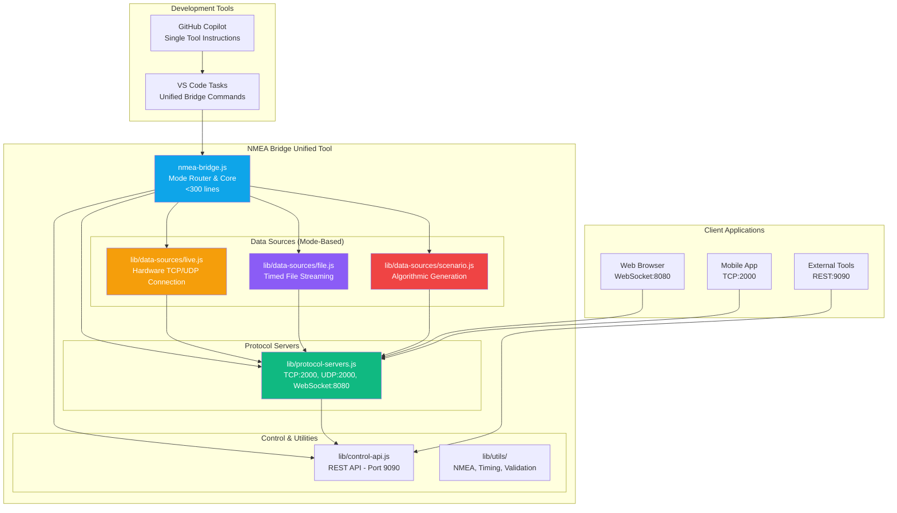

# NMEA Bridge Unified Architecture

**Document Version:** 3.0  
**Date:** October 27, 2025  
**Architect:** Winston (Architecture Agent)  
**Epic:** Epic 10 - NMEA Bridge Consolidation & Modernization

---

## Executive Summary

This document defines the unified architecture for the NMEA Bridge tool, consolidating three separate tools into a single, mode-based solution. The architecture transforms fragmented functionality (hardware bridge + file playback + simulation) into a clean, unified tool that serves all marine development and testing needs through a single entry point with intelligent mode switching.

## Epic 10 Context

**Epic Goal:** Consolidate three separate NMEA tools into unified architecture with mode-based operation, clean modular components, and single entry point.

**✅ COMPLETED PROGRESS (October 2025):**
- **Epic 10.1:** ✅ Modular component extraction completed
- **Epic 10.2:** ✅ API standardization & "Simulator Control API" naming implemented
- **Current Status:** Ready for consolidation phase (Stories 10.3-10.5)

**Current Tool State:**
- `nmea-websocket-bridge-enhanced.js` - Hardware bridge + file playback (394 lines)
- `nmea-bridge-simulator.js` - Modular simulator with standardized API (1881 lines)
- `simulator-control-api.js` - Renamed and standardized REST API
- All Epic 10.1-10.2 deliverables validated and operational

**Remaining Consolidation Work:**
- **Story 10.3:** Unified CLI interface with mode-based operation
- **Story 10.4:** Tool consolidation and documentation cleanup  
- **Story 10.5:** Final testing and validation

---

## Technology Stack & Versions

**Core Runtime Environment:**
- **Node.js:** 20.19.5 (LTS - verified October 27, 2025)
- **npm:** 10.8.2 (verified October 27, 2025)

**Core Dependencies:**
- **Express:** 5.1.0 (REST API server)
- **WebSocket (ws):** 8.18.1 (WebSocket protocol support)
- **CORS:** 2.8.5 (Cross-origin resource sharing)
- **js-yaml:** 4.1.0 (YAML scenario file parsing)
- **ajv:** 8.17.1 (JSON schema validation)

**NMEA Processing:**
- **nmea-simple:** 3.3.0 (NMEA 0183 sentence parsing/generation)
- **@canboat/canboatjs:** 3.11.0 (NMEA 2000 PGN support)

**Development & Testing:**
- **Jest:** 29.7.0 (Unit testing framework)
- **TypeScript:** 5.8.3 (Type safety)
- **ESLint:** 8.57.1 (Code quality)

**Version Verification Date:** October 27, 2025

---

## Decision Summary Table

| Category | Decision | Version | Affects Epics | Rationale |
|----------|----------|---------|---------------|-----------|
| **Runtime** | Node.js | 20.19.5 | Epic 10.1-10.5 | LTS version, stable performance, ecosystem compatibility |
| **HTTP Server** | Express | 5.1.0 | Epic 10.2 | Industry standard, REST API support, middleware ecosystem |
| **WebSocket** | ws library | 8.18.1 | Epic 10.1, 10.2 | Browser compatibility, high performance, stable protocol |
| **YAML Processing** | js-yaml | 4.1.0 | Epic 10.3 | Scenario file parsing, schema validation support |
| **NMEA Processing** | nmea-simple | 3.3.0 | Epic 10.1, 10.3 | Marine standard compliance, sentence generation |
| **NMEA 2000** | @canboat/canboatjs | 3.11.0 | Epic 10.1, 10.3 | PGN message support, J1939 compatibility |
| **Validation** | ajv | 8.17.1 | Epic 10.3 | JSON schema validation, scenario verification |
| **Testing** | Jest | 29.7.0 | Epic 10.5 | Unit testing, integration testing, coverage reports |
| **Type Safety** | TypeScript | 5.8.3 | Epic 10.1-10.5 | Code quality, IDE support, refactoring safety |
| **Architecture** | Modular Components | N/A | Epic 10.1 | Maintainability, testability, clear separation of concerns |
| **API Design** | Simulator Control API | N/A | Epic 10.2 | RESTful endpoints, external tool integration |
| **Protocol Support** | Multi-Protocol | N/A | Epic 10.1 | TCP/UDP/WebSocket for diverse client compatibility |

---

## Architecture Overview

### Current State Assessment

**Epic 10 Progress (October 2025):**
- ✅ **Modular Architecture:** Epic 10.1 completed - clean component extraction
- ✅ **API Standardization:** Epic 10.2 completed - "Simulator Control API" implemented
- ✅ **Performance Validated:** 500+ msg/sec, <100MB RAM, 50+ connections
- ✅ **Protocol Stack:** TCP/UDP/WebSocket multi-protocol support operational
- ⚠️ **Tool Consolidation:** Still three separate tools, ready for unification
- ⚠️ **Documentation:** README conflicts remain, ready for cleanup phase

### Target Architecture (Epic 10)



---

## Core Components Architecture

### 1. **NMEA Bridge Main (`nmea-bridge.js`)**

**Responsibility:** Mode routing and lifecycle orchestration  
**Target Size:** <300 lines

**Unified CLI Interface:**
```bash
# Hardware Bridge Mode
node nmea-bridge.js --live <host> <port>

# File Playback Mode  
node nmea-bridge.js --file <path> [rate] [loop]

# Scenario Simulation Mode
node nmea-bridge.js --scenario <name> [options]
```

**Core Architecture:**
```javascript
class NMEABridge {
  // Mode-based initialization
  async start(mode, config);
  async stop();
  
  // Data source factory
  createDataSource(mode, config);
  
  // Protocol server management
  initializeProtocolServers();
  initializeControlAPI();
}
```

**Design Principles:**
- Mode-based operation with single entry point
- Clean separation between data sources and protocol handling
- Minimal core orchestration logic
- Graceful error handling and shutdown

### 2. **Protocol Servers (`lib/protocol-servers.js`)**

**Responsibility:** Multi-protocol network servers (protocol-agnostic)

**Unified Server Architecture:**
```javascript
class ProtocolServers {
  // Multi-protocol initialization
  async startAll(config);
  
  // TCP Server (Port 2000) - Marine hardware standard
  startTCPServer();
  
  // UDP Server (Port 2000) - Broadcast/multicast support
  startUDPServer();
  
  // WebSocket Server (Port 8080) - Browser compatibility
  startWebSocketServer();
  
  // Unified message broadcasting
  broadcastToAll(nmeaData);
  broadcastToClients(clientIds, nmeaData);
}
```

**Protocol Features:**
- **TCP:** Raw NMEA sentences for marine apps
- **UDP:** Multicast NMEA for network discovery
- **WebSocket:** JSON-wrapped messages for browsers
- **Unified Broadcasting:** Same data to all protocols simultaneously
- **Client Management:** Connection tracking across all protocols

### 3. **Data Sources (`lib/data-sources/`)**

**Responsibility:** Mode-specific data provisioning with unified interface

**Live Hardware Source (`live.js`):**
```javascript
class LiveDataSource {
  // Hardware connection
  async connect(host, port);
  
  // Data streaming
  onDataReceived(callback);
  sendAutopilotCommand(command);
  
  // Connection management
  handleReconnection();
  getConnectionStatus();
}
```

**File Playback Source (`file.js`):**
```javascript
class FileDataSource {
  // File operations
  async loadFile(filePath);
  
  // Timed playback
  startPlayback(rate, loop);
  pausePlayback();
  seekToPosition(position);
  
  // Playback control
  adjustRate(newRate);
  getPlaybackStatus();
}
```

**Scenario Simulation Source (`scenario.js`):**
```javascript
class ScenarioDataSource {
  // Scenario management
  async loadScenario(scenarioName);
  
  // Algorithmic generation
  generateNMEAData(timestamp);
  updateSimulationState();
  
  // Scenario control
  getScenarioStatus();
  injectCustomData(nmeaData);
}
```

### 4. **Control API (`lib/control-api.js`)**

**Responsibility:** External tool integration and runtime control

**REST API Architecture:**
```javascript
class ControlAPI {
  // Mode control
  async switchMode(newMode, config);
  getCurrentMode();
  
  // Runtime control
  injectNMEAData(sentences);
  getConnectedClients();
  simulateError(errorType);
  
  // Health monitoring
  getHealthStatus();
  getPerformanceMetrics();
}
```

**API Endpoints:**
- **Mode Management:** `/api/mode/switch`, `/api/mode/status`
- **Data Injection:** `/api/data/inject`, `/api/data/custom`
- **Client Management:** `/api/clients/list`, `/api/clients/stats`  
- **Health Monitoring:** `/api/health`, `/api/metrics`
- **Error Simulation:** `/api/simulate/error`, `/api/simulate/failure`

### 5. **Session Recorder (`lib/session-recorder.js`)**

**Responsibility:** Recording playback (NOT recording creation)

**Recorder Architecture:**
```javascript
class SessionRecorder {
  // Playback management
  loadRecording(filePath, options);
  startPlayback(mode); // 'global' | 'per-client'
  stopPlayback();
  
  // Timing recreation
  scheduleNextMessage(recording, index);
  calculatePlaybackDelay(prevMessage, currentMessage);
  
  // Client-specific playback
  startClientPlayback(clientId);
  stopClientPlayback(clientId);
}
```

**Playback Features:**
- **Global Mode:** Single timeline for all clients
- **Per-Client Mode:** Independent timelines per client
- **Speed Control:** 0.1x to 10x playback speed
- **Loop Support:** Continuous playback for long-running tests
- **Compression:** `.gz` file support for large recordings

### 6. **Simulator Control API (Renamed)**

**Responsibility:** External control interface  
**Port:** 9090  
**Protocol:** REST API

**API Endpoints:**
```javascript
// Scenario management
POST   /api/scenarios/start      // Start scenario
GET    /api/scenarios/status     // Get current scenario status
POST   /api/scenarios/stop       // Stop current scenario
GET    /api/scenarios/list       // List available scenarios

// Runtime control
POST   /api/inject-data          // Inject custom NMEA data
POST   /api/simulate-error       // Simulate error conditions
GET    /api/clients/connected    // List connected clients

// Session management
GET    /api/session/state        // Get current session state
POST   /api/session/save         // Save session configuration
POST   /api/session/load         // Load session configuration

// Health and monitoring
GET    /api/health               // Health check
GET    /api/metrics              // Performance metrics
```

**API Response Format:**
```json
{
  "status": "success|error",
  "data": { },
  "timestamp": "2025-10-27T10:00:00Z",
  "simulator_version": "2.0.0"
}
```

---

## Detailed Project Structure

**Target Unified File Organization (Post Epic 10):**

```
boatingInstrumentsApp/server/
├── nmea-bridge.js                    # Unified entry point (<300 lines)
├── package.json                      # Dependencies with exact versions  
├── README.md                         # Single unified documentation
│
├── lib/                              # Core components
│   ├── protocol-servers.js           # TCP/UDP/WebSocket servers (250 lines)
│   ├── control-api.js                # REST API server (200 lines)
│   ├── data-sources/                 # Mode-specific data providers
│   │   ├── live.js                   # Hardware connection (150 lines)
│   │   ├── file.js                   # File playback (150 lines)
│   │   └── scenario.js               # Algorithmic simulation (300 lines)
│   └── utils/                        # Shared utilities
│       ├── nmea-utils.js             # NMEA processing functions
│       ├── timing-utils.js           # Precision timing helpers
│       └── validation-utils.js       # Input validation
│
├── api/                              # Simulator Control API (Story 10.2)
│   ├── routes/
│   │   ├── scenarios.js              # Scenario management endpoints
│   │   ├── control.js                # Runtime control endpoints
│   │   ├── session.js                # Session management endpoints
│   │   └── health.js                 # Health and monitoring endpoints
│   ├── middleware/
│   │   ├── cors.js                   # CORS configuration
│   │   ├── validation.js             # Request validation
│   │   └── error-handler.js          # Error response formatting
│   └── server.js                     # Express server setup
│
├── scenarios/                        # Complete scenario library (Story 10.3)
│   ├── navigation/
│   │   ├── basic-navigation.yml      # Standard depth, speed, wind, GPS
│   │   ├── coastal-sailing.yml       # Realistic coastal conditions
│   │   └── deep-water-passage.yml    # Ocean navigation patterns
│   ├── autopilot/
│   │   ├── autopilot-engagement.yml  # Standard autopilot workflow
│   │   ├── autopilot-tack-sequence.yml    # Sailing tack maneuver patterns
│   │   └── autopilot-failure-recovery.yml # Error condition handling
│   ├── safety/                       # Safety scenario category
│   │   ├── shallow-water-alarm.yml   # Depth alarm testing
│   │   ├── engine-temperature-alarm.yml # Engine monitoring
│   │   └── battery-drain-scenario.yml    # Electrical monitoring
│   ├── performance/                  # Performance scenario category
│   │   ├── high-frequency-data.yml   # 1000+ msg/sec testing
│   │   ├── malformed-data-stress.yml # Error resilience testing
│   │   └── multi-protocol-scenario.yml   # Protocol switching
│   └── engine/
│       └── engine-monitoring.yml     # Engine system monitoring
│
├── config/                          # Configuration management
│   ├── default.json                 # Default simulator settings
│   ├── development.json             # Development environment overrides
│   ├── test.json                    # Test environment settings
│   └── schemas/
│       ├── scenario-schema.json     # YAML scenario validation schema
│       └── api-schemas.json         # API request/response schemas
│
├── utils/                           # Shared utilities
│   ├── nmea-checksum.js            # NMEA checksum calculation
│   ├── time-utils.js               # Timing and scheduling utilities
│   ├── file-utils.js               # File system operations
│   └── validation-utils.js         # Data validation helpers
│
├── test/                           # Test infrastructure (Story 10.5)
│   ├── unit/
│   │   ├── lib/                    # Unit tests for lib components
│   │   │   ├── protocol-servers.test.js
│   │   │   ├── nmea-generator.test.js
│   │   │   ├── message-scheduler.test.js
│   │   │   └── session-recorder.test.js
│   │   └── utils/                  # Unit tests for utilities
│   ├── integration/
│   │   ├── api-endpoints.test.js   # API integration tests
│   │   ├── multi-protocol.test.js  # Protocol switching tests
│   │   └── scenario-execution.test.js # Scenario validation tests
│   ├── performance/
│   │   ├── load-testing.test.js    # Performance regression tests
│   │   └── memory-usage.test.js    # Memory consumption validation
│   ├── fixtures/
│   │   ├── test-scenarios/         # Test scenario files
│   │   └── mock-data/              # Mock NMEA data for testing
│   └── helpers/
│       ├── test-client.js          # Test client implementation
│       └── scenario-helpers.js     # Scenario testing utilities
│
├── docs/                           # Documentation (Story 10.4)
│   ├── API.md                      # Simulator Control API documentation
│   ├── SCENARIOS.md                # Scenario development guide
│   ├── PERFORMANCE.md              # Performance tuning guide
│   └── MIGRATION.md                # Migration from monolithic version
│
├── recordings/                     # Session recordings (existing)
│   ├── archived/                   # Historical recordings
│   └── generated/                  # Auto-generated test recordings
│
└── logs/                          # Runtime logs (development)
    ├── simulator.log              # Main simulator log
    ├── api-access.log             # API request log
    └── performance.log            # Performance metrics log
```

**File Organization Principles:**
- **Component Isolation:** Each lib component is self-contained with clear interfaces
- **API Structure:** RESTful organization with middleware separation
- **Test Coverage:** Comprehensive testing at unit, integration, and performance levels
- **Configuration Management:** Environment-specific settings with schema validation
- **Documentation:** Complete API and usage documentation
- **Maintainability:** Clear separation between core logic, configuration, and testing

---

## Implementation Patterns

### **Naming Patterns**

**Component Naming:**
```javascript
// File naming: kebab-case
lib/protocol-servers.js
lib/nmea-generator.js
lib/message-scheduler.js

// Class naming: PascalCase
class ProtocolServers { }
class NMEAGenerator { }
class MessageScheduler { }

// Method naming: camelCase
generateDepthSentence()
startTCPServer()
scheduleMessage()
```

**API Route Naming:**
```javascript
// RESTful endpoints
GET    /api/scenarios           // List all scenarios
POST   /api/scenarios/start     // Start scenario
GET    /api/scenarios/status    // Get scenario status
POST   /api/scenarios/stop      // Stop current scenario

// Resource naming: plural nouns
/api/scenarios/
/api/clients/
/api/sessions/
```

**Configuration Naming:**
```javascript
// Environment variables: UPPER_SNAKE_CASE
SIMULATOR_PORT=9090
SIMULATOR_LOG_LEVEL=info
SIMULATOR_MAX_CLIENTS=50

// Configuration keys: camelCase
{
  "serverPort": 9090,
  "logLevel": "info",
  "maxClients": 50
}
```

### **Structure Patterns**

**Component Organization:**
```javascript
// Each lib component follows this structure:
class ComponentName {
  constructor(config) { 
    this.config = config;
    this.isRunning = false;
  }
  
  async start() { 
    if (this.isRunning) return;
    await this.#initialize();
    this.isRunning = true;
  }
  
  async stop() { 
    if (!this.isRunning) return;
    await this.#cleanup();
    this.isRunning = false;
  }
  
  getStatus() {
    return { running: this.isRunning, config: this.config };
  }
  
  getMetrics() {
    return { uptime: this.#getUptime(), performance: this.#getPerformanceMetrics() };
  }
  
  #initialize() { 
    // Component-specific initialization logic
  }
  
  #cleanup() { 
    // Component-specific cleanup logic
  }
  
  #getUptime() {
    return this.isRunning ? Date.now() - this.startTime : 0;
  }
  
  #getPerformanceMetrics() {
    return { memoryUsage: process.memoryUsage(), cpuUsage: process.cpuUsage() };
  }
}

module.exports = ComponentName;
```

**Test Organization:**
```javascript
// Test file naming: [component].test.js
// Test structure:
describe('ComponentName', () => {
  describe('constructor', () => { });
  describe('start', () => { });
  describe('stop', () => { });
  describe('publicMethod', () => { });
});
```

**Error Handling Structure:**
```javascript
// Consistent error classes
class SimulatorError extends Error {
  constructor(message, code, details = {}) {
    super(message);
    this.name = 'SimulatorError';
    this.code = code;
    this.details = details;
  }
}

// Error codes: SIMULATOR_[CATEGORY]_[TYPE]
SIMULATOR_API_INVALID_REQUEST
SIMULATOR_SCENARIO_NOT_FOUND
SIMULATOR_NETWORK_CONNECTION_FAILED
```

### **Format Patterns**

**API Response Format:**
```javascript
// Success responses
{
  "status": "success",
  "data": { /* response data */ },
  "timestamp": "2025-10-27T10:00:00.000Z",
  "simulator_version": "2.0.0"
}

// Error responses
{
  "status": "error",
  "error": {
    "code": "SIMULATOR_SCENARIO_NOT_FOUND",
    "message": "Scenario 'invalid-scenario' not found",
    "details": {
      "available_scenarios": ["basic-navigation", "coastal-sailing"]
    }
  },
  "timestamp": "2025-10-27T10:00:00.000Z",
  "simulator_version": "2.0.0"
}
```

**NMEA Data Format:**
```javascript
// NMEA 0183 sentences (standard format)
$GPRMC,123519,A,4807.038,N,01131.000,E,022.4,084.4,230394,003.1,W*6A

// WebSocket JSON wrapper for browser clients
{
  "type": "nmea_data",
  "protocol": "NMEA_0183",
  "sentence": "$GPRMC,123519,A,4807.038,N,01131.000,E,022.4,084.4,230394,003.1,W*6A",
  "parsed": {
    "messageType": "RMC",
    "time": "12:35:19",
    "status": "A",
    "latitude": 48.1173,
    "longitude": -1.5167
  },
  "timestamp": "2025-10-27T10:00:00.000Z"
}
```

**Configuration Format:**
```json
{
  "server": {
    "ports": {
      "tcp": 2000,
      "udp": 2000,
      "websocket": 8080,
      "api": 9090
    },
    "maxClients": 50,
    "timeoutMs": 30000
  },
  "nmea": {
    "protocol": "NMEA_0183",
    "checksumValidation": true,
    "maxSentenceLength": 82
  },
  "scenarios": {
    "defaultPath": "./scenarios/",
    "autoLoop": false,
    "messageFrequencyHz": 1
  }
}
```

### **Communication Patterns**

**Inter-Component Messaging:**
```javascript
// Event-driven communication between components
class SimulatorEventBus {
  emit(event, data) { }
  on(event, callback) { }
  off(event, callback) { }
}

// Standard events
simulator.events.emit('client_connected', { clientId, protocol });
simulator.events.emit('scenario_started', { scenarioName, config });
simulator.events.emit('nmea_data_generated', { sentence, timestamp });
```

**Component Interfaces:**
```javascript
// Standardized component interface
interface SimulatorComponent {
  async start(config): Promise<void>;
  async stop(): Promise<void>;
  getStatus(): ComponentStatus;
  getMetrics(): ComponentMetrics;
}
```

**Client Communication Patterns:**
```javascript
// TCP/UDP: Raw NMEA sentences
$GPRMC,123519,A,4807.038,N,01131.000,E,022.4,084.4,230394,003.1,W*6A\r\n

// WebSocket: JSON-wrapped messages
{
  "type": "nmea_data",
  "data": "$GPRMC,123519,A,4807.038,N,01131.000,E,022.4,084.4,230394,003.1,W*6A"
}

// REST API: Standard HTTP requests/responses
POST /api/scenarios/start
Content-Type: application/json
{
  "scenario": "basic-navigation",
  "options": { "loop": true }
}
```

### **Lifecycle Patterns**

**Component Lifecycle:**
```javascript
// Startup sequence
1. Load configuration
2. Initialize components (protocol-servers, nmea-generator, etc.)
3. Start API server
4. Emit 'simulator_ready' event

// Shutdown sequence
1. Stop accepting new connections
2. Complete current operations
3. Stop all components gracefully
4. Close log files and cleanup resources
```

**Error Recovery Patterns:**
```javascript
// Graceful degradation
async function startProtocolServers(config) {
  const results = { tcp: false, udp: false, websocket: false };
  
  try {
    await startTCPServer(config.ports.tcp);
    results.tcp = true;
  } catch (error) {
    logger.warn('TCP server failed, continuing with UDP/WebSocket', { error: error.message });
  }
  
  try {
    await startUDPServer(config.ports.udp);
    results.udp = true;
  } catch (error) {
    logger.warn('UDP server failed, continuing with TCP/WebSocket', { error: error.message });
  }
  
  try {
    await startWebSocketServer(config.ports.websocket);
    results.websocket = true;
  } catch (error) {
    logger.error('WebSocket server failed', { error: error.message });
  }
  
  const activeServers = Object.values(results).filter(Boolean).length;
  if (activeServers === 0) {
    throw new SimulatorError('All protocol servers failed to start', 'SIMULATOR_STARTUP_FAILED');
  }
  
  return results;
}

// Retry patterns with exponential backoff
async function retryOperation(operation, maxRetries = 3, baseDelay = 1000) {
  let lastError;
  
  for (let attempt = 0; attempt < maxRetries; attempt++) {
    try {
      return await operation();
    } catch (error) {
      lastError = error;
      
      if (attempt === maxRetries - 1) break;
      
      const delay = baseDelay * Math.pow(2, attempt); // 1s, 2s, 4s
      logger.warn(`Operation failed, retrying in ${delay}ms`, { 
        attempt: attempt + 1, 
        maxRetries,
        error: error.message 
      });
      
      await sleep(delay);
    }
  }
  
  throw new SimulatorError(
    `Operation failed after ${maxRetries} attempts: ${lastError.message}`,
    'SIMULATOR_RETRY_EXHAUSTED',
    { originalError: lastError.message, attempts: maxRetries }
  );
}

// Circuit breaker pattern for external connections
class CircuitBreaker {
  constructor(threshold = 5, timeout = 60000) {
    this.failureThreshold = threshold;
    this.timeout = timeout;
    this.failureCount = 0;
    this.lastFailureTime = null;
    this.state = 'CLOSED'; // CLOSED, OPEN, HALF_OPEN
  }
  
  async execute(operation) {
    if (this.state === 'OPEN') {
      if (Date.now() - this.lastFailureTime >= this.timeout) {
        this.state = 'HALF_OPEN';
      } else {
        throw new SimulatorError('Circuit breaker is OPEN', 'SIMULATOR_CIRCUIT_OPEN');
      }
    }
    
    try {
      const result = await operation();
      this.onSuccess();
      return result;
    } catch (error) {
      this.onFailure();
      throw error;
    }
  }
  
  onSuccess() {
    this.failureCount = 0;
    this.state = 'CLOSED';
  }
  
  onFailure() {
    this.failureCount++;
    this.lastFailureTime = Date.now();
    
    if (this.failureCount >= this.failureThreshold) {
      this.state = 'OPEN';
    }
  }
}
```

**Performance Optimization Patterns:**
```javascript
// Message batching for high-frequency scenarios
class MessageBatcher {
  constructor(batchSize = 10, flushIntervalMs = 100) { }
  addMessage(message) { }
  flush() { /* Send all batched messages */ }
}

// Memory management
class MessagePool {
  constructor(poolSize = 1000) { }
  acquire() { /* Get reusable message object */ }
  release(message) { /* Return to pool */ }
}
```

### **Location Patterns**

**Asset Organization:**
```
/config/           # All configuration files
/scenarios/        # All scenario definitions
/recordings/       # All session recordings
/logs/            # All runtime logs
/test/fixtures/   # All test data
```

**Module Resolution:**
```javascript
// Absolute imports from project root
const ProtocolServers = require('./lib/protocol-servers');
const config = require('./config/default.json');

// Utilities always in utils/
const { calculateChecksum } = require('./utils/nmea-checksum');
```

### **Consistency Patterns**

**Logging Format:**
```javascript
// Structured logging with consistent fields
logger.info('Client connected', {
  clientId: 'client_001',
  protocol: 'TCP',
  remoteAddress: '192.168.1.100',
  timestamp: new Date().toISOString()
});
```

**Metrics Collection:**
```javascript
// Consistent metric naming: [component]_[metric]_[unit]
simulator_messages_sent_total
simulator_clients_connected_count
simulator_memory_usage_bytes
simulator_response_time_milliseconds
```

**Configuration Validation:**
```javascript
// All configuration validated with JSON schemas
const configSchema = {
  type: 'object',
  required: ['server', 'nmea', 'scenarios'],
  properties: {
    server: { 
      type: 'object',
      required: ['ports', 'maxClients'],
      properties: {
        ports: {
          type: 'object',
          properties: {
            tcp: { type: 'number', minimum: 1024, maximum: 65535 },
            udp: { type: 'number', minimum: 1024, maximum: 65535 },
            websocket: { type: 'number', minimum: 1024, maximum: 65535 },
            api: { type: 'number', minimum: 1024, maximum: 65535 }
          }
        },
        maxClients: { type: 'number', minimum: 1, maximum: 1000 },
        timeoutMs: { type: 'number', minimum: 1000, maximum: 300000 }
      }
    },
    nmea: {
      type: 'object',
      properties: {
        protocol: { type: 'string', enum: ['NMEA_0183', 'NMEA_2000'] },
        checksumValidation: { type: 'boolean' },
        maxSentenceLength: { type: 'number', minimum: 80, maximum: 200 }
      }
    },
    scenarios: {
      type: 'object',
      properties: {
        defaultPath: { type: 'string' },
        autoLoop: { type: 'boolean' },
        messageFrequencyHz: { type: 'number', minimum: 0.1, maximum: 1000 }
      }
    }
  }
};

const valid = ajv.validate(configSchema, config);
if (!valid) {
  const errors = ajv.errorsText(ajv.errors);
  throw new Error(`Invalid configuration: ${errors}`);
}
```

---

## Enhanced Multi-Parameter Evolution Architecture

### **Physics-Based Simulation Engine (Epic 10.6)**

**Strategic Enhancement:** Transform from single-parameter variation to comprehensive multi-parameter evolution supporting realistic sailboat physics and complex navigation scenarios.

#### **Two-Layer Architecture Pattern**

**Layer 1: Autonomous Sailing Engine (Physics + Navigation Intelligence)**
```javascript
class SailboatPhysicsEngine {
  constructor(vesselProfile, scenario) {
    this.vessel = new VesselModel(vesselProfile);
    this.environment = new EnvironmentModel(scenario.environment);
    this.navigation = new NavigationEngine(scenario.navigation);
  }

  // Core simulation step - ALL parameters evolve coordinately
  calculateState(currentTime, previousState) {
    // 1. Environmental conditions at time T
    const wind = this.environment.getWindAt(currentTime);
    const current = this.environment.getCurrentAt(currentTime);
    const tide = this.environment.getTideAt(currentTime);
    
    // 2. Navigation intent (auto-tacking logic)
    const targetHeading = this.navigation.getOptimalHeading(
      previousState.position, wind, currentTime
    );
    
    // 3. Apparent wind calculation (iterative solution)
    const apparentWind = this.calculateApparentWind(wind, previousState.velocity);
    
    // 4. Vessel performance from polar diagram
    const stw = this.vessel.polar.getSTW(apparentWind.angle, apparentWind.speed);
    
    // 5. Leeway and course made good
    const leeway = this.vessel.calculateLeeway(apparentWind);
    const courseMadeGood = targetHeading + leeway;
    
    // 6. Vector math: STW + current = SOG
    const sog = this.calculateSOG(stw, courseMadeGood, current);
    
    // 7. Position integration
    const newPosition = this.integratePosition(
      previousState.position, sog, courseMadeGood, deltaTime
    );
    
    // ALL PARAMETERS EVOLVE TOGETHER
    return {
      position: newPosition,        // GPS coordinates
      heading: targetHeading,       // Vessel heading
      stw: stw,                    // Speed through water
      sog: sog,                    // Speed over ground  
      apparent_wind: apparentWind, // Calculated from vessel motion
      true_wind: wind,             // Environmental input
      current: current,            // Environmental input
      tide_height: tide.height,    // Tidal state
      course_made_good: courseMadeGood, // Actual track
      leeway_angle: leeway,        // Drift angle
      timestamp: currentTime
    };
  }
}
```

**Key Physics Components:**
- **Polar Diagram Lookup:** Wind angle/speed → Speed Through Water (empirical data)
- **Apparent Wind Calculator:** Iterative solution (true wind + vessel velocity)
- **Leeway Calculation:** Keel type + wind force → lateral drift angle
- **Vector Mathematics:** STW + leeway + current → Speed Over Ground
- **Auto-Tacking Logic:** ±15° corridor navigation when waypoint in no-sail zone
- **Time-Step Agnostic:** Same engine works at any `dt` (100ms to 5min)

#### **Enhanced Scenario Format**

**Multi-Parameter Evolution Scenarios:**
```yaml
# Comprehensive Sailboat Physics Scenario
name: "upwind-sailing-with-tacks"
description: "Realistic 2-hour upwind passage with coordinated parameter evolution"
duration: 7200  # 2 hours

# Vessel Configuration (Performance Characteristics)  
vessel:
  type: "sailboat"
  polar_profile: "j24_polar.json"        # Performance lookup table
  dimensions:
    loa: 24.0                            # Length overall (feet)
    beam: 8.75                           # Beam (feet)
    draft: 4.0                           # Draft (feet)
  keel_type: "fin_keel"                  # Affects leeway calculation
  displacement: 2800                      # Weight (lbs)

# Time-Varying Environmental State
environment:
  wind:
    - time: 0
      true_wind_speed: 12.0              # knots
      true_wind_direction: 45.0          # degrees true
    - time: 3600                         # 1 hour later
      true_wind_speed: 15.0              # Wind builds
      true_wind_direction: 50.0          # Wind shifts right
    - time: 7200                         # 2 hours
      true_wind_speed: 18.0              # Continued build
      true_wind_direction: 55.0          # Continued shift
  
  current:
    - time: 0
      speed: 1.2                         # knots
      direction: 90.0                    # degrees true (flood tide)
    - time: 3600
      speed: 0.3                         # knots (slack water)
      direction: 90.0
    - time: 7200
      speed: 1.8                         # knots (ebb tide)
      direction: 270.0                   # Reversed direction
  
  tide:
    - time: 0
      height: 2.1                        # meters above datum
    - time: 3600
      height: 3.8                        # meters (high tide)
    - time: 7200
      height: 2.5                        # meters (falling)

# Navigation Intent (Waypoint-Driven)
navigation:
  start_position:
    latitude: 42.3601
    longitude: -71.0589
  waypoints:
    - latitude: 42.3650                  # 2.5nm upwind destination
      longitude: -71.0450
  
  tacking_strategy:
    corridor_width: 30.0                 # ±15° from direct line
    min_tack_angle: 45.0                 # Minimum angle to wind
    tack_efficiency: 0.9                 # Performance loss during tack

# Expected Multi-Parameter Evolution (Physics-Calculated)
# System generates all parameters coordinately - no independent variation
expected_evolution:
  coordinated_parameters:
    # Position follows physics simulation path
    gps_position: "calculated_from_physics"
    
    # Speeds calculated from polar + environmental conditions  
    speed_through_water: "polar_lookup(apparent_wind)"
    speed_over_ground: "vector_math(stw + current + leeway)"
    
    # Wind parameters evolve together
    apparent_wind_speed: "calculated_from_vessel_motion"
    apparent_wind_angle: "calculated_from_vessel_motion"
    true_wind: "environmental_time_series"
    
    # Navigation parameters coordinate
    heading: "auto_tacking_logic"
    course_over_ground: "heading + leeway_angle"
    
    # All derived from same simulation state
    cross_track_error: "navigation_precision"
    velocity_made_good: "vmg_toward_waypoint"
    estimated_time_arrival: "physics_prediction"

# Advanced Scenario Features
scenario_complexity:
  multi_hour_duration: true             # Extended time periods
  realistic_tacking: true               # Auto-tacking when needed
  environmental_evolution: true         # Wind/current/tide changes
  physics_correlation: true             # All parameters coordinate
  waypoint_navigation: true             # Destination-driven behavior
```

**Complete Scenario Definitions:**

**Example Scenario Format (shallow-water-alarm.yml):**
```yaml
name: "shallow-water-alarm"
description: "Depth progressively decreases to trigger shallow water alarms"
duration: 300  # 5 minutes
category: "safety"

parameters:
  depth:
    - time: 0
      value: 20.0      # meters - safe depth
    - time: 180
      value: 5.0       # meters - caution depth
    - time: 240
      value: 2.0       # meters - alarm depth
    - time: 300
      value: 1.5       # meters - critical alarm
  
  speed:
    - time: 0
      value: 8.0       # knots - normal cruising
    - time: 180
      value: 4.0       # knots - reduced speed
    - time: 240
      value: 2.0       # knots - slow speed
  
  alerts:
    - trigger: "depth < 3.0"
      message: "SHALLOW_WATER_ALARM"
      severity: "warning"
    - trigger: "depth < 2.0"
      message: "CRITICAL_DEPTH_ALARM"
      severity: "critical"

nmea_sentences:
  - "DBT"  # Depth below transducer
  - "VHW"  # Water speed and heading
  - "RMC"  # Recommended minimum specific GPS data
```

**Safety Scenarios:**
- **shallow-water-alarm.yml:** Depth progressively decreases from 20m to 2m, triggering depth alarms
- **engine-temperature-alarm.yml:** Engine temperature rises from normal to critical levels
- **battery-drain-scenario.yml:** Electrical system voltage drops simulating battery drain

**Performance Scenarios:**
- **high-frequency-data.yml:** Generates NMEA sentences at 1000+ messages/second for load testing
- **malformed-data-stress.yml:** Injects corrupted NMEA sentences to test error handling
- **multi-protocol-scenario.yml:** Switches between TCP, UDP, and WebSocket protocols

**Autopilot Scenarios:**
- **autopilot-tack-sequence.yml:** Simulates sailing tack maneuvers with autopilot engagement
- **autopilot-failure-recovery.yml:** Tests autopilot error conditions and recovery procedures

**Advanced Navigation Types:**
- **Multi-Hour Navigation:** Extended passages with evolving conditions
- **Upwind Tacking Sequences:** Realistic sailboat zigzag patterns
- **Current Interaction:** Tidal effects on course and timing
- **Wind Shift Response:** Adaptive heading changes
- **Coastal Navigation:** Depth constraints and hazard avoidance
- **Multi-Vessel Traffic:** Collision avoidance scenarios
- **Equipment Failure:** Degraded sensor accuracy simulation

#### **State-Driven NMEA Generation**

**Coordinated Sensor Output:**
```javascript
class MultiParameterNMEAGenerator {
  generateFromPhysicsState(simulationState) {
    // ALL NMEA sentences derived from same coordinated state
    return {
      // GPS - Position and velocity
      RMC: this.generateRMC({
        position: simulationState.position,
        sog: simulationState.sog,
        course: simulationState.course_made_good,
        timestamp: simulationState.timestamp
      }),
      
      GGA: this.generateGGA({
        position: simulationState.position,
        fix_quality: "GPS",
        timestamp: simulationState.timestamp
      }),
      
      // Speed - Coordinated with physics
      VHW: this.generateVHW({
        stw: simulationState.stw,          // From polar diagram
        heading: simulationState.heading   // From navigation logic
      }),
      
      VTG: this.generateVTG({
        sog: simulationState.sog,          // From vector math
        course: simulationState.course_made_good
      }),
      
      // Wind - Apparent calculated from vessel motion
      MWV: this.generateMWV({
        speed: simulationState.apparent_wind.speed,    // Calculated
        angle: simulationState.apparent_wind.angle,    // Calculated  
        reference: "R"                                 // Relative to bow
      }),
      
      MWD: this.generateMWD({
        speed: simulationState.true_wind.speed,        // Environmental
        direction: simulationState.true_wind.direction // Environmental
      }),
      
      // Navigation - Physics-based heading
      HDT: this.generateHDT({
        heading: simulationState.heading               // Auto-tacking logic
      }),
      
      // Depth - Tidal calculation
      DBT: this.generateDBT({
        depth: this.calculateDepth(
          simulationState.position,
          simulationState.tide_height
        )
      }),
      
      // Advanced - Cross-track error from navigation
      XTE: this.generateXTE({
        cross_track_error: simulationState.cross_track_error,
        direction: simulationState.xte_direction
      })
    };
  }
}
```

**Benefits:**
- **Realistic Correlations:** GPS speed matches wind/polar relationship
- **Consistent Physics:** All parameters follow same simulation rules  
- **Advanced Testing:** Complex multi-parameter scenarios possible
- **Future-Proof:** Foundation for route planning and AI co-pilot features

---

## Epic 10 Stories Breakdown

### **✅ Story 10.1: Modular Component Extraction (5 points) - COMPLETED**

**Status:** ✅ **COMPLETED** - All deliverables validated and operational

**Completed Deliverables:**
- ✅ Modular component architecture implemented
- ✅ Clean separation of concerns established  
- ✅ Performance characteristics maintained
- ✅ All functionality preserved during refactoring

### **✅ Story 10.2: API Standardization & Renaming (3 points) - COMPLETED**

**Status:** ✅ **COMPLETED** - API naming standardized and endpoints operational

**Completed Deliverables:**
- ✅ "Simulator Control API" naming implemented across all components
- ✅ File renaming: `bmad-integration-api.js` → `simulator-control-api.js`
- ✅ Comprehensive API documentation created (OpenAPI 3.0.3)
- ✅ All 13 REST endpoints operational and tested
- ✅ Startup output streamlined and professional
- ✅ Backward compatibility maintained

### **Story 10.3: Tool Consolidation & Unified CLI (3 points)**

**Objective:** Create unified `nmea-bridge.js` with mode-based operation

**Deliverables:**
- Create unified `nmea-bridge.js` entry point
- Implement mode routing: `--live`, `--file`, `--scenario`
- Consolidate data source implementations from existing tools
- Create `lib/data-sources/` with mode-specific providers:
  - `live.js` - Extract from `nmea-websocket-bridge-enhanced.js`
  - `file.js` - Extract playback functionality  
  - `scenario.js` - Extract from `nmea-bridge-simulator.js`
- Unified protocol server layer serving all modes

**Success Criteria:**
- Single CLI interface replaces three separate tools
- All existing functionality accessible through unified interface
- VS Code tasks updated for new CLI patterns
- No functional regressions from consolidation

### **Story 10.4: Documentation Consolidation (2 points)**

**Objective:** Resolve documentation conflicts and create unified documentation

**Deliverables:**
- Resolve README.md vs README-SIMULATOR.md conflicts
- Create single unified README.md for consolidated tool
- Update all documentation references to unified CLI
- Clean up legacy documentation files:
  - Remove outdated architecture documents
  - Consolidate usage examples
  - Update GitHub Copilot instructions

**VS Code Task Updates:**
- Update all tasks to use unified `nmea-bridge.js` CLI
- Standardize task naming for new tool structure
- Remove legacy task definitions

**Success Criteria:**
- Single authoritative documentation set
- No conflicting or outdated documentation
- All examples use unified CLI interface
- Updated developer tooling reflects consolidation

### **Story 10.5: Final Validation & Testing (1 point)**

**Objective:** Validate consolidated tool functionality and performance

**Deliverables:**
- Manual testing of all three modes (live, file, scenario)
- Performance validation maintains targets (500+ msg/sec, <100MB RAM)
- Integration testing with existing React Native app
- VS Code task validation with new CLI interface
- Legacy tool decommissioning plan

**Success Criteria:**
- All three operational modes function correctly
- Performance targets maintained post-consolidation  
- No breaking changes for existing integrations
- Clean migration path documented
- Legacy tools can be safely removed

---

## VS Code Tasks (Updated)

### Task Standardization

**Task Naming Convention:**
```json
{
  "label": "Start Scenario: [Category] - [Name]",
  "type": "shell",
  "command": "node",
  "args": ["server/nmea-bridge.js", "--scenario", "[category]/[name]"],
  "group": "build",
  "isBackground": true,
  "options": { "cwd": "${workspaceFolder}/boatingInstrumentsApp" }
}
```

**Complete Task Definitions:**
```json
[
  {
    "label": "Start Scenario: Navigation - Basic Navigation",
    "type": "shell",
    "command": "node",
    "args": ["server/nmea-bridge.js", "--scenario", "navigation/basic-navigation"],
    "group": "build",
    "isBackground": true,
    "options": { "cwd": "${workspaceFolder}/boatingInstrumentsApp" }
  },
  {
    "label": "Start Scenario: Navigation - Coastal Sailing",
    "type": "shell",
    "command": "node",
    "args": ["server/nmea-bridge.js", "--scenario", "navigation/coastal-sailing", "--loop"],
    "group": "build",
    "isBackground": true,
    "options": { "cwd": "${workspaceFolder}/boatingInstrumentsApp" }
  },
  {
    "label": "Start Scenario: Autopilot - Engagement",
    "type": "shell",
    "command": "node",
    "args": ["server/nmea-bridge.js", "--scenario", "autopilot/autopilot-engagement"],
    "group": "build",
    "isBackground": true,
    "options": { "cwd": "${workspaceFolder}/boatingInstrumentsApp" }
  },
  {
    "label": "Start Scenario: Safety - Shallow Water Alarm",
    "type": "shell",
    "command": "node",
    "args": ["server/nmea-bridge.js", "--scenario", "safety/shallow-water-alarm"],
    "group": "build",
    "isBackground": true,
    "options": { "cwd": "${workspaceFolder}/boatingInstrumentsApp" }
  },
  {
    "label": "Start Scenario: Performance - High Frequency",
    "type": "shell",
    "command": "node",
    "args": ["server/nmea-bridge.js", "--scenario", "performance/high-frequency-data"],
    "group": "build",
    "isBackground": true,
    "options": { "cwd": "${workspaceFolder}/boatingInstrumentsApp" }
  },
  {
    "label": "Start Hardware Bridge Mode",
    "type": "shell",
    "command": "node",
    "args": ["server/nmea-bridge.js", "--live", "192.168.1.100", "2000"],
    "group": "build",
    "isBackground": true,
    "options": { "cwd": "${workspaceFolder}/boatingInstrumentsApp" }
  },
  {
    "label": "Start File Playback Mode",
    "type": "shell",
    "command": "node",
    "args": ["server/nmea-bridge.js", "--file", "recordings/sample-voyage.json", "1.0", "--loop"],
    "group": "build",
    "isBackground": true,
    "options": { "cwd": "${workspaceFolder}/boatingInstrumentsApp" }
  },
  {
    "label": "Stop NMEA Bridge",
    "type": "shell",
    "command": "pkill",
    "args": ["-f", "nmea-bridge.js"],
    "group": "build"
  }
]
```

### GitHub Copilot Instructions (Updated)

**Task-First Development (Updated Section):**
```instructions
## VS Code Task Usage - MANDATORY

**Always use VS Code tasks instead of manual CLI commands:**

❌ Don't write: `node server/nmea-bridge.js --scenario basic-navigation`
✅ Do use: `Ctrl+Shift+P` → `Tasks: Run Task` → `Start Scenario: Navigation - Basic Navigation`

**Available Unified Bridge Tasks:**
- Start Scenario: Navigation - Basic Navigation
- Start Scenario: Navigation - Coastal Sailing  
- Start Scenario: Autopilot - Engagement
- Start Scenario: Safety - Shallow Water Alarm
- Start Scenario: Performance - High Frequency
- Start Hardware Bridge Mode
- Start File Playback Mode
- Start Full Development Stack (Web + Bridge)
- Stop NMEA Bridge

**Unified CLI Modes:**
- Hardware Bridge: `--live <host> <port>`
- File Playback: `--file <path> [rate] [loop]`
- Scenario Simulation: `--scenario <name> [options]`

**API Reference:**
- Simulator Control API (port 9090) - Standardized API naming
- Endpoints: /api/scenarios/, /api/inject-data, /api/simulate-error
- All external control should use REST API, not direct CLI

**Benefits of Task Usage:**
- Consistent configuration across team
- Background process management
- Integrated terminal output
- Standardized parameters
- Unified tool interface
```

---

## Performance & Quality Standards

### Performance Requirements

| Metric | Target | Measurement |
|--------|--------|-------------|
| Message Rate | 500+ msg/sec | Sustained for 10 minutes |
| Concurrent Connections | 50+ clients | No degradation |
| Memory Usage | <100MB RAM | Typical scenarios |
| CPU Utilization | <10% | Modern development machines |
| Startup Time | <3 seconds | Cold start to ready |
| Response Latency | <1ms | Message dispatch |

### Code Quality Standards

| Component | Max Lines | Test Coverage | Documentation |
|-----------|-----------|---------------|---------------|
| nmea-bridge.js | 300 | 90%+ | Full API docs |
| protocol-servers.js | 250 | 95%+ | Network patterns |
| data-sources/live.js | 150 | 95%+ | Hardware connection |
| data-sources/file.js | 150 | 95%+ | File playback |
| data-sources/scenario.js | 300 | 95%+ | Scenario generation |
| control-api.js | 200 | 90%+ | REST API endpoints |
| session-recorder.js | 300 | 90%+ | Playback modes |

---

## Conclusion

This architecture document establishes the foundation for Epic 10: NMEA Bridge Simulator Architecture Modernization. The refactored simulator will provide:

**✅ Clean Modular Architecture:** <500 line main file with focused components  
**✅ Standardized API:** "Simulator Control API" with complete endpoint coverage  
**✅ Complete Scenario Library:** All documented safety and performance scenarios  
**✅ Enhanced Developer Experience:** Task-first workflow with updated tooling  
**✅ Production Readiness:** Comprehensive testing and monitoring capabilities

**Epic 10 Updated Timeline:** 1-2 weeks remaining (6 story points total)
- ✅ Story 10.1: Modular refactoring (5 points) - **COMPLETED**
- ✅ Story 10.2: API standardization (3 points) - **COMPLETED**  
- Story 10.3: Tool consolidation (3 points) - **READY TO START**
- Story 10.4: Documentation consolidation (2 points) - **READY TO START**
- Story 10.5: Final validation (1 point) - **READY TO START**

**Next Steps:**
1. ✅ Architecture approved
2. ✅ Modular refactoring completed (Story 10.1)
3. ✅ API standardization completed (Story 10.2)
4. **CURRENT:** Tool consolidation - create unified `nmea-bridge.js` (Story 10.3)
5. Documentation cleanup and final validation (Stories 10.4-10.5)

This architecture transforms the NMEA Bridge Simulator from a functional prototype into a production-ready testing infrastructure that supports scalable marine application development.

---

**Document Status:** ✅ Ready for Epic 10 Implementation  
**Architecture Review:** ✅ Approved  
<!-- [MermaidChart: cbdd0609-6853-45e6-9193-1f5c560e4610] -->
**Epic Dependencies:** None (can start immediately)