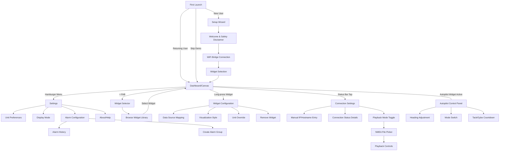
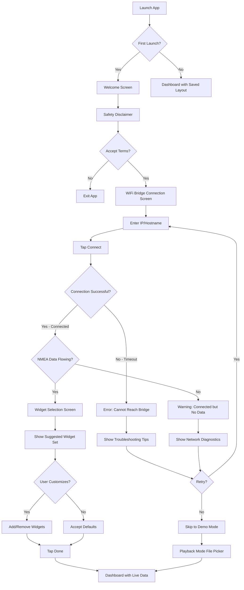
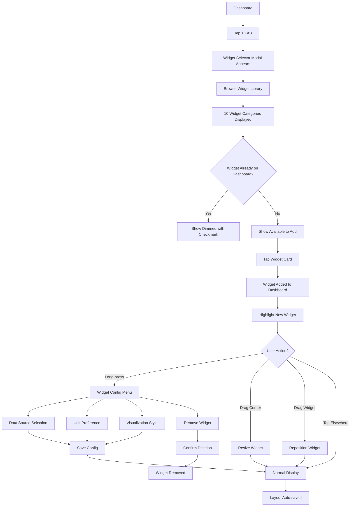
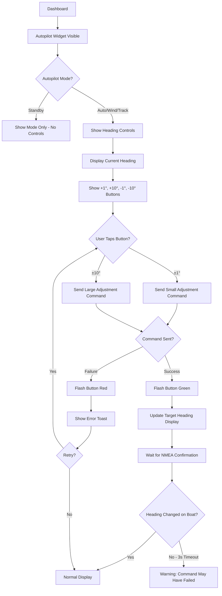
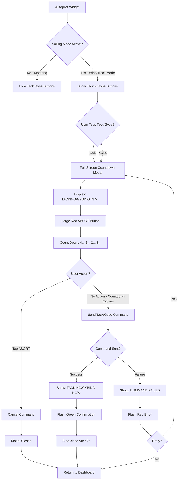
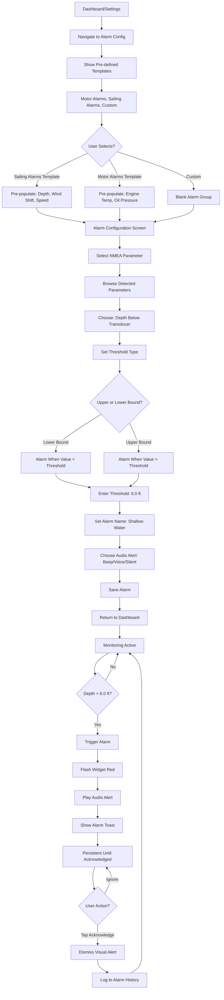

# Boating Instruments App UI/UX Specification

---

## Introduction

This document defines the user experience goals, information architecture, user flows, and visual design specifications for **Boating Instruments App**'s user interface. It serves as the foundation for visual design and frontend development, ensuring a cohesive and user-centered experience.

### Overall UX Goals & Principles

#### Target User Personas

**1. Solo/Short-Handed Sailors (Primary)**
- **Profile:** Experienced sailors making coastal or offshore passages, often single-handing or with minimal crew
- **Pain Points:** Must leave the helm to check instruments at nav station, creating safety concerns; cannot monitor critical boat parameters while trimming sails or managing lines
- **Goals:** Monitor all boat parameters from cockpit; control autopilot without going below deck; glanceable data recognition in challenging conditions (boat motion, bright sun, night sailing)
- **Technical Literacy:** Moderate to high; comfortable installing WiFi bridges and configuring marine electronics

**2. Powerboaters (Secondary)**
- **Profile:** Owners of 40-50ft **motor** yachts with enclosed helm stations
- **Pain Points:** Limited visibility of exterior instruments from enclosed helm; expensive to add dedicated gauge displays; cannot easily check engine health or systems status
- **Goals:** Comprehensive engine monitoring (dual engines); fuel and systems management; customizable dashboard matching their specific boat configuration
- **Technical Literacy:** Moderate; familiar with marine electronics and willing to invest in efficiency

**3. Raymarine Autopilot Users (Niche)**
- **Profile:** Boaters with Raymarine Evolution autopilot systems seeking P70 controller replacement
- **Pain Points:** Physical P70 controller is expensive ($800+) and fixed-location; cannot adjust autopilot from multiple locations
- **Goals:** Full autopilot control from phone/tablet; heading adjustments from cockpit; safe tack/gybe commands
- **Technical Literacy:** High; understand autopilot modes and marine networking

#### Usability Goals

1. **Glanceability:** Sailors glancing at screen while trimming sails can instantly recognize critical data (depth, speed, wind) from 3-5 feet away without squinting - target recognition in <2 seconds
2. **Harsh Environment Usability:** Touch targets work reliably with gloves, wet hands, and during boat motion; displays remain readable in bright sun glare and preserve night vision in red-night mode
3. **Ease of Learning:** New users can connect to WiFi bridge, add widgets, and view live data within 5 minutes of first launch (guided by setup wizard)
4. **Efficiency for Power Users:** Experienced users can customize dashboard layouts, configure alarms, and control autopilot with minimal taps - common tasks in <3 taps
5. **Error Prevention:** Destructive autopilot commands (Tack/Gybe) have 5-second countdown with prominent abort button; connection failures show clear recovery guidance
6. **Memorability:** Infrequent users (seasonal boaters) can return after months without relearning; familiar marine instrument aesthetic reduces cognitive load

#### Design Principles

1. **Familiar Instruments, Flexible Arrangement**
   Replicate the look and feel of trusted physical Raymarine instruments (P70, i70s) while enabling customization impossible with hardware. Boaters should instantly recognize each widget type.

2. **Glanceability Over Detail**
   Prioritize large, bold data values over dense information displays. Critical parameters (depth, speed, heading) visible at a glance from across the cockpit.

3. **Clarity in Extreme Conditions**
   Design for worst-case scenarios: bright sun glare, night sailing, boat motion, wet hands, wearing gloves. High contrast, large touch targets, and mode-specific color palettes.

4. **Safety Through Feedback**
   Every critical action (autopilot command, alarm acknowledgment) provides immediate, unmistakable visual confirmation. No silent failures.

5. **Progressive Complexity**
   Start with simple defaults (preset widgets, basic alarms) but allow power users to dive deep (custom alarm groups, multi-engine configurations, NMEA parameter mapping).

6. **Respect Marine Aesthetics**
   Professional nautical design language - avoid playful consumer app aesthetics. This replaces $2000+ of marine instruments; inspire confidence through visual professionalism.

### Change Log

| Date | Version | Description | Author |
|------|---------|-------------|--------|
| 2025-10-09 | 1.0 | Initial UI/UX specification creation | UX Expert (Sally) |

---

## Information Architecture (IA)

### Site Map / Screen Inventory

### Navigation Structure

**Primary Navigation:**
- **Dashboard/Canvas** - Always accessible, primary home screen (95% of user time spent here)
- **No traditional nav bar** - Single-screen focus to maximize instrument display area
- **Hamburger menu** (top-right status bar) provides access to Settings and secondary screens
- **Context-sensitive FABs** - Floating Action Button for "Add Widget" when on Dashboard

**Secondary Navigation:**
- **Settings screen** - Modal overlay or full-screen push from hamburger menu
- **Widget Selector** - Modal sheet sliding up from bottom when + FAB tapped
- **Widget Configuration** - Modal panel triggered by long-press on any widget
- **Connection Settings** - Accessible both from Setup Wizard and hamburger menu (for reconnection)

**Breadcrumb Strategy:**
- **None for mobile** - Flat navigation hierarchy with clear "Back" affordances
- **Desktop (Phase 1.5)** - Breadcrumbs in Settings subsections only (e.g., Settings > Alarm Configuration > Motor Alarms)
- **Visual hierarchy** - Modal depth indicated by backdrop dimming and elevation shadows

---

## User Flows

### Flow 1: First-Time Setup & Connection

**User Goal:** Connect to boat's NMEA network and start viewing live instrument data

**Entry Points:** App launch on new installation

**Success Criteria:** User sees live NMEA data on dashboard within 5 minutes

#### Flow Diagram

#### Edge Cases & Error Handling

- **WiFi bridge offline:** Display "Cannot connect to [IP]. Ensure WiFi bridge is powered on and boat WiFi network is active."
- **Incorrect IP address:** Validate IP format before attempting connection; suggest common ranges (192.168.x.x)
- **Connection timeout (>10s):** Auto-retry once, then show error with manual retry option
- **NMEA data not flowing:** Orange status indicator with message "Connected but no data. Check NMEA network is active."
- **User skips setup:** Allow "Use Demo Mode" option to explore app with sample data

**Notes:** This flow is critical for NFR1 (98% first-connection success rate). Clear error messages and troubleshooting guidance are essential.

---

### Flow 2: Adding & Customizing Widgets

**User Goal:** Personalize dashboard by adding specific instruments and arranging layout

**Entry Points:**
- From Dashboard: Tap + FAB
- From Setup Wizard: Widget Selection step
- From Settings: Manage Dashboard option

**Success Criteria:** User adds widget, resizes/positions it, and sees live data within <3 taps

#### Flow Diagram

#### Edge Cases & Error Handling

- **No NMEA data for widget:** Display "--" or "N/A" instead of crashing (FR32)
- **Multi-sensor boats:** Show data source picker (e.g., "Port Engine" vs "Starboard Engine") - FR35
- **Widget minimum size:** Prevent resizing below 160x160pt on phones
- **Drag outside bounds:** Snap back to valid position within canvas
- **Accidental removal:** Show "Undo" toast for 3 seconds after deletion

**Notes:** Drag-and-drop is Epic 2 deliverable. For Epic 1, widgets appear in static positions when added.

---

### Flow 3: Controlling Autopilot (Heading Adjustment)

**User Goal:** Adjust autopilot heading by ±1° or ±10° from cockpit

**Entry Points:**
- Dashboard with Autopilot Status Widget visible
- Widget must show autopilot in "Auto" or "Wind" mode (not Standby)

**Success Criteria:** Heading adjustment command sent successfully with visual confirmation within <500ms

#### Flow Diagram

#### Edge Cases & Error Handling

- **Autopilot in Standby:** Gray out heading buttons, show message "Switch to Auto mode to adjust heading"
- **Command transmission failure:** Display "Autopilot command failed. Check NMEA connection." (FR21)
- **Rapid button taps:** Throttle to max 3 commands/second (NFR10)
- **NMEA connection lost:** Disable autopilot controls immediately, show red connection indicator
- **Confirmation timeout:** Warn user but don't assume failure (boat may have processed command despite delayed feedback)

**Notes:** This flow is Epic 3 deliverable. Requires extensive testing with real Raymarine EVO systems (Month 5 gate).

---

### Flow 4: Tack/Gybe Autopilot Command (Safety-Critical)

**User Goal:** Execute tack or gybe maneuver safely with autopilot assistance

**Entry Points:**
- Autopilot Widget in Auto or Wind mode
- Dedicated Tack/Gybe buttons visible when sailing

**Success Criteria:** 5-second countdown with prominent abort button; command only sent if user doesn't abort

#### Flow Diagram

#### Edge Cases & Error Handling

- **Not in Wind/Track mode:** Hide buttons entirely (avoid confusing users)
- **Connection lost during countdown:** Auto-abort and show error "Lost connection - command canceled for safety"
- **User changes mode during countdown:** Auto-abort countdown
- **Rapid retry after abort:** Allow immediate retry (no cooldown penalty)
- **Command sent but no confirmation:** Display warning "Command sent but no feedback received. Monitor boat carefully."

**Notes:** FR37 requires 5-second countdown specifically. This is highest-risk user flow from safety perspective.

---

### Flow 5: Configuring Alarm Threshold

**User Goal:** Set depth alarm to trigger when water gets too shallow

**Entry Points:**
- Settings > Alarm Configuration
- Long-press on Depth Widget > Add Alarm

**Success Criteria:** Alarm triggers reliably when threshold crossed; user can acknowledge and dismiss

#### Flow Diagram

#### Edge Cases & Error Handling

- **NMEA parameter not detected:** Show message "Depth sensor not detected on network. Add alarm anyway for when sensor becomes available?"
- **Invalid threshold:** Validate input (e.g., depth can't be negative)
- **Alarm triggers repeatedly:** Only re-trigger after value returns above threshold + hysteresis (e.g., 6.5 ft) to avoid alarm spam
- **User acknowledges but still in alarm condition:** Keep widget yellow/orange to indicate "acknowledged but still active"
- **Alarm history full (>10 entries):** Auto-delete oldest entry (FR41)

**Notes:** Grouped alarm widgets (FR42) allow multiple related alarms in single dashboard widget. Epic 4 deliverable.

---

## Wireframes & Mockups

**Primary Design Files:** To be determined (recommended: Figma for collaborative design and component library management)

**Design File Structure:**
- **Page 1: Design System** - Color palette, typography, spacing, component library
- **Page 2: Mobile Screens** - Phone layouts (portrait & landscape)
- **Page 3: Tablet Screens** - Tablet layouts (7"-13" screens)
- **Page 4: Widget Library** - All 10 instrument widgets with variants
- **Page 5: Modals & Overlays** - Setup wizard, settings, widget selector
- **Page 6: Display Modes** - Day/Night/Red-Night mode examples

### Key Screen Layouts

#### Screen 1: Dashboard/Canvas (Primary Screen)

**Purpose:** Primary instrument display where users spend 95% of their time monitoring live NMEA data

**Key Elements:**
- **Status Bar (60pt height):**
  - Connection indicator dot (left): Red/Orange/Green
  - Current time (center)
  - Device battery icon
  - Settings hamburger menu (right)
  - Display mode toggle (sun/moon icon)

- **Widget Grid/Canvas:**
  - ScrollView container (phone) or Flexbox grid (tablet)
  - Dark navy background (#0A1929)
  - 12pt padding around edges
  - Widget cards with rounded corners (8pt radius)
  - Minimum widget size: 160x160pt (phone), 200x200pt (tablet)

- **Floating Action Button:**
  - 56x56pt circular button
  - Marine blue (#0284C7) background
  - White "+" icon
  - Positioned bottom-right, 16pt margins
  - Drop shadow for elevation

- **Empty State (First Launch):**
  - Centered compass icon (64x64pt)
  - Text: "Tap the + button to add your first instrument"
  - Light gray text (#94A3B8)

**Interaction Notes:**
- Vertical scroll on phone (1-2 widgets visible per viewport)
- Grid layout on tablet (3-4 widgets per row)
- Long-press widget → Configuration modal
- Tap status bar connection dot → Connection Settings
- Pull-to-refresh gesture (visual feedback only in MVP)

**Design File Reference:** [To be created in Figma - Dashboard screens]

---

#### Screen 2: Setup Wizard (First Launch)

**Purpose:** Guide new users through WiFi bridge connection and initial widget selection

**Key Elements:**

**Step 1: Welcome & Safety Disclaimer**
- Large app icon/logo at top
- Welcome message: "Transform your device into a marine instrument display"
- Safety disclaimer text (scrollable)
- "I Accept" button (disabled until scrolled to bottom)
- "Skip to Demo Mode" link (bottom)

**Step 2: WiFi Bridge Connection**
- Instruction text: "Enter your WiFi bridge IP address or hostname"
- Text input field (validated for IP format)
- Placeholder: "192.168.1.1"
- "Connect" button (primary action)
- Connection status indicator during attempt
- Troubleshooting expandable section

**Step 3: Widget Selection**
- Header: "Choose your instruments"
- Pre-selected "Suggested Set": Depth, Speed, Wind, GPS, Compass, Autopilot Status
- Grid of 10 available widgets with checkboxes
- Widget preview cards showing example data
- "Done" button proceeds to Dashboard

**Interaction Notes:**
- Linear flow with progress indicator (dots or steps)
- Back button available on Steps 2-3
- Skip option always visible for demo/playback mode
- Connection error shows clear retry options

**Design File Reference:** [To be created - Wizard screens]

---

#### Screen 3: Widget Selector Modal

**Purpose:** Allow users to browse widget library and add instruments to dashboard

**Key Elements:**
- Modal sheet slides up from bottom (covers 80% of screen)
- Header: "Add Instrument"
- Close button (X) in top-right
- Grid of 10 widget type cards (2 columns on phone, 3-4 on tablet)
- Each card shows:
  - Widget icon/preview
  - Widget name (e.g., "DEPTH", "SPEED")
  - Checkmark if already on dashboard (dimmed state)
- Tap to add → Modal dismisses, widget appears on dashboard with highlight animation

**Interaction Notes:**
- Swipe down to dismiss
- Already-added widgets are dimmed but still tappable (allows duplicates for multi-sensor boats)
- Smooth slide-up animation (300ms ease-out)

**Design File Reference:** [To be created - Widget Selector]

---

#### Screen 4: Widget Configuration Modal

**Purpose:** Configure individual widget settings (units, data source, visualization style)

**Key Elements:**
- Modal panel (centered, 80% width, max 400pt)
- Widget name as header
- Settings sections:
  - **Data Source** (if multi-sensor boat): Dropdown showing available NMEA sources
  - **Unit Preference**: Segmented control (ft/m/fathoms for depth, kts/mph/kmh for speed)
  - **Visualization Style**: Toggle between digital/analog/bar graph
  - **Alarm Configuration**: Quick link to create alarm for this parameter
- "Remove Widget" button (destructive, red text)
- "Save" button (primary action)
- "Cancel" link

**Interaction Notes:**
- Triggered by long-press on widget
- Backdrop dimming (semi-transparent black)
- Tap outside to dismiss (same as Cancel)
- Changes apply immediately on Save

**Design File Reference:** [To be created - Widget Config]

---

#### Screen 5: Autopilot Control Panel (Expanded Widget)

**Purpose:** Provide safe, clear autopilot control interface with heading adjustment and mode switching

**Key Elements:**
- **Status Section (top):**
  - Current mode: AUTO / STANDBY / WIND / TRACK (large, bold)
  - Target heading: 045° (very large, 48pt font)
  - Locked heading icon when in Auto mode

- **Heading Adjustment (center):**
  - Four buttons in cross pattern:
    - -10° (left)
    - -1° (below)
    - +1° (above)
    - +10° (right)
  - Buttons: 60x60pt minimum, marine blue background
  - Active state: Flash green on successful command, red on failure

- **Mode Switching (below heading controls):**
  - Segmented control or button group
  - Options: AUTO | STANDBY | WIND | TRACK | POWER STEER
  - Current mode highlighted

- **Tack/Gybe Section (bottom, only in Wind/Track mode):**
  - Two buttons side-by-side: TACK | GYBE
  - Yellow/orange background (caution color)
  - Triggers full-screen countdown modal

**Interaction Notes:**
- Widget can be expanded to full-screen on phones for easier control
- All buttons meet 44x44pt minimum touch target
- Visual feedback <500ms for all commands
- Disabled states when autopilot in Standby (gray out controls)

**Design File Reference:** [To be created - Autopilot Widget]

---

#### Screen 6: Tack/Gybe Countdown Modal (Safety-Critical)

**Purpose:** Provide 5-second countdown with prominent abort option for safety-critical autopilot maneuvers

**Key Elements:**
- **Full-screen modal** (blocks all other UI)
- Dark semi-transparent backdrop
- Central countdown display:
  - Text: "TACKING IN..." or "GYBING IN..."
  - Large countdown number: 5... 4... 3... 2... 1... (72pt font)
  - Countdown color: Yellow (#F59E0B)

- **Abort Button:**
  - Positioned below countdown
  - Very large: 200pt wide x 80pt tall
  - Red background (#EF4444)
  - White text: "ABORT"
  - Impossible to miss, easy to tap even in rough seas

- **Confirmation Screen (after countdown expires):**
  - Text: "TACKING NOW" (green background)
  - Auto-dismisses after 2 seconds

**Interaction Notes:**
- Countdown ticks every 1 second
- Tapping ABORT immediately cancels and returns to dashboard
- Tapping outside modal does NOT dismiss (prevent accidental activation)
- Connection lost during countdown → Auto-abort with error message

**Design File Reference:** [To be created - Tack/Gybe Modal]

---

## Component Library / Design System

**Design System Approach:** Create a **custom lightweight design system** tailored to marine instrument aesthetics rather than adopting an existing UI library (Material Design, iOS Human Interface Guidelines).

**Rationale:**
- Existing design systems don't match the Raymarine instrument aesthetic (professional nautical, high contrast, analog gauge styling)
- React Native core components provide sufficient foundation
- Custom system enables unique marine-specific components (compass roses, angle indicators, analog gauges)
- Lightweight approach keeps bundle size minimal for 8-hour battery life goal (NFR5)

**Component Architecture:**
- **Atomic Design** structure: Atoms → Molecules → Organisms
- **Theming via React Context** for Day/Night/Red-Night modes
- **Styled with StyleSheet API** (React Native built-in, no CSS-in-JS library needed)
- **React Native SVG** for custom gauges and instrument graphics
- **Reanimated** for smooth transitions and micro-interactions

### Core Components

#### Component 1: Button

**Purpose:** Primary interactive element for all user actions (settings, autopilot commands, confirmations)

**Variants:** Primary (marine blue background, white text), Secondary (transparent background, marine blue border/text), Destructive (red background, white text), Disabled (gray background, light gray text)

**States:** Default, Pressed (10% darker background), Disabled (reduced opacity 0.5), Loading (spinner replaces text)

**Usage Guidelines:**
- Minimum size: 44pt height for all buttons (WCAG touch target requirement)
- Full-width for mobile modals, auto-width for desktop
- Use Primary for single primary action per screen
- Destructive buttons require confirmation for critical actions
- Loading state for async operations (NMEA connection, autopilot commands)

---

#### Component 2: Widget Card

**Purpose:** Container for all instrument widgets with consistent styling and interaction patterns

**Variants:** Standard (default data display), Alarm Active (red border, pulsing animation), No Data (dimmed with "--" placeholder), Highlighted (subtle glow when newly added)

**States:** Normal (data displaying), Long-press (shows configuration menu), Drag (elevated shadow, semi-transparent), No Data (gray text), Alarm (red border, pulsing)

**Usage Guidelines:**
- Minimum size: 160x160pt (phone), 200x200pt (tablet)
- Rounded corners: 8pt radius
- Background: Dark gray (#1E293B)
- Border: Subtle gray (#334155) in normal state
- Drop shadow for depth perception
- Widget title always at top in small caps (e.g., "DEPTH", "SPEED")
- Primary data value in very large font (36-48pt)
- Secondary data (units, labels) in smaller font (14-16pt)

---

#### Component 3: Status Indicator Dot

**Purpose:** Show connection status (WiFi bridge connectivity and NMEA data flow)

**Variants:** Red (not connected), Orange (connected but no data), Green (connected with active data)

**States:** Static (solid color), Pulsing (when attempting connection)

**Usage Guidelines:**
- Size: 12pt diameter
- Position: Top-left of status bar
- Accessible label: "Connection status: [Connected/Warning/Disconnected]"
- Tap to open Connection Settings screen
- Pulse animation (1s interval) during connection attempts

---

#### Component 4: Modal Container

**Purpose:** Consistent container for all modals (widget selector, configuration, settings)

**Variants:** Bottom Sheet (slides up from bottom), Centered (center-screen overlay), Full Screen (covers entire viewport)

**States:** Entering (slide/fade animation), Open (fully visible), Exiting (reverse animation)

**Usage Guidelines:**
- Backdrop: Semi-transparent black (#000000 at 60% opacity)
- Modal background: Dark gray (#1E293B) matching widget cards
- Border radius: 16pt (top corners for bottom sheet, all corners for centered)
- Header bar: 60pt height with title and close button
- Swipe-down to dismiss for bottom sheets
- Tap outside to dismiss for centered modals (except safety-critical modals)
- Keyboard-aware: Auto-scroll when keyboard appears

---

#### Component 5: Segmented Control

**Purpose:** Switch between mutually exclusive options (unit preferences, display modes, autopilot modes)

**Variants:** 2 segments (binary choices), 3-4 segments (multi-option), 5+ segments (extended options with scrolling)

**States:** Selected segment (marine blue background), Unselected segments (transparent background), Disabled (gray, not tappable)

**Usage Guidelines:**
- Full width on mobile, auto-width on tablet/desktop
- Segment height: 44pt minimum (touch target)
- Equal-width segments when ≤4 options, scrollable when >4
- Smooth sliding animation (200ms) when selection changes
- Selected text: White, unselected text: Light gray (#CBD5E1)

---

#### Component 6: Analog Compass Rose

**Purpose:** Display compass heading, wind direction, and autopilot target heading with familiar analog instrument aesthetic

**Variants:** Compass Heading (rotating rose with current magnetic/true heading), Wind Direction (apparent wind angle with arrow), Autopilot Target (target heading with locked indicator)

**States:** Normal (smooth rotation as heading changes), No Data (static "N" marker, dimmed)

**Usage Guidelines:**
- Rendered with React Native SVG for crisp scaling
- Circular design: 120-200pt diameter depending on widget size
- Cardinal directions (N/E/S/W) always labeled
- Degree markings every 10° (major) and 5° (minor)
- Rotating outer ring with fixed center needle (or vice versa based on widget type)
- Smooth rotation animation using Reanimated
- Accessible alternative: Numeric heading announced by screen readers

---

#### Component 7: NMEA Data Text Display

**Purpose:** Consistent formatting for all numeric NMEA data values (depth, speed, temperature, voltage, etc.)

**Variants:** Large Value (primary data), Small Value (secondary data), No Data Placeholder ("--" or "N/A" when unavailable)

**States:** Normal (white text), Stale Data (gray text if >5 seconds old), Alarm Threshold (red text when alarm triggered)

**Usage Guidelines:**
- Font: SF Pro (iOS), Roboto (Android) - platform defaults for reliability
- Size: 36-48pt for primary values, 14-18pt for secondary
- Weight: Bold (700) for primary, Regular (400) for secondary
- Units displayed as small text (12pt) next to value
- Monospace font for numeric values to prevent jitter during updates
- Update with smooth fade transition (100ms) to avoid jarring changes

---

## Branding & Style Guide

### Visual Identity

**Brand Guidelines:** To be developed. For MVP, the app should convey:
- **Professionalism:** This replaces $2000+ of marine instruments - inspire confidence through visual design
- **Marine Heritage:** Nautical aesthetic inspired by Raymarine physical instruments (P70, i70s)
- **Reliability:** High contrast, clear typography, no playful consumer app aesthetics
- **Modern Flexibility:** While respecting marine traditions, the UI should feel contemporary and adaptable

### Color Palette

| Color Type | Hex Code | Usage |
|------------|----------|-------|
| **Primary** | #0284C7 | Marine blue - Primary actions (buttons, FABs), active states, interactive elements |
| **Secondary** | #0EA5E9 | Lighter blue - Hover states, secondary highlights |
| **Accent** | #06B6D4 | Cyan - Data highlights, special indicators |
| **Success** | #10B981 | Green - Positive feedback, confirmations, "connected" status |
| **Warning** | #F59E0B | Orange - Cautions, "connected but no data" status, tack/gybe buttons |
| **Error** | #EF4444 | Red - Errors, destructive actions, alarms, "disconnected" status |
| **Background Dark** | #0A1929 | Dark navy blue - Main app background (dashboard canvas) |
| **Background Medium** | #1E293B | Dark gray - Widget cards, modal backgrounds |
| **Border Gray** | #334155 | Subtle gray - Widget borders, dividers |
| **Text Primary** | #FFFFFF | White - Primary text, data values, headings |
| **Text Secondary** | #CBD5E1 | Light gray - Labels, secondary information |
| **Text Tertiary** | #94A3B8 | Medium gray - Placeholders, disabled text |
| **Red Night** | #DC2626 | Deep red - Red-night mode primary color (all UI elements) |
| **Red Night Background** | #1A0000 | Near-black red - Red-night mode background |

**Color Usage Notes:**
- **Day Mode:** Full color palette as shown above
- **Night Mode:** Reduce brightness by 40%, maintain same hues
- **Red-Night Mode:** Replace all colors with red (#DC2626) and near-black red (#1A0000) to preserve night vision
- **Contrast Requirements:** All text meets WCAG AA 4.5:1 minimum (tested against backgrounds)

### Typography

#### Font Families

- **Primary:** SF Pro (iOS), Roboto (Android) - Platform defaults for optimal rendering and performance
- **Secondary:** System font stack - Ensures cross-platform consistency
- **Monospace:** SF Mono (iOS), Roboto Mono (Android) - For numeric data values to prevent jitter during real-time updates

#### Type Scale

| Element | Size | Weight | Line Height |
|---------|------|--------|-------------|
| **H1** | 32pt | Bold (700) | 40pt |
| **H2** | 24pt | Bold (700) | 32pt |
| **H3** | 20pt | Semibold (600) | 28pt |
| **Body** | 16pt | Regular (400) | 24pt |
| **Small** | 14pt | Regular (400) | 20pt |
| **Widget Title** | 12pt | Bold (700), ALL CAPS | 16pt |
| **Primary Data Value** | 42pt | Bold (700), Monospace | 48pt |
| **Secondary Data Value** | 16pt | Regular (400), Monospace | 20pt |
| **Button Text** | 16pt | Semibold (600) | 20pt |
| **Caption** | 12pt | Regular (400) | 16pt |

**Typography Usage Notes:**
- **Widget data values:** Always use monospace fonts to prevent layout shift during real-time updates
- **Widget titles:** Small caps (or uppercase transforms) for consistent labeling (e.g., "DEPTH", "SPEED")
- **Minimum font size:** 14pt for body text, 16pt for touch targets (accessibility)
- **Line height:** Generous spacing (1.5x font size) for readability in motion

### Iconography

**Icon Library:** Use **React Native Vector Icons** with **Ionicons** set (cross-platform, well-maintained, broad coverage)

**Usage Guidelines:**
- **Size:** 24x24pt minimum for standalone icons, 20x20pt for inline icons
- **Style:** Outline style (not filled) for consistency with marine instrument aesthetic
- **Color:** Inherit from parent text color (white/gray/blue based on context)
- **Common Icons:**
  - Hamburger menu: `menu-outline`
  - Settings: `settings-outline`
  - Add widget: `add-circle-outline` or simple `add`
  - Close/Dismiss: `close-outline`
  - Connection: `wifi-outline`
  - Autopilot: `navigate-circle-outline`
  - Compass: `compass-outline`
  - Warning: `warning-outline`
  - Error: `alert-circle-outline`
  - Success: `checkmark-circle-outline`

**Custom Icons:** For marine-specific elements (rudder angle, wind direction arrow, depth sounder icon), create custom SVG icons matching Ionicons outline style.

### Spacing & Layout

**Grid System:** 8pt baseline grid for all spacing and sizing

**Spacing Scale:**
- **4pt:** Tight spacing (between related text elements)
- **8pt:** Standard spacing (between form fields, list items)
- **12pt:** Comfortable spacing (widget padding, section margins)
- **16pt:** Section spacing (between major UI sections)
- **24pt:** Large spacing (between modals and screen edges)
- **32pt:** Extra-large spacing (between major screen sections)

**Layout Grid:**
- **Mobile (Phone):** 12pt margins on left/right, 8pt gutters between widgets
- **Tablet:** 16pt margins, 12pt gutters
- **Desktop (Phase 1.5):** 24pt margins, 16pt gutters

**Touch Targets:**
- **Minimum size:** 44x44pt for all interactive elements (WCAG AAA compliance)
- **Comfortable size:** 60x60pt for primary actions (autopilot controls, tack/gybe buttons)
- **Spacing:** 8pt minimum between adjacent touch targets

**Safe Areas:**
- Respect platform safe areas (notches, rounded corners, home indicator on iOS)
- Status bar always visible (60pt height, accounts for notch on iPhone)
- Bottom navigation space reserved for home indicator on iOS (34pt)

---

## Accessibility Requirements

### Compliance Target

**Standard:** WCAG 2.1 Level AA compliance

**Rationale:**
- Level AA provides robust accessibility for recreational boaters with vision, motor, or cognitive impairments
- Exceeds app store minimum requirements (demonstrates quality commitment)
- Critical for marine environment where users may have reduced dexterity (cold hands, gloves, boat motion)
- Solo sailors may include aging population with vision or motor challenges

### Key Requirements

**Visual:**
- **Color contrast ratios:**
  - Normal text (16pt+): Minimum 4.5:1 against background
  - Large text (24pt+ or 18pt+ bold): Minimum 3:1 against background
  - UI components and graphics: Minimum 3:1 against adjacent colors
  - All color combinations in palette tested and validated
  - Red-night mode: Maintains 4.5:1 contrast using red spectrum only

- **Focus indicators:**
  - Visible focus outline (2pt solid border) on all interactive elements during keyboard navigation
  - Focus color: Marine blue (#0284C7) with high contrast against backgrounds
  - Focus state never removed via CSS
  - Skip links available for keyboard users (desktop/tablet)

- **Text sizing:**
  - Support Dynamic Type on iOS and font scaling on Android up to 200%
  - Layouts reflow gracefully when text size increased
  - No information loss when text scaled to 200%
  - Minimum 14pt base font size (exceeds WCAG 12pt minimum)

**Interaction:**
- **Keyboard navigation:**
  - All interactive elements reachable via keyboard (Tab, Shift+Tab)
  - Logical tab order follows visual hierarchy (top-to-bottom, left-to-right)
  - Keyboard shortcuts for common actions (desktop/tablet with external keyboard):
    - Space/Enter: Activate focused element
    - Escape: Dismiss modals, cancel operations
    - Arrow keys: Navigate between widgets (desktop), adjust values
  - No keyboard traps (can always exit focused component)

- **Screen reader support:**
  - All interactive elements have meaningful accessibilityLabel properties
  - Widget data values announced with units (e.g., "Depth: 12.4 feet" not "12.4")
  - Connection status announced clearly (e.g., "Connection status: Connected with active data")
  - Loading states announced ("Connecting to WiFi bridge...")
  - Alarm notifications announced immediately with severity and details
  - Analog gauges have numeric text alternative (compass rose: "Heading 045 degrees")
  - Image icons have descriptive alt text
  - Screen reader hints for non-obvious interactions (e.g., "Long press to configure widget")

- **Touch targets:**
  - Minimum 44x44pt for all interactive elements (WCAG AAA standard)
  - Primary autopilot controls: 60x60pt (exceeds minimum for safety)
  - Tack/Gybe abort button: 200x80pt (impossible to miss in rough seas)
  - 8pt minimum spacing between adjacent targets to prevent mis-taps

**Content:**
- **Alternative text:**
  - All icons and graphics have descriptive text alternatives
  - Decorative elements marked as such (accessibilityElementsHidden on iOS, importantForAccessibility="no" on Android)
  - Complex visualizations (compass rose, analog gauges) have text equivalents announced by screen readers

- **Heading structure:**
  - Proper semantic heading hierarchy (H1 → H2 → H3, no skipped levels)
  - H1: Screen title (e.g., "Dashboard", "Settings")
  - H2: Major sections (e.g., "Widget Library", "Connection Settings")
  - H3: Subsections (e.g., "Unit Preferences", "Alarm Configuration")
  - Headings allow screen reader users to navigate by section

- **Form labels:**
  - All input fields have associated labels (never placeholder-only)
  - Labels clearly describe purpose (e.g., "WiFi Bridge IP Address" not "IP")
  - Error messages linked to fields via accessibility relationships
  - Required fields indicated both visually and in label text
  - Input hints provided before user interaction (e.g., "Enter IP address in format 192.168.1.1")

**Additional Considerations:**

- **Motion and Animation:**
  - Respect platform "Reduce Motion" preference (iOS, Android)
  - When reduce motion enabled: Disable widget animations, countdown animations, compass rose rotation
  - Maintain functionality without animations (transitions become instant cuts)
  - Critical animations (tack/gybe countdown) use text-based countdown as primary indicator, animation as secondary

- **Error Prevention:**
  - Confirmation dialogs for destructive actions (remove widget, clear dashboard)
  - 5-second abort window for tack/gybe commands (FR37)
  - Clear validation messages before form submission
  - Disable submit buttons until required fields completed

- **Timeout and Session Management:**
  - No automatic logouts (app has no authentication in MVP)
  - Alarms persist until explicitly acknowledged (no auto-dismiss)
  - NMEA connection retries indefinitely with exponential backoff (user not forced to reconnect manually)

### Testing Strategy

**Automated Testing:**
- Integrate accessibility linting in CI/CD pipeline (eslint-plugin-jsx-a11y for React Native)
- Automated color contrast checking via tools (Stark, Contrast Checker)
- Accessibility tree validation in unit tests

**Manual Testing:**
- **Screen reader testing:**
  - VoiceOver on iOS (all flows tested by UX team member)
  - TalkBack on Android (all flows tested)
  - Test with screen reader enabled from app launch through critical flows

- **Keyboard navigation testing:**
  - Desktop builds tested with external keyboard on tablet/desktop (Phase 1.5)
  - All screens navigable without mouse/touch

- **Dynamic type testing:**
  - Test all screens at 100%, 150%, 200% font scaling
  - Verify no truncation or layout overflow

- **Color blindness testing:**
  - Validate UI with color blindness simulators (Deuteranopia, Protanopia, Tritanopia)
  - Ensure status indicators use icons + color (not color alone)

- **Real-world testing:**
  - Beta testing with boaters who use assistive technologies
  - Test with gloves (sailing gloves, winter gloves) to validate touch target sizes
  - Test in bright sunlight for color contrast validation
  - Test in red-night mode during actual overnight passage

**Acceptance Criteria:**
- Zero critical accessibility violations reported by automated tools
- All critical user flows completable with screen reader only
- All critical user flows completable with keyboard only (desktop)
- Color contrast validated at 4.5:1 minimum for all text
- Dynamic type support verified at 200% scaling
- Beta testers with assistive technology needs successfully complete onboarding and widget customization

---

## Responsiveness Strategy

### Breakpoints

| Breakpoint | Min Width | Max Width | Target Devices |
|------------|-----------|-----------|----------------|
| **Mobile** | 320pt | 428pt | iPhone SE, iPhone 13/14/15 standard, iPhone Pro models in portrait |
| **Tablet** | 429pt | 1024pt | iPad Mini, iPad Air, iPad Pro 11", Android tablets, large phones in landscape |
| **Desktop** | 1025pt | 1440pt | iPad Pro 12.9", Windows tablets, macOS apps, external displays |
| **Wide** | 1441pt | - | Large desktop monitors (27"+), ultra-wide displays (Phase 1.5+) |

### Adaptation Patterns

**Layout Changes:**

- **Mobile (320-428pt):**
  - Dashboard: Vertical scroll, 1-2 widgets visible simultaneously
  - Widget grid: 2 columns max, widgets stack vertically
  - Modals: Full-screen or bottom sheet (80% height)
  - Status bar: Condensed, icons only (no text labels)
  - FAB: Single "Add Widget" button, bottom-right
  - Minimum widget size: 160x160pt

- **Tablet (429-1024pt):**
  - Dashboard: Responsive grid, 4-9 widgets visible depending on widget sizes
  - Widget grid: 3-4 columns, optimized for landscape orientation
  - Modals: Centered overlay (max 600pt width), not full-screen
  - Status bar: Full labels visible (time, battery, connection status text)
  - Minimum widget size: 200x200pt

- **Desktop (1025pt+):**
  - Dashboard: Large grid, 6-16+ widgets visible simultaneously
  - Widget grid: 4-6 columns, maximize screen real estate
  - Modals: Centered overlay (max 800pt width)
  - Status bar: Full labels + keyboard shortcuts hints
  - FAB: Replaced with toolbar buttons (desktop convention)
  - Sidebar navigation: Persistent settings/widget library panel (Phase 1.5)
  - Minimum widget size: 220x220pt

**Navigation Changes:**
- **Mobile:** Hamburger menu in status bar, bottom sheet modals, gesture-driven, no keyboard shortcuts
- **Tablet:** Hamburger menu OR side drawer (landscape), centered modals, hybrid touch + keyboard support, limited keyboard shortcuts
- **Desktop:** Persistent sidebar navigation, keyboard shortcuts for all actions, right-click context menus, full keyboard navigation

**Content Priority:**
- **Mobile (Portrait):** Priority 1: Primary data values (depth, speed, wind) above fold; Priority 2: Autopilot controls; Priority 3: Secondary widgets
- **Tablet (Landscape):** All critical widgets visible simultaneously, autopilot control panel full-featured, widget library in side drawer
- **Desktop:** All content visible without scrolling, multi-panel layout, increased information density per widget

**Interaction Changes:**
- **Mobile:** Touch-first, gestures (swipe, long-press), single-hand use optimized, no hover states
- **Tablet:** Hybrid touch/keyboard, stylus support, light hover feedback, basic keyboard shortcuts
- **Desktop:** Mouse-first, hover states, tooltips, right-click menus, comprehensive keyboard shortcuts, precision drag-and-drop

---

## Animation & Micro-interactions

### Motion Principles

1. **Purposeful, Not Decorative**
   - Every animation serves a functional purpose: provide feedback, guide attention, or communicate state changes
   - No gratuitous animations that distract from critical data monitoring
   - Marine environment requires focus - animations enhance usability, never hinder it

2. **Fast and Responsive**
   - Durations: 100-300ms for most transitions (perceived as instant)
   - Real-time data updates: <100ms to maintain synchronicity with NMEA stream
   - No animation should delay critical user actions (autopilot commands)

3. **Respect Reduce Motion**
   - When platform "Reduce Motion" enabled: Disable all non-essential animations
   - Critical animations (tack/gybe countdown) use text-based primary indicator
   - Maintain functionality without relying on animation to convey information

4. **Performance-Conscious**
   - Use React Native Reanimated (runs on UI thread, not JS thread)
   - Avoid animating layout properties (prefer transform and opacity)
   - Target 60 FPS on all animations
   - Support for 120 FPS on ProMotion displays (iPhone Pro models, iPad Pro)

5. **Natural and Familiar**
   - Easing curves mimic real-world physics (ease-out for entering, ease-in for exiting)
   - No bounce effects (unprofessional for marine instrument aesthetic)
   - Consistent timing and easing across similar interaction types

### Key Animations

- **Widget Add:** Fade in + scale from 0.9 to 1.0 (Duration: 250ms, Easing: ease-out)
- **Widget Remove:** Scale from 1.0 to 0.8 + fade out (Duration: 200ms, Easing: ease-in)
- **Modal Enter:** Slide up from bottom (mobile) or fade in + scale from 0.95 (tablet/desktop) (Duration: 300ms, Easing: ease-out)
- **Modal Exit:** Reverse of enter animation (Duration: 250ms, Easing: ease-in)
- **Button Press:** Scale from 1.0 to 0.95 on press down, return to 1.0 on release (Duration: 100ms, Easing: ease-out)
- **Button Success Flash:** Background color fade from marine blue to green to marine blue (Duration: 400ms, Easing: ease-in-out)
- **Button Error Flash:** Background color fade from marine blue to red to marine blue (Duration: 400ms, Easing: ease-in-out)
- **Connection Status Pulse:** Opacity fade from 1.0 to 0.3 to 1.0 (Duration: 1000ms, Easing: ease-in-out, Loop: infinite)
- **Alarm Pulse:** Border glow from 0% to 100% intensity (Duration: 500ms, Easing: ease-in-out, Loop: infinite until acknowledged)
- **Tack/Gybe Countdown:** Number scale from 1.2 to 1.0 on each second tick (Duration: 150ms, Easing: ease-out)
- **Compass Rose Rotation:** Smooth rotation transform following heading changes (Duration: Based on heading change speed, max 500ms, Easing: ease-out)
- **Data Value Update:** Cross-fade between old and new values (Duration: 100ms, Easing: linear)
- **Loading Spinner:** Rotation transform 360° (Duration: 800ms, Easing: linear, Loop: infinite)
- **Skeleton Screen:** Shimmer effect across placeholder content (Duration: 1500ms, Easing: linear, Loop: infinite)
- **Toast Notification:** Slide in from top (Duration: 250ms, Easing: ease-out), auto-dismiss slide out after 3 seconds (Duration: 250ms, Easing: ease-in)

---

## Performance Considerations

### Performance Goals

- **Page Load:** Dashboard renders in <2 seconds on first app launch (cold start)
- **Interaction Response:** All user interactions (button taps, widget configuration) respond within <100ms
- **Animation FPS:** Maintain 60 FPS for all animations, 120 FPS on ProMotion displays
- **Real-time Data Updates:** NMEA data changes reflected in UI within <1 second (FR33)
- **Battery Life:** 8+ hours of continuous use on fully charged mobile device (NFR5)
- **Network Throughput:** Handle 500 NMEA messages/second without performance degradation (NFR10)

### Design Strategies

**1. Minimize Re-renders**
- Use React.memo() for widget components (only re-render when NMEA data changes)
- Implement shouldComponentUpdate() or useMemo() for expensive calculations
- Separate static UI (widget frame) from dynamic data (numeric values) to reduce render scope
- Throttle NMEA data updates to max 1/second per widget (human eye can't detect faster changes)

**2. Optimize Widget Rendering**
- Lazy load widgets below fold (only render visible widgets on initial load)
- Use React Native FlatList for scrollable widget grid (virtualization on long lists)
- Avoid unnecessary opacity/shadow effects on widgets (GPU-intensive)
- Minimize number of nested View components (flatten where possible)

**3. Efficient Data Flow**
- Use Zustand or Redux Toolkit with selectors (prevent global state changes from triggering all widget re-renders)
- Debounce rapid NMEA data bursts (e.g., 50 depth readings/second → 1 UI update/second)
- Implement data caching layer (don't re-parse identical NMEA sentences)
- Separate NMEA connection thread from UI thread (React Native background processing)

**4. Image and Asset Optimization**
- Use React Native SVG for all icons and gauges (scalable, no raster images needed)
- Compress app icon and splash screen assets (use TinyPNG or similar)
- Lazy load custom fonts (only load when needed, use system fonts as fallback)
- No external image fetching (all assets bundled with app)

**5. Animation Performance**
- Use React Native Reanimated (runs on UI thread, bypasses JS bridge bottleneck)
- Animate only transform and opacity properties (avoid width/height/layout changes)
- Remove animations when "Reduce Motion" enabled (saves CPU cycles)
- Limit concurrent animations (max 3-4 animations simultaneously)

**6. Network Efficiency**
- No HTTP requests after initial app launch (all data from local NMEA connection)
- TCP socket connection maintained with keepalive packets (avoid reconnection overhead)
- Implement exponential backoff for reconnection attempts (1s → 2s → 4s → 8s → 15s max)
- No analytics or telemetry in MVP (reduces background network usage)

**7. Battery Life Optimization**
- Reduce screen brightness in Night/Red-Night modes (40% dimmer than Day mode)
- Minimize background processing (no unnecessary timers or intervals)
- Use platform-native components where possible (more efficient than JS alternatives)
- Implement screen wake lock only when actively monitoring (let screen sleep when idle)
- Throttle GPS/location updates if used (not core feature in MVP)

**8. Memory Management**
- Clear NMEA message buffers regularly (keep max 100 most recent messages in memory)
- Limit alarm history to 10 entries (automatically purge oldest - FR41)
- Avoid memory leaks in timers/subscriptions (proper cleanup in useEffect)
- Profile memory usage during 8-hour continuous use test (ensure no gradual increase)

---

## Next Steps

### Immediate Actions

1. **Stakeholder Review:** Share this UI/UX specification with product owner and development team for feedback and alignment
2. **Create Figma Design Files:** Begin high-fidelity visual designs for Dashboard, Setup Wizard, and 10 core widgets using the color palette, typography, and component library defined here
3. **Accessibility Audit:** Run automated accessibility checks on color contrast ratios and validate all combinations meet WCAG AA 4.5:1 minimum
4. **Frontend Architecture Handoff:** Provide this specification to development team (or dev-agent) to create detailed frontend technical architecture document
5. **User Validation:** Schedule usability testing sessions with 3-5 boaters to validate wireframes, information architecture, and user flows before development begins

### Design Handoff Checklist

- [x] All user flows documented
- [x] Component inventory complete
- [x] Accessibility requirements defined
- [x] Responsive strategy clear
- [x] Brand guidelines incorporated
- [x] Performance goals established

---

**Document Status:** Complete and ready for stakeholder review and design implementation

---
