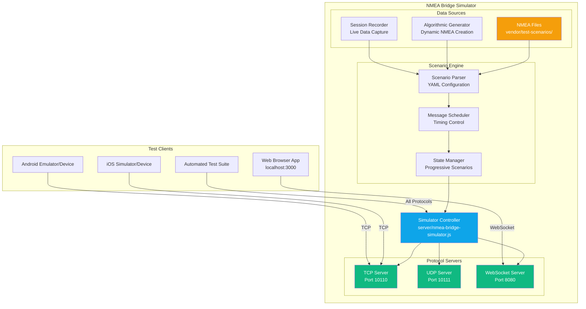

# NMEA Bridge Simulator Architecture

## Change Log

| Date | Version | Description | Author |
|------|---------|-------------|--------|
| 2025-10-14 | 1.0 | Initial NMEA Bridge Simulator Architecture | Winston (Architect) |

---

## Epic 7: NMEA Bridge Simulator Testing Infrastructure

**Epic Status:** Ready for Development  
**Epic Owner:** Development Team  
**Epic Duration:** 3-4 weeks  
**Epic Priority:** High (Foundation for comprehensive testing strategy)

### Epic Goal

Establish comprehensive multi-platform NMEA testing infrastructure that replaces physical WiFi bridge hardware dependency with software simulation, enabling consistent, repeatable, and scenario-based testing across web, iOS, and Android platforms while supporting BMAD agent integration for automated story validation.

### Epic Value Proposition

**Business Value:**
- **Reduced Development Costs:** Eliminate dependency on physical marine hardware and boat access for testing
- **Improved Quality:** Consistent, repeatable test scenarios ensure reliable validation across all platforms
- **Faster Development Cycles:** Developers can test marine scenarios without weather dependencies or hardware setup
- **Enhanced QA Capabilities:** Automated testing with standardized marine scenarios and BMAD agent integration

**Technical Value:**
- **Cross-Platform Testing:** Unified testing infrastructure supporting web, iOS, Android development workflows
- **Performance Validation:** High-frequency NMEA streams (500+ msg/sec) for load testing and optimization
- **Failure Simulation:** Network disconnections, malformed data, and timeout scenarios for resilience testing
- **CI/CD Integration:** Docker-based simulator for automated testing pipelines

### Stories Overview

- **[Story 7.1: Core Multi-Protocol Simulator](../stories/story-7.1-core-multi-protocol-simulator.md)** - Enhanced NMEA Bridge Simulator with TCP, UDP, WebSocket support and scenario-based streaming
- **[Story 7.2: Standardized Test Scenario Library](../stories/story-7.2-standardized-test-scenario-library.md)** - Comprehensive marine scenario library with YAML configuration and timing control  
- **[Story 7.3: BMAD Agent Integration & Testing Infrastructure](../stories/story-7.3-bmad-agent-integration-testing.md)** - Automated validation workflows, performance testing, and comprehensive documentation

---

## Critical Architecture Understanding: WiFi Bridge Modes

### **ESSENTIAL MARINE NETWORK ARCHITECTURE**

**Physical Network Reality:**
- **All autopilots** (including Raymarine Evolution) are connected to **NMEA 2000/Raymarine STng physical bus** on the boat
- **WiFi Bridge Operating Mode** determines **transport format only**, not the underlying protocol requirements

**Bridge Mode Behavior:**
- **NMEA 0183 Bridge Mode:**
  - **Instrument Data:** NMEA 2000 PGNs mapped to equivalent NMEA 0183 sentences (e.g., engine temp PGN → NMEA 0183 temperature sentence)
  - **Autopilot Control:** NMEA 2000 autopilot PGNs embedded in **$PCDIN sentences** (e.g., `$PCDIN,01F112,00,00,FF,00,00,00,00,FF*59`)
- **NMEA 2000 Bridge Mode:**
  - **All Data:** Native NMEA 2000 PGNs transmitted directly (instrument data + autopilot control)

**Simulator Requirement:**
- Must support **both bridge modes** with appropriate message format translation
- Autopilot control testing requires **$PCDIN encapsulation logic** for NMEA 0183 bridge mode
- Bridge mode selection must be **configurable** to test both scenarios

---

## Introduction

This document outlines the **NMEA Bridge Simulator architecture** for the Boating Instruments App testing infrastructure. The simulator provides a comprehensive testing environment that replaces physical WiFi bridge hardware with software simulation, enabling consistent, repeatable, and scenario-based testing across all platforms (web, iOS, Android, desktop).

**Document Scope:** NMEA Bridge Simulator design, test scenario architecture, multi-platform integration, and BMAD agent integration patterns

**Related Documents:**
- **[Core System Architecture](architecture.md)** - Main application architecture
- **[Testing Strategy](../TESTING-STRATEGY.md)** - Overall testing methodology
- **[UI Architecture](ui-architecture.md)** - Frontend testing integration

### System Context

**Purpose:** Replace physical marine WiFi bridge hardware with software simulation for development and testing

**Problem Addressed:** 
- Physical WiFi bridges require boat access and marine environment
- Real boat testing is expensive, weather-dependent, and limited availability
- Consistent test conditions impossible with live marine data
- Development teams need predictable NMEA data streams for validation

**Solution Architecture:** Multi-protocol NMEA simulator supporting TCP, UDP, and WebSocket connections with standardized test scenario playback

### Simulator Capabilities

**Multi-Platform Protocol Support:**
- **TCP Server:** Emulates WiFi bridge TCP port 2000 for iOS/Android direct connection (established default)
- **UDP Server:** Supports UDP-based NMEA data streams (both 0183 and 2000 formats)
- **WebSocket Server:** Enables web browser development via ws://localhost:8080
- **File Playback:** Streams recorded NMEA sequences with timing control
- **Live Generation:** Algorithmic NMEA data generation for continuous testing

**Critical WiFi Bridge Mode Support:**
- **NMEA 0183 Bridge Mode:** Instrument data as traditional NMEA 0183 sentences + autopilot control via $PCDIN-encapsulated NMEA 2000 PGNs
- **NMEA 2000 Bridge Mode:** All data (instrument + autopilot control) transmitted as native NMEA 2000 PGNs
- **Autopilot Control Principle:** Always requires NMEA 2000 PGNs regardless of bridge mode (physical autopilot connected to NMEA 2000/STng bus)

**Test Scenario Architecture:**
- **Standardized Scenarios:** Pre-built test sequences for common marine conditions
- **Parametric Generation:** Dynamic NMEA data based on input parameters
- **Failure Simulation:** Network disconnections, malformed data, timeout scenarios
- **Performance Testing:** High-frequency streams (500+ msg/sec) for load testing

---

## Simulator Architecture Overview

### High-Level Architecture



### Core Components

#### **1. Simulator Controller (`server/nmea-bridge-simulator.js`)**

**Responsibilities:**
- Multi-protocol server management (TCP/UDP/WebSocket)
- Test scenario orchestration and state management
- Client connection handling and message routing
- Performance monitoring and logging

**Key Features:**
- **Hot Configuration Reload:** Update scenarios without restarting simulator
- **Multi-Client Support:** Handle simultaneous connections from different platforms
- **Protocol Translation:** Convert between NMEA formats (0183 ↔ 2000 PGN)
- **Session Management:** Track client sessions and provide session-specific data

#### **2. Protocol Servers**

**TCP Server (Port 2000):**
- Emulates standard WiFi bridge TCP interface (established project default)
- Supports iOS/Android native TCP socket connections
- **WiFi Bridge Mode Support:** Configurable bridge operating mode
  - **NMEA 0183 Bridge Mode:** Traditional NMEA 0183 sentences + $PCDIN-encapsulated NMEA 2000 PGNs for autopilot control
  - **NMEA 2000 Bridge Mode:** Native NMEA 2000 PGN messages for all data including autopilot control
- Handles autopilot command bidirectional communication in both bridge modes
- Implements connection lifecycle (connect/disconnect/timeout)

**UDP Server (Port 2000 - Optional):**
- NMEA data multicast simulation (both 0183 and 2000 formats depending on bridge mode)
- Supports multiple listener clients
- Higher frequency data streams (engine data, navigation)
- **Bridge Mode Aware:** Message format determined by configured bridge operating mode

**WebSocket Server (Port 8080):**
- Web browser development environment support
- Real-time bidirectional communication
- JSON message protocol for command/response
- Browser-compatible CORS handling

#### **3. Test Scenario Engine**

**Scenario Definition System:**
- **YAML Configuration:** Human-readable test scenario definitions
- **Parametric Control:** Variables for boat characteristics, environmental conditions
- **Progressive State:** Scenarios evolve over time (e.g., autopilot engagement sequence)
- **Conditional Logic:** Branching scenarios based on client commands

**Message Scheduling:**
- **Realistic Timing:** Matches actual marine instrument update frequencies
- **Jitter Simulation:** Realistic network timing variations
- **Burst Control:** Handles high-frequency data bursts
- **Synchronization:** Multiple data sources coordinated timing

---

## Test Scenario Architecture

### Scenario Categories & Library

**Standard Test Scenarios (`vendor/test-scenarios/`):**

#### **1. Basic Navigation Scenarios**

**`basic-navigation.yml`** - Fundamental marine instrument data
```yaml
scenario:
  name: "Basic Navigation Instruments"
  description: "Standard depth, speed, wind, GPS data for UI validation"
  duration: 300  # 5 minutes
  
parameters:
  vessel:
    length: 40  # feet
    type: "sailboat"
  conditions:
    depth_range: [8, 25]  # feet
    wind_speed: [12, 18]  # knots
    boat_speed: [5, 7]   # knots
    
nmea_streams:
  - sentence: "DBT"  # Depth Below Transducer
    frequency: 2     # Hz
    parameters:
      depth_feet: "sine_wave(15, 5, 0.1)"  # 15±5 feet, 0.1 Hz variation
      
  - sentence: "VTG"  # Track Made Good and Ground Speed
    frequency: 1     # Hz
    parameters:
      speed_knots: "gaussian(6, 0.5)"  # 6 knots ±0.5 std dev
      
  - sentence: "MWV"  # Wind Speed and Angle
    frequency: 2     # Hz
    parameters:
      wind_angle: "random_walk(45, 10)"  # Starting 45°, ±10° steps
      wind_speed: "gaussian(15, 2)"      # 15 knots ±2 std dev
```

**`coastal-sailing.yml`** - Realistic coastal sailing conditions
- Variable depth (5-100 feet)
- Tidal current effects
- Wind shifts and gusts
- GPS track following coastline

**`deep-water-passage.yml`** - Ocean passage simulation
- Consistent deep water (>1000 feet)
- Ocean swells reflected in boat motion
- Long-term wind patterns
- Autopilot engagement scenarios

#### **2. Autopilot Control Scenarios**

**`autopilot-engagement.yml`** - Complete autopilot workflow
```yaml
scenario:
  name: "Autopilot Engagement Sequence"
  description: "Full autopilot engagement, heading changes, and disengagement"
  
phases:
  - phase: "manual_steering"
    duration: 60
    autopilot_mode: "standby"
    
  - phase: "engagement"
    duration: 30
    autopilot_mode: "auto"
    target_heading: 270
    
  - phase: "heading_adjustments" 
    duration: 120
    events:
      - time: 30
        command: "adjust_heading"
        value: "+10"  # +10 degrees
      - time: 90
        command: "adjust_heading" 
        value: "-5"   # -5 degrees
        
  - phase: "disengagement"
    duration: 15
    autopilot_mode: "standby"
```

**`autopilot-tack-sequence.yml`** - Sailing tack maneuver
- Pre-tack wind conditions
- 5-second countdown timer
- Heading change through wind
- Post-tack stabilization

**`autopilot-failure-recovery.yml`** - Error condition handling
- Autopilot fault simulation
- Emergency disengagement
- Manual override scenarios

#### **3. Alarm & Safety Scenarios**

**`shallow-water-alarm.yml`** - Depth alarm testing
```yaml
scenario:
  name: "Shallow Water Approach"
  description: "Progressive depth decrease triggering alarms"
  
depth_profile:
  - time: 0
    depth: 50      # Safe depth
  - time: 120
    depth: 15      # Approaching shallow
  - time: 180  
    depth: 8       # Warning depth (triggers yellow alarm)
  - time: 210
    depth: 5       # Critical depth (triggers red alarm)
  - time: 240
    depth: 12      # Recovery (alarm clears)
    
alarm_thresholds:
  depth_warning: 10   # feet
  depth_critical: 6   # feet
```

**`engine-temperature-alarm.yml`** - Engine monitoring
- Progressive engine temperature increase
- Oil pressure variations
- RPM fluctuations
- Multiple engine scenarios (twin-engine boats)

**`battery-drain-scenario.yml`** - Electrical system monitoring
- Battery voltage decline over time
- Solar panel charging simulation
- Alternator charging patterns

#### **4. Stress & Performance Scenarios**

**`high-frequency-data.yml`** - Performance testing
```yaml
scenario:
  name: "High Frequency Data Stream"
  description: "500+ messages/second for performance testing"
  
message_rate: 500  # Hz
duration: 600      # 10 minutes

streams:
  - sentence: "DBT"
    frequency: 50    # 50 Hz depth updates
  - sentence: "HDT" 
    frequency: 100   # 100 Hz heading updates
  - sentence: "VTG"
    frequency: 25    # 25 Hz speed updates
  - sentence: "MWV"
    frequency: 50    # 50 Hz wind updates
```

**`malformed-data-stress.yml`** - Error resilience testing
- Invalid NMEA checksums
- Truncated sentences
- Binary garbage data
- Network disconnections
- Timeout scenarios

**`multi-protocol-scenario.yml`** - Protocol switching
- NMEA 0183 to NMEA 2000 transitions
- Mixed protocol streams
- PGN format validation
- Protocol error recovery

#### **5. Real-World Recorded Scenarios**

**`recorded-regatta.nmea`** - Actual sailing race data
- Real GPS track from sailing regatta
- Authentic wind data and shifts
- Tacking sequences from actual race
- Time-compressed for testing (2-hour race → 10-minute test)

**`recorded-delivery.nmea`** - Ocean passage data
- Multi-day passage compressed to 1-hour test
- Real autopilot usage patterns
- Weather system passage
- Equipment failures and recoveries

### Scenario Configuration System

**Dynamic Parameter Control:**
```yaml
# Parameterized scenario generation
parameters:
  vessel_characteristics:
    length: ${VESSEL_LENGTH:40}        # Override via environment
    beam: ${VESSEL_BEAM:12}
    draft: ${VESSEL_DRAFT:6}
    
  environmental_conditions:
    wind_speed_base: ${WIND_BASE:15}   # Base wind speed
    wind_variation: ${WIND_VAR:5}      # Variation range
    wave_height: ${WAVE_HEIGHT:2}      # Feet
    
  test_parameters:
    duration_multiplier: ${SPEED:1.0}  # Speed up/slow down scenario
    message_frequency: ${FREQ:1.0}     # Frequency multiplier
    failure_rate: ${FAIL_RATE:0.0}     # Inject failures (0.0-1.0)
```

**Conditional Scenario Logic:**
```yaml
# Branching scenarios based on client behavior
conditional_events:
  - condition: "autopilot_engaged"
    trigger: 
      sentence: "APB"
      mode: "A"  # Auto mode
    actions:
      - enable_stream: "autopilot_status"
      - modify_parameter: "heading_stability" 
        value: 0.5  # More stable heading in auto mode
        
  - condition: "shallow_water_detected"
    trigger:
      sentence: "DBT" 
      depth_feet: "<10"
    actions:
      - generate_alarm: "depth_warning"
      - modify_frequency:
          sentence: "DBT"
          new_frequency: 5  # Increase depth update rate
```

---

## Multi-Platform Integration

### Platform-Specific Connection Patterns

#### **Web Browser Integration**
```javascript
// Web app connection to simulator
const simulatorWS = new WebSocket('ws://localhost:8080');

simulatorWS.onmessage = (event) => {
  const data = JSON.parse(event.data);
  
  switch(data.type) {
    case 'nmea_sentence':
      nmeaParser.parse(data.sentence);
      break;
      
    case 'scenario_status':
      console.log(`Scenario: ${data.name}, Phase: ${data.phase}`);
      break;
      
    case 'connection_established':
      console.log('Connected to NMEA Bridge Simulator');
      break;
  }
};

// Send autopilot commands back to simulator
simulatorWS.send(JSON.stringify({
  type: 'autopilot_command',
  command: 'adjust_heading',
  value: '+10'
}));
```

#### **iOS/Android Native Integration**
```typescript
// Native app TCP connection to simulator
import TcpSocket from 'react-native-tcp-socket';

const connectToSimulator = () => {
  const socket = TcpSocket.createConnection({
    port: 10110,
    host: 'localhost',  // Or simulator server IP
  });
  
  socket.on('data', (data) => {
    const nmeaSentence = data.toString();
    nmeaParser.parse(nmeaSentence);
  });
  
  socket.on('connect', () => {
    console.log('Connected to NMEA Bridge Simulator');
    
    // Optional: Request specific scenario
    socket.write('$SIMULATOR,REQUEST,SCENARIO,basic-navigation*7F\r\n');
  });
  
  return socket;
};
```

#### **Automated Test Integration**
```typescript
// Integration with automated test suites
class NMEABridgeSimulator {
  private tcpServer: net.Server;
  private wsServer: WebSocket.Server;
  private currentScenario: Scenario;
  
  async startScenario(scenarioName: string): Promise<void> {
    this.currentScenario = await this.loadScenario(scenarioName);
    this.currentScenario.start();
  }
  
  async waitForPhase(phaseName: string, timeoutMs: number = 30000): Promise<void> {
    return new Promise((resolve, reject) => {
      const timeout = setTimeout(() => reject(new Error('Phase timeout')), timeoutMs);
      
      this.currentScenario.on('phase_change', (phase) => {
        if (phase.name === phaseName) {
          clearTimeout(timeout);
          resolve();
        }
      });
    });
  }
  
  getScenarioState(): ScenarioState {
    return this.currentScenario.getCurrentState();
  }
}

// Usage in integration tests
describe('Autopilot Control Integration', () => {
  let simulator: NMEABridgeSimulator;
  
  beforeEach(async () => {
    simulator = new NMEABridgeSimulator();
    await simulator.start();
    await simulator.startScenario('autopilot-engagement');
  });
  
  it('should engage autopilot and adjust heading', async () => {
    // Wait for manual steering phase
    await simulator.waitForPhase('manual_steering');
    
    // Engage autopilot
    app.pressAutopilotButton();
    
    // Wait for autopilot engagement in simulator
    await simulator.waitForPhase('engagement');
    
    // Verify UI shows autopilot engaged
    expect(app.getAutopilotStatus()).toBe('AUTO');
    
    // Test heading adjustment
    app.pressHeadingAdjustButton('+10');
    
    // Verify simulator received command
    const state = simulator.getScenarioState();
    expect(state.lastCommand).toBe('adjust_heading:+10');
  });
});
```

---

## Development & Testing Integration

### BMAD Agent Integration

**Agent Usage Patterns:**

#### **Dev Agent (`#dev`) Integration**
```typescript
// Simulator provides consistent test environment for development
interface DevAgentSimulatorIntegration {
  // Start appropriate simulator scenario for feature being developed
  startDevelopmentScenario(featureType: 'widgets' | 'autopilot' | 'alarms'): void;
  
  // Inject specific NMEA data for testing UI edge cases
  injectTestData(dataType: string, value: any): void;
  
  // Simulate error conditions for error handling development
  simulateError(errorType: 'connection_lost' | 'malformed_data' | 'timeout'): void;
}
```

**Usage Example:**
```bash
# Dev agent developing new engine widget
node server/nmea-bridge-simulator.js --scenario engine-monitoring --duration 600

# Start web development environment
npm run web

# Widget automatically receives realistic engine data patterns
```

#### **QA Agent (`#qa`) Integration**
```typescript
// QA agent uses simulator for comprehensive test coverage
interface QAAgentSimulatorIntegration {
  // Execute full test scenario suite
  executeTestSuite(testSuite: 'regression' | 'performance' | 'safety'): TestResults;
  
  // Validate specific user story acceptance criteria
  validateStoryScenario(storyId: string, scenario: string): ValidationResult;
  
  // Generate test report with scenario coverage
  generateTestReport(): TestCoverageReport;
}
```

**Usage Example:**
```bash
# QA agent validating Story 2.2 (Widget Framework)
node server/nmea-bridge-simulator.js --scenario widget-drag-drop-test --record-session

# Run automated UI tests
npm run test:story-2.2

# Simulator provides consistent drag-and-drop test data
```

#### **Architect Agent (`#architect`) Integration**
```typescript
// Architect uses simulator for performance and scalability testing
interface ArchitectSimulatorIntegration {
  // Test system performance under load
  executePerformanceTest(messageRate: number, duration: number): PerformanceMetrics;
  
  // Validate architecture decisions with realistic data flows
  validateArchitecturalPatterns(scenario: string): ArchitecturalValidation;
  
  // Test cross-platform compatibility
  validateCrossPlatformBehavior(): PlatformCompatibilityReport;
}
```

### Simulator API & Control Interface

**REST API for External Control:**
```typescript
// RESTful API for simulator control
interface SimulatorAPI {
  // Scenario management
  POST   /api/scenarios/start { name: string, parameters?: object }
  GET    /api/scenarios/status
  POST   /api/scenarios/stop
  GET    /api/scenarios/list
  
  // Real-time control
  POST   /api/inject-data { sentence: string }
  POST   /api/simulate-error { type: string, duration?: number }
  GET    /api/clients/connected
  
  // Session management  
  GET    /api/session/state
  POST   /api/session/save { name: string }
  POST   /api/session/load { name: string }
}
```

**Command Line Interface:**
```bash
# Simulator CLI commands
node server/nmea-bridge-simulator.js [options]

Options:
  --scenario <name>           Load specific test scenario
  --file <path>              Play NMEA file
  --duration <seconds>       Override scenario duration
  --rate <multiplier>        Speed up/slow down playback
  --tcp-port <port>          TCP server port (default: 2000)
  --udp-port <port>          UDP server port (default: 2000)  
  --ws-port <port>           WebSocket port (default: 8080)
  --record <filename>        Record session to file
  --replay <filename>        Replay recorded session
  --verbose                  Detailed logging
  --api-port <port>         REST API port (default: 9090)

Examples:
  # Standard development
  node server/nmea-bridge-simulator.js --scenario basic-navigation
  
  # Performance testing  
  node server/nmea-bridge-simulator.js --scenario high-frequency --rate 2.0
  
  # Autopilot testing with recording
  node server/nmea-bridge-simulator.js --scenario autopilot-engagement --record autopilot-test-session.json
  
  # Stress testing
  node server/nmea-bridge-simulator.js --scenario malformed-data-stress --duration 3600
```

### Continuous Integration Integration

**CI Pipeline Integration:**
```yaml
# .github/workflows/test-with-simulator.yml
name: Test with NMEA Bridge Simulator

on: [push, pull_request]

jobs:
  test-with-simulator:
    runs-on: ubuntu-latest
    
    services:
      nmea-simulator:
        image: node:18
        ports:
          - 2000:2000
          - 8080:8080
        options: --name nmea-simulator
        
    steps:
      - name: Checkout code
        uses: actions/checkout@v3
        
      - name: Start NMEA Bridge Simulator
        run: |
          cd server
          node nmea-bridge-simulator.js --scenario ci-regression-test &
          sleep 5  # Wait for simulator startup
          
      - name: Run Unit Tests
        run: npm test
        
      - name: Run Integration Tests  
        run: npm run test:integration
        env:
          NMEA_SIMULATOR_HOST: localhost
          NMEA_SIMULATOR_PORT: 10110
          
      - name: Run Performance Tests
        run: |
          # Switch simulator to performance scenario
          curl -X POST localhost:9090/api/scenarios/start \
            -H "Content-Type: application/json" \
            -d '{"name": "high-frequency", "parameters": {"rate": 500}}'
          
          npm run test:performance
          
      - name: Stop Simulator
        run: curl -X POST localhost:9090/api/scenarios/stop
```

---

## Implementation Architecture

### File Structure & Organization

```
server/
├── nmea-bridge-simulator.js           # Main simulator entry point
├── lib/
│   ├── scenario-engine.js            # Scenario parsing and execution
│   ├── protocol-servers.js           # TCP/UDP/WebSocket servers
│   ├── nmea-generator.js             # Algorithmic NMEA data generation
│   ├── message-scheduler.js          # Timing and frequency control
│   ├── session-recorder.js           # Session recording/playback
│   └── api-server.js                 # REST API for external control
│
├── config/
│   ├── simulator-config.json         # Default simulator configuration
│   ├── server-ports.json             # Port configurations per environment
│   └── logging-config.json           # Logging levels and outputs
│
└── utils/
    ├── nmea-validator.js              # NMEA sentence validation
    ├── checksum-calculator.js         # NMEA checksum calculation
    └── protocol-converter.js          # NMEA 0183 ↔ 2000 conversion

vendor/
├── test-scenarios/                    # Standardized test scenarios
│   ├── basic/
│   │   ├── basic-navigation.yml
│   │   ├── coastal-sailing.yml
│   │   └── deep-water-passage.yml
│   │
│   ├── autopilot/
│   │   ├── autopilot-engagement.yml
│   │   ├── autopilot-tack-sequence.yml
│   │   └── autopilot-failure-recovery.yml
│   │
│   ├── safety/
│   │   ├── shallow-water-alarm.yml
│   │   ├── engine-temperature-alarm.yml
│   │   └── battery-drain-scenario.yml
│   │
│   ├── performance/
│   │   ├── high-frequency-data.yml
│   │   ├── malformed-data-stress.yml
│   │   └── multi-protocol-scenario.yml
│   │
│   └── recorded/
│       ├── recorded-regatta.nmea
│       ├── recorded-delivery.nmea
│       └── recorded-storm-passage.nmea
│
├── sample-data/                       # Legacy sample files (maintained for compatibility)
│   ├── basic-instruments.nmea
│   ├── autopilot-session.nmea
│   └── multi-engine.nmea
│
└── fixtures/                          # Integration test fixtures
    ├── unit-test-sequences/
    ├── integration-test-data/
    └── performance-test-patterns/

__tests__/
├── simulator/
│   ├── scenario-engine.test.js        # Test scenario parsing and execution
│   ├── protocol-servers.test.js       # Test multi-protocol server behavior
│   ├── message-scheduler.test.js      # Test timing and frequency control
│   └── integration/
│       ├── web-browser-integration.test.js
│       ├── native-app-integration.test.js
│       └── cross-platform-compatibility.test.js
│
└── fixtures/
    ├── test-scenarios/                # Test scenario definitions for simulator testing
    └── expected-outputs/              # Expected NMEA outputs for validation
```

### Configuration Schema

**Scenario Configuration Schema (`scenario.schema.json`):**
```json
{
  "$schema": "http://json-schema.org/draft-07/schema#",
  "type": "object",
  "properties": {
    "scenario": {
      "type": "object",
      "properties": {
        "name": { "type": "string" },
        "description": { "type": "string" },
        "duration": { "type": "number", "minimum": 0 },
        "category": { 
          "type": "string",
          "enum": ["basic", "autopilot", "safety", "performance", "recorded"]
        }
      },
      "required": ["name", "description", "duration"]
    },
    
    "parameters": {
      "type": "object",
      "properties": {
        "vessel": {
          "type": "object",
          "properties": {
            "length": { "type": "number" },
            "beam": { "type": "number" }, 
            "draft": { "type": "number" },
            "type": { 
              "type": "string", 
              "enum": ["sailboat", "motorboat", "catamaran", "trawler"]
            }
          }
        },
        "conditions": {
          "type": "object",
          "properties": {
            "wind_speed": { "type": "array", "items": { "type": "number" } },
            "wave_height": { "type": "number" },
            "depth_range": { "type": "array", "items": { "type": "number" } }
          }
        }
      }
    },
    
    "nmea_streams": {
      "type": "array",
      "items": {
        "type": "object", 
        "properties": {
          "sentence": { "type": "string" },
          "frequency": { "type": "number", "minimum": 0 },
          "parameters": { "type": "object" }
        },
        "required": ["sentence", "frequency"]
      }
    },
    
    "phases": {
      "type": "array",
      "items": {
        "type": "object",
        "properties": {
          "phase": { "type": "string" },
          "duration": { "type": "number" },
          "events": {
            "type": "array",
            "items": {
              "type": "object",
              "properties": {
                "time": { "type": "number" },
                "command": { "type": "string" },
                "value": { "type": ["string", "number"] }
              }
            }
          }
        }
      }
    }
  },
  
  "required": ["scenario", "nmea_streams"]
}
```

### Performance & Scalability Specifications

**Performance Requirements:**
- **Message Rate:** Support up to 1000 NMEA messages/second
- **Client Connections:** Handle 50+ simultaneous client connections
- **Memory Usage:** <100MB RAM for standard scenarios
- **CPU Usage:** <10% CPU utilization on modern development machines
- **Latency:** <1ms message dispatch latency
- **Reliability:** 99.9% uptime during test sessions

**Scalability Architecture:**
- **Horizontal Scaling:** Multiple simulator instances for large test environments
- **Protocol Isolation:** Independent TCP/UDP/WebSocket servers
- **Scenario Parallelism:** Multiple scenarios running simultaneously
- **Resource Management:** Automatic memory and CPU monitoring with alerts

---

## Testing & Validation Strategy

### Simulator Self-Testing

**Simulator Validation Tests:**
```javascript
describe('NMEA Bridge Simulator', () => {
  describe('Scenario Engine', () => {
    it('should parse valid scenario YAML files', () => {
      const scenario = ScenarioEngine.load('vendor/test-scenarios/basic/basic-navigation.yml');
      expect(scenario.isValid()).toBe(true);
      expect(scenario.getDuration()).toBe(300);
    });
    
    it('should generate correct NMEA sentences', () => {
      const scenario = ScenarioEngine.load('basic-navigation');
      scenario.start();
      
      const message = scenario.getNextMessage();
      expect(message.sentence).toMatch(/^\$[A-Z]{2}[A-Z]{3},.*\*[0-9A-F]{2}$/);
      expect(NMEAValidator.validateChecksum(message.sentence)).toBe(true);
    });
  });
  
  describe('Multi-Protocol Servers', () => {
    it('should accept TCP connections on port 10110', async () => {
      const simulator = new NMEABridgeSimulator();
      await simulator.start();
      
      const socket = net.createConnection(10110, 'localhost');
      expect(socket.readyState).toBe('open');
      
      await simulator.stop();
    });
    
    it('should accept WebSocket connections on port 8080', async () => {
      const simulator = new NMEABridgeSimulator();
      await simulator.start();
      
      const ws = new WebSocket('ws://localhost:8080');
      await new Promise(resolve => ws.onopen = resolve);
      
      expect(ws.readyState).toBe(WebSocket.OPEN);
      
      ws.close();
      await simulator.stop();
    });
  });
  
  describe('Performance', () => {
    it('should maintain 500 msg/sec for 10 minutes', async () => {
      const simulator = new NMEABridgeSimulator();
      await simulator.startScenario('high-frequency-data');
      
      const startTime = Date.now();
      let messageCount = 0;
      
      const connection = simulator.createTCPConnection();
      connection.on('data', () => messageCount++);
      
      await new Promise(resolve => setTimeout(resolve, 600000)); // 10 minutes
      
      const endTime = Date.now();
      const duration = (endTime - startTime) / 1000;
      const actualRate = messageCount / duration;
      
      expect(actualRate).toBeGreaterThan(450); // Allow 10% tolerance
      
      await simulator.stop();
    });
  });
});
```

### Cross-Platform Validation

**Platform Integration Tests:**
```typescript
describe('Cross-Platform Simulator Integration', () => {
  let simulator: NMEABridgeSimulator;
  
  beforeEach(async () => {
    simulator = new NMEABridgeSimulator();
    await simulator.start();
  });
  
  afterEach(async () => {
    await simulator.stop();
  });
  
  describe('Web Browser Integration', () => {
    it('should provide NMEA data via WebSocket', async () => {
      await simulator.startScenario('basic-navigation');
      
      const ws = new WebSocket('ws://localhost:8080');
      const messages: string[] = [];
      
      ws.onmessage = (event) => {
        const data = JSON.parse(event.data);
        if (data.type === 'nmea_sentence') {
          messages.push(data.sentence);
        }
      };
      
      await new Promise(resolve => setTimeout(resolve, 5000));
      
      expect(messages.length).toBeGreaterThan(10);
      expect(messages[0]).toMatch(/^\$/);
    });
  });
  
  describe('Native App Integration', () => {
    it('should provide NMEA data via TCP', async () => {
      await simulator.startScenario('basic-navigation');
      
      const socket = net.createConnection(10110, 'localhost');
      const messages: string[] = [];
      
      socket.on('data', (data) => {
        messages.push(data.toString());
      });
      
      await new Promise(resolve => setTimeout(resolve, 5000));
      
      expect(messages.length).toBeGreaterThan(10);
      expect(messages[0]).toMatch(/^\$/);
      
      socket.destroy();
    });
  });
  
  describe('Autopilot Command Testing', () => {
    it('should accept and respond to autopilot commands', async () => {
      await simulator.startScenario('autopilot-engagement');
      
      const socket = net.createConnection(10110, 'localhost');
      let autopilotResponse = false;
      
      socket.on('data', (data) => {
        const sentence = data.toString();
        if (sentence.includes('$ECAPB')) {
          autopilotResponse = true;
        }
      });
      
      // Send autopilot command
      socket.write('$ECAPB,270,A*1F\r\n');
      
      await new Promise(resolve => setTimeout(resolve, 2000));
      
      expect(autopilotResponse).toBe(true);
      
      socket.destroy();
    });
  });
});
```

---

## Deployment & Operations

### Development Environment Setup

**Quick Start Commands:**
```bash
# Install simulator dependencies
cd server
npm install ws tcp-server yaml-parser

# Start basic development simulator
node nmea-bridge-simulator.js --scenario basic-navigation

# Start with API control interface
node nmea-bridge-simulator.js --scenario basic-navigation --api-port 9090

# Start web app connected to simulator
npm run web
```

**Docker Deployment:**
```dockerfile
# Dockerfile.nmea-simulator
FROM node:18-alpine

WORKDIR /app
COPY server/ ./server/
COPY vendor/test-scenarios/ ./vendor/test-scenarios/

EXPOSE 10110 8080 9090

CMD ["node", "server/nmea-bridge-simulator.js", "--scenario", "basic-navigation", "--api-port", "9090"]
```

```yaml
# docker-compose.yml
version: '3.8'
services:
  nmea-simulator:
    build:
      context: .
      dockerfile: Dockerfile.nmea-simulator
    ports:
      - "10110:10110"  # TCP NMEA
      - "8080:8080"    # WebSocket
      - "9090:9090"    # REST API
    environment:
      - LOG_LEVEL=info
      - DEFAULT_SCENARIO=basic-navigation
    volumes:
      - ./vendor/test-scenarios:/app/vendor/test-scenarios
      - ./logs:/app/logs
```

### Production Testing Environment

**CI/CD Integration:**
```yaml
# Production-grade CI pipeline with simulator
name: Full Test Suite with NMEA Simulator

on: [push, pull_request]

jobs:
  test-matrix:
    strategy:
      matrix:
        platform: [web, ios-simulator, android-emulator]
        scenario: [basic-navigation, autopilot-engagement, shallow-water-alarm]
    
    runs-on: ubuntu-latest
    
    steps:
      - name: Start NMEA Bridge Simulator
        run: |
          docker run -d --name nmea-sim \
            -p 10110:10110 -p 8080:8080 -p 9090:9090 \
            nmea-bridge-simulator:latest \
            --scenario ${{ matrix.scenario }} --api-port 9090
            
      - name: Wait for Simulator Ready
        run: |
          timeout 30 bash -c 'until curl -f http://localhost:9090/api/scenarios/status; do sleep 1; done'
          
      - name: Run Platform Tests
        run: |
          case ${{ matrix.platform }} in
            web)
              npm run test:web
              ;;
            ios-simulator)
              npm run test:ios-simulator
              ;;
            android-emulator)
              npm run test:android-emulator
              ;;
          esac
        env:
          NMEA_SIMULATOR_HOST: localhost
          NMEA_SIMULATOR_TCP_PORT: 10110
          NMEA_SIMULATOR_WS_PORT: 8080
          
      - name: Collect Test Results
        run: |
          curl http://localhost:9090/api/session/save \
            -X POST -H "Content-Type: application/json" \
            -d "{\"name\": \"${{ matrix.platform }}-${{ matrix.scenario }}-$(date +%s)\"}"
            
      - name: Stop Simulator
        run: docker stop nmea-sim && docker rm nmea-sim
```

### Monitoring & Observability

**Simulator Metrics:**
```typescript
interface SimulatorMetrics {
  performance: {
    messagesPerSecond: number;
    averageLatency: number;
    memoryUsageMB: number;
    cpuUtilization: number;
  };
  
  connections: {
    activeTCPConnections: number;
    activeWebSocketConnections: number; 
    totalConnectionsServed: number;
    connectionErrors: number;
  };
  
  scenarios: {
    currentScenario: string;
    scenarioProgress: number; // 0-1
    messagesGenerated: number;
    errorsGenerated: number;
  };
  
  system: {
    uptime: number;
    version: string;
    nodeVersion: string;
    platform: string;
  };
}
```

**Logging Strategy:**
```typescript
// Structured logging for simulator operations
const logger = {
  info: (message: string, context?: object) => {
    console.log(JSON.stringify({
      timestamp: new Date().toISOString(),
      level: 'INFO',
      message,
      context,
      simulator_version: SIMULATOR_VERSION
    }));
  },
  
  performance: (metrics: PerformanceMetrics) => {
    console.log(JSON.stringify({
      timestamp: new Date().toISOString(),
      type: 'PERFORMANCE',
      ...metrics
    }));
  },
  
  scenario: (event: 'start' | 'stop' | 'phase_change', data: object) => {
    console.log(JSON.stringify({
      timestamp: new Date().toISOString(),
      type: 'SCENARIO',
      event,
      ...data
    }));
  }
};
```

---

## Future Enhancements

### Advanced Simulation Features

**Machine Learning Integration:**
- **Realistic Motion Simulation:** ML models trained on real boat motion data
- **Weather Pattern Generation:** AI-generated weather sequences based on historical data
- **Adaptive Scenarios:** Scenarios that adapt based on client behavior patterns

**Hardware-in-the-Loop Testing:**
- **Physical Autopilot Integration:** Connect to actual autopilot hardware for validation
- **Sensor Emulation:** Simulate physical sensor outputs (depth transducer, wind vane)
- **Multi-Vessel Simulation:** Simulate multiple boats for collision avoidance testing

**Cloud-Scale Testing:**
- **Distributed Simulation:** Multiple simulator instances for large-scale testing
- **Global Test Scenarios:** Scenarios representing different geographical regions
- **Performance Analytics:** Cloud-based performance monitoring and analytics

### Integration Ecosystem

**Third-Party Tool Integration:**
- **Marine Navigation Software:** Integration with OpenCPN, Navionics for route testing
- **Weather Services:** Real-time weather data integration for dynamic scenarios
- **Marine Electronics:** Integration with actual marine electronics manufacturers' test suites

**Simulator as a Service:**
- **Cloud-Hosted Simulators:** On-demand simulator instances for distributed teams
- **API-Driven Control:** Full REST API for external test orchestration
- **Test Result Analytics:** Comprehensive test result analysis and reporting

---

## Summary

The NMEA Bridge Simulator provides a comprehensive, multi-platform testing infrastructure that replaces physical WiFi bridge hardware with sophisticated software simulation. Key capabilities include:

**Multi-Protocol Support:** TCP, UDP, and WebSocket servers supporting all target platforms
**Standardized Test Scenarios:** Comprehensive library of marine scenarios from basic navigation to complex autopilot sequences
**BMAD Agent Integration:** Purpose-built for AI-driven development workflows with comprehensive API support
**Performance Testing:** High-frequency data streams and stress testing capabilities
**CI/CD Ready:** Docker-based deployment with complete continuous integration support

**Benefits for Development Teams:**
- **Consistent Testing:** Repeatable test conditions across all platforms
- **Comprehensive Coverage:** Scenarios covering all marine operational conditions
- **Development Velocity:** No dependency on physical marine hardware or boat access
- **Quality Assurance:** Standardized test scenarios ensure consistent behavior validation

**BMAD Integration:** The simulator architecture is specifically designed to support AI agent workflows, providing consistent test environments for automated quality assurance, performance validation, and cross-platform compatibility testing.

This architecture establishes the NMEA Bridge Simulator as a foundational testing infrastructure component, enabling reliable and comprehensive validation of the Boating Instruments App across all target platforms and operational scenarios.

---

**Document Complete - NMEA Bridge Simulator Architecture v1.0**