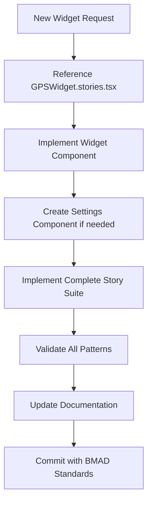

# AI Agent Development Framework

*BMAD BMM Knowledge Capture - Maritime Instrument Framework*

## Overview

This document serves as the master reference for AI agents developing within the BMAD autopilot maritime framework. It consolidates the essential patterns, templates, and requirements established through the GPS Widget implementation and maritime settings development.

## Quick Reference for AI Agents

### Essential Files to Reference

1. **Storybook Integration Template**: `boatingInstrumentsApp/src/stories/widgets/GPSWidget.stories.tsx`
   - **Authority**: Primary template for all widget story implementations
   - **Usage**: Copy patterns for MockStoreProvider, story types, settings integration

2. **Maritime Settings Template**: `boatingInstrumentsApp/src/components/settings/MaritimeSettingsConfiguration.tsx`
   - **Authority**: Complete settings UI implementation pattern
   - **Usage**: Template for all maritime settings components

3. **Widget Integration Template**: `boatingInstrumentsApp/src/widgets/GPSWidget.tsx`
   - **Authority**: Proper widget-to-settings integration
   - **Usage**: Shows how widgets consume settings store data

4. **Documentation Standards**: `docs/ui-architecture/`
   - **Authority**: Design system and component standards
   - **Usage**: Reference for consistent implementation patterns

### Development Workflow for AI Agents



## Widget Development Checklist

### Phase 1: Component Implementation
- [ ] Create widget component following `GPSWidget.tsx` pattern
- [ ] Implement proper store integration (NMEA, Widget, Settings)
- [ ] Add TypeScript interfaces with proper naming conventions
- [ ] Support all maritime themes (day, night, red-night, auto)
- [ ] Handle data states (normal, stale, no-data, error)

### Phase 2: Settings Integration (if applicable)
- [ ] Create settings component following `MaritimeSettingsConfiguration.tsx` pattern
- [ ] Implement proper sections (GPS vs Ship Time separation)
- [ ] Use maritime abbreviations (DD, DDM, DMS, UTM)
- [ ] Add professional time notation (HH:mm, hh:mm a)
- [ ] Include comprehensive timezone dropdown

### Phase 3: Storybook Implementation
- [ ] Create complete story suite following `GPSWidget.stories.tsx`
- [ ] Implement MockStoreProvider with proper isolation
- [ ] Add Default, Settings, Data States, and Theme stories
- [ ] Include interactive demo instructions
- [ ] Document implementation features

### Phase 4: Documentation
- [ ] Update relevant documentation in `docs/ui-architecture/`
- [ ] Add patterns to design system if new
- [ ] Update component standards if extending framework
- [ ] Commit following BMAD BMM standards

## Critical Implementation Patterns

### 1. Store Integration Pattern

```typescript
// Widget component integration
export const ExampleWidget: React.FC<ExampleWidgetProps> = ({ id, title }) => {
  // Theme integration
  const theme = useTheme();
  
  // Unit conversion with widget-specific settings
  const { getWidgetFormattedValue } = useUnitConversion();
  
  // Widget-specific settings from settings store
  const widgetSettings = useSettingsStore((state) => state.widgetSpecificSettings);
  
  // Widget state management
  const expanded = useWidgetStore((state) => state.widgetExpanded[id] || false);
  const toggleWidgetExpansion = useWidgetStore((state) => state.toggleWidgetExpanded);
  
  // NMEA data selectors
  const widgetData = useNmeaStore(useCallback((state: any) => state.nmeaData.widgetData, []));
  
  // Widget interaction handlers
  const handlePress = useCallback(() => {
    toggleWidgetExpansion(id);
  }, [id, toggleWidgetExpansion]);

  return (
    <TouchableOpacity onPress={handlePress}>
      {/* Widget implementation */}
    </TouchableOpacity>
  );
};
```

### 2. Settings Component Pattern

```typescript
// Settings component for widget configuration
export const ExampleSettingsConfiguration: React.FC = () => {
  const setWidgetSetting = useSettingsStore((state) => state.setWidgetSetting);
  const widgetSettings = useSettingsStore((state) => state.widgetSettings);

  return (
    <View style={styles.container}>
      <Text style={styles.sectionTitle}>⚙️ Example Widget Settings</Text>
      
      <View style={styles.section}>
        <SettingsPicker
          label="Widget Format"
          value={widgetSettings.format}
          options={formatOptions}
          onValueChange={(value) => setWidgetSetting('format', value)}
        />
        
        <TimezonePicker
          section="widget"
          selectedTimezone={widgetSettings.timezone}
          onTimezoneChange={(timezone) => setWidgetSetting('timezone', timezone)}
        />
      </View>
    </View>
  );
};
```

### 3. Storybook MockStoreProvider Pattern

```typescript
// Mandatory for all widget stories
const MockStoreProvider: React.FC<{
  children: React.ReactNode;
  nmeaData?: any;
  widgetSettings?: any;
}> = ({ children, nmeaData = defaultMockData, widgetSettings }) => {

  useEffect(() => {
    // 1. CRITICAL: Clear and reset stores to prevent cross-contamination
    useNmeaStore.setState({
      nmeaData: {
        widgetSpecificData: nmeaData.widgetSpecificData,
        timestamp: nmeaData.timestamp,
        // Clear other fields
        otherWidgetData: undefined,
      },
    });

    // 2. Initialize widget store
    useWidgetStore.setState({
      widgetExpanded: {},
      pinnedWidgets: [],
    });

    // 3. Apply widget settings if provided
    if (widgetSettings) {
      useSettingsStore.setState({
        widgetSettings: {
          ...useSettingsStore.getState().widgetSettings,
          ...widgetSettings,
        },
      });
    }

    // 4. CRITICAL: Cleanup on unmount
    return () => {
      useNmeaStore.setState({ nmeaData: {} });
    };
  }, [nmeaData.widgetSpecificData, nmeaData.timestamp, widgetSettings]);

  return <View>{children}</View>;
};
```

## Maritime Framework Specifics

### Settings Architecture Requirements

1. **Separation Principle**: GPS settings (navigation) separate from Ship Time (scheduling)
2. **Maritime Standards**: Use proper abbreviations (DD, DDM, DMS, UTM) not symbols
3. **Professional Notation**: Time formats like HH:mm, hh:mm a not component letters
4. **Comprehensive Timezones**: UTC±n format with major cities like OS selectors

### Theme Support Requirements

All widgets must support maritime themes:
- **Day**: High contrast for outdoor visibility
- **Night**: Reduced brightness for cockpit use
- **Red Night**: Night vision preservation for navigation
- **Auto**: Dynamic based on time/location

### Data State Handling

All widgets must handle:
- **Normal Data**: Fresh, valid NMEA data
- **Stale Data**: Data older than widget-specific threshold
- **No Data**: Null or undefined values
- **Error States**: Invalid or corrupted data

## File Organization Standards

```
Widget Development Structure:
├── src/widgets/ExampleWidget.tsx              # Widget component
├── src/components/settings/ExampleSettings.tsx # Settings component
├── src/stories/widgets/ExampleWidget.stories.tsx # Complete story suite
├── src/hooks/useExampleWidget.ts              # Widget-specific hooks
├── src/types/exampleWidget.types.ts           # Type definitions
└── docs/ui-architecture/                      # Documentation updates
    ├── component-standards.md                 # Updated patterns
    ├── design-system.md                       # Theme/settings patterns
    └── storybook-integration-patterns.md      # Story patterns
```

## Validation Workflow

Before marking widget development complete:

1. **Story Validation**: All required story types implemented
2. **Settings Integration**: Proper maritime settings if applicable
3. **Theme Testing**: All maritime themes validated
4. **Data State Testing**: All data states handled properly
5. **Accessibility**: Screen reader friendly implementation
6. **Documentation**: All patterns documented properly
7. **Type Safety**: Complete TypeScript coverage
8. **Performance**: No memory leaks or excessive re-renders

## Common Pitfalls to Avoid

### Store Management Issues
- ❌ **Cross-contamination**: Not clearing stores between stories
- ❌ **Memory leaks**: Missing cleanup in useEffect
- ❌ **State conflicts**: Multiple stories affecting same store simultaneously

### Settings Implementation Issues
- ❌ **Mixed concerns**: GPS and Ship Time settings combined
- ❌ **Symbol usage**: Using °, ', " instead of DD, DDM, DMS, UTM
- ❌ **Component notation**: Using h, min, s instead of HH:mm format

### Storybook Pattern Issues
- ❌ **Missing story types**: Not implementing all required stories
- ❌ **Poor isolation**: Stories affecting each other
- ❌ **Incomplete testing**: Missing data states or theme validation

## Success Patterns

### Established Implementations to Follow
- ✅ **GPSWidget**: Complete reference implementation
- ✅ **MaritimeSettingsConfiguration**: Settings UI template
- ✅ **Timezone System**: Comprehensive UTC±n implementation
- ✅ **Story Patterns**: Complete testing and documentation

### Framework Extensions
When extending the framework with new patterns:
1. Document in appropriate `docs/ui-architecture/` files
2. Update component standards and design system
3. Create reference implementation as template
4. Update this AI Agent Development Framework document

## Related Documentation

- `docs/ui-architecture/storybook-integration-patterns.md`: Detailed Storybook patterns
- `docs/ui-architecture/design-system.md`: Maritime settings and theme system
- `docs/ui-architecture/component-standards.md`: Core component architecture
- `docs/stories/`: User story specifications and requirements
- `boatingInstrumentsApp/src/stories/widgets/GPSWidget.stories.tsx`: Reference implementation